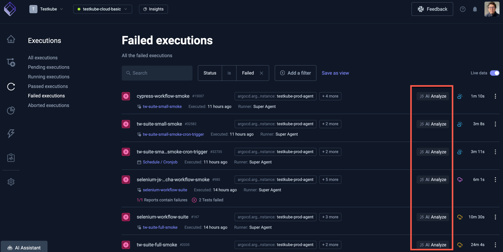
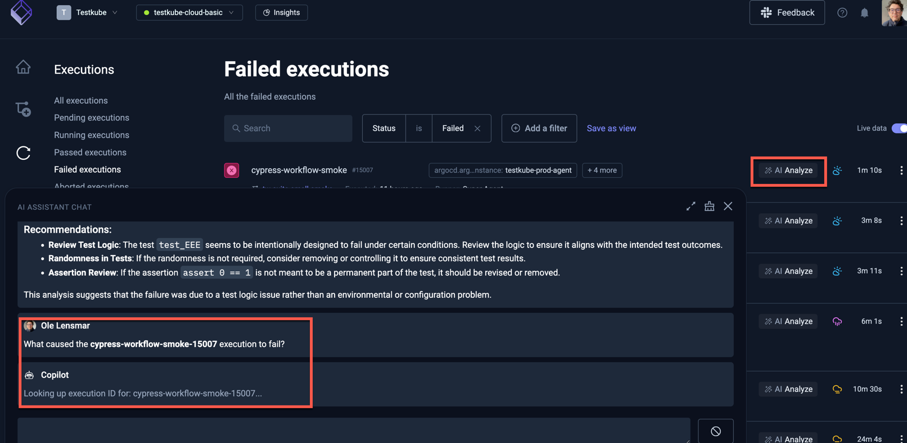
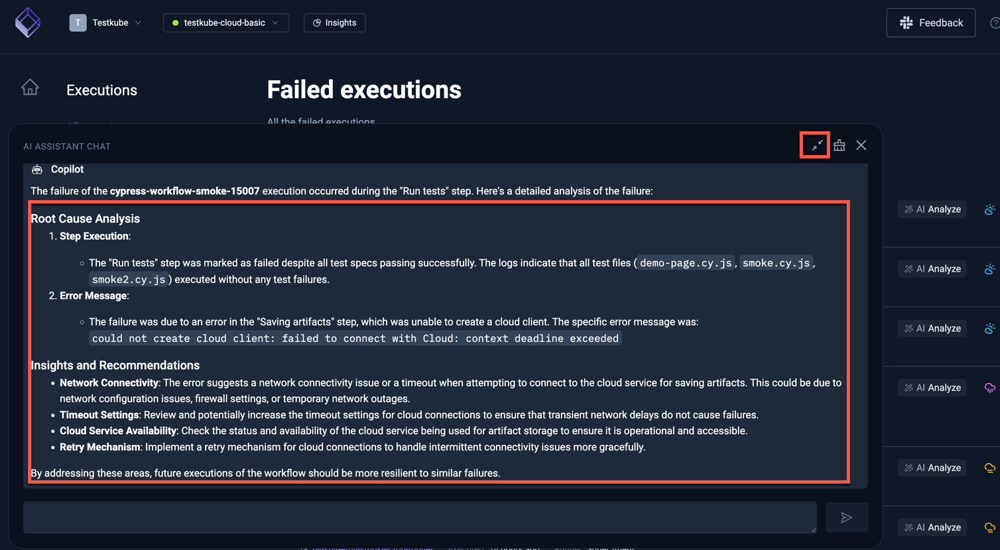

# AI Analysis for Failed Workflows

The [AI-Assistant](/articles/ai-assistant-overview) available in Testkube can be used to analyse failed Workflow Executions, 
either by prompting it or simply selecting the corresponding "AI Analyze" in the Dashboard shown next to each failed/aborted Execution:

Selecting this will open the AI Assistant with a prompt to analyze the failed Workflow Execution as the input:

:::tip
You could of course enter the same prompt manually and for any execution, not just failed ones.
:::

The result of the analysis will be presented in the AI Assistant (use the expand button on the top right to see the full output):

