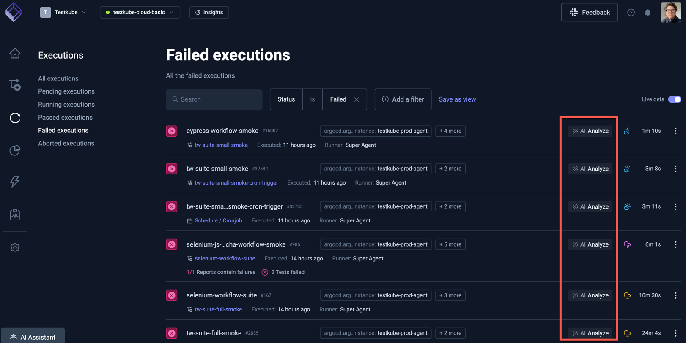
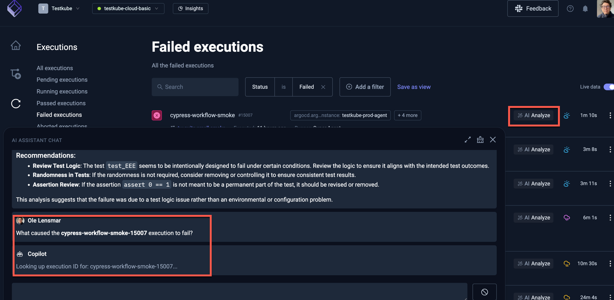
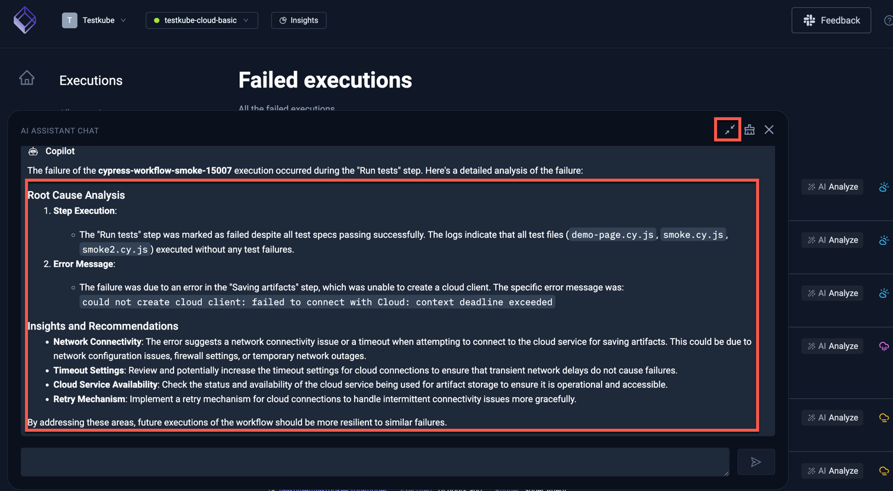

# AI Analysis for Failed Workflows

The [AI Assistant](/articles/ai-assistant-overview) available in Testkube can be used to analyse failed Workflow Executions, 
either by prompting it in a chat or by selecting the "AI Analyze" button in the Dashboard shown next to each failed/aborted Execution:

Selecting this will open a new AI chat with a prompt to analyze the failed Workflow Execution:

:::tip
You could of course enter the same prompt manually in any chat and for any execution, not just failed ones.
:::

The result of the analysis will be presented in the chat:

