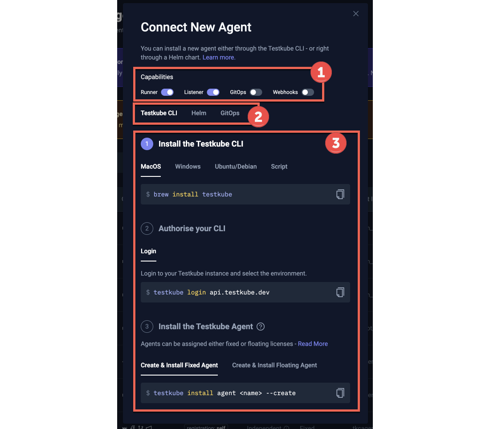
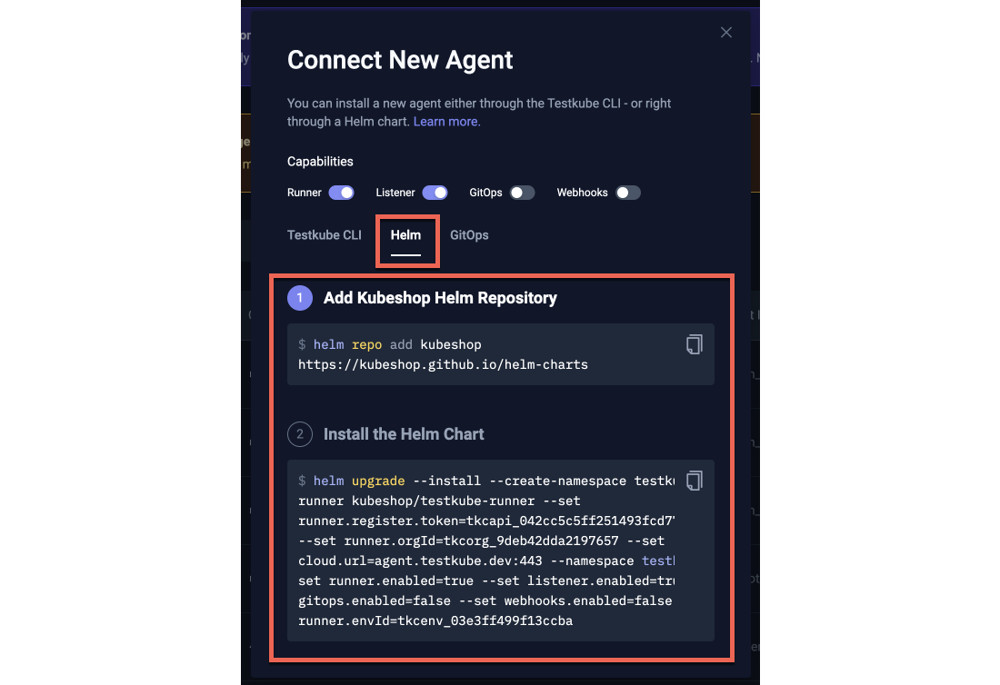
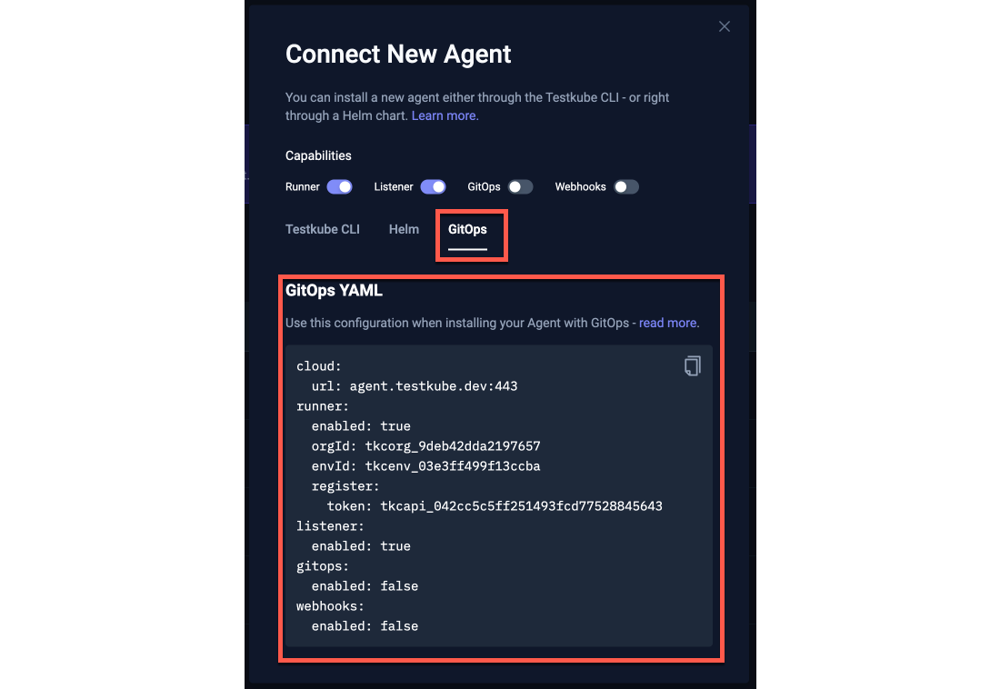
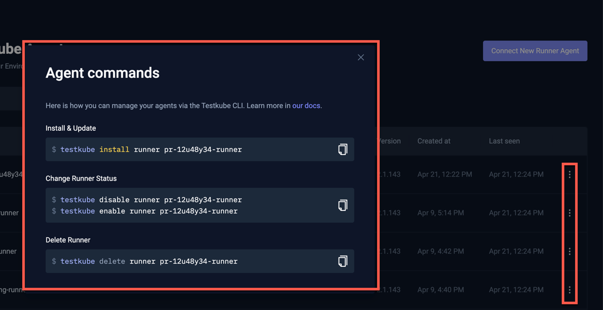
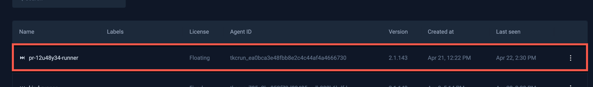

# Testkube Agents

A Testkube Environment can contain any number of Agents to perform specific tasks. Agents are added to an Environment 
via the Dashboard (see below) and then deployed into their target cluster/namespace using either the provided CLI or Helm commands.

:::tip
The Agents described here are related to the Test Orchestration capabilites of Testkube, not to be confused with [Testkube AI Agents](/articles/ai-agents), 
which allow you to run Agentic workloads in your Testkube Environment.
:::

### Deprecation of Standalone Agents in Testkube 2.7.0

As of Testkube 2.7.0, the concept of a standalone "superagent" has been deprecated and been entirely replaced with Agents with the below capabilities - [Read More](/articles/control-plane-source-of-truth). 

When upgrading a "superagent" from a pre 2.7.0 version to a 2.7.0+ version, that Agent will be automatically migrated to an Agent with all 4 capabilties enabled, its name will be set to `default-agent-<environment-name>`.

## Agent Capabilities

A Testkube Agent can have any of the following 4 capabilities

1. **Runner Agents** - are deployed to any cluster/namespace where you want to execute your TestWorkflows.
2. **Listene Agents** - are deployed to any cluster/namespace where you want to listen for [Kubernetes Event Triggers](/articles/test-triggers).
3. **GitOps Agents** - are deployed for syncing Testkube Resources into the Control Plane - [Read More](#gitops-agents).
4. **Webhook Agents** - are deployed to from where you want to emit Webhook/CDEvents - [Read More](#webhook-agents).

### Naming - Agents vs Capabilities 

Since an Agent can technically have any combination of these capabilties enabled, we will use the term capability and agent somewhat 
interchangably - i.e. a "Runner Agent" is the same as an "Agent with the Runner Capability", while an Agent with both the Listener and Webhook capabilities is both 
a Listener Agent and a Webhook Agent. 

### Runner Agents

Runner Agents execute Test Workflows in the cluster/namespace where they are deployed. You can have any number of Runner Agents in an Environment, allowing you to

1. **Run the same Workflow in multiple namespaces/clusters**, (possibly at the same time!).
2. **Add ephemeral Runner Agents** (deployed in ephemeral infrastructure) to an Environment and run your Test Workflows on them - [Read More](/articles/ephemeral-environments).

Use-cases for this are:

- Execute the same set of tests across production, staging, or testing environments to ensure consistent test execution.
- Execute the same set of tests in geographically dispersed environments to ensure consistent application behavior.
- Execute tests in local sandbox environments during development while having access to the centralized catalog of tests.
- Execute tests from multiple geographical locations against a (single) environment for realistic performance and e2e testing.
- Execute tests in ephemeral environments created during CI/CD pipelines for testing and deployment purposes - [Read More](/articles/ephemeral-environments).

Read More about how to run Workflows on Runner Agents at [Running Test Workflows](/articles/test-workflows-running).

The Standalone Agent always doubles as a Runner Agent also, see below.

:::info
Runner Agents require a license - [Read More](#licensing-for-runner-agents).
:::

### Listener Agents

Listener Agents are created and deployed to clusters/namespaces where you want to listen for Kubernetes Events to trigger [Test Triggers](/articles/test-triggers). 

Use-cases for deploying Listener Agents:

- Listening to application changes in a cluster(s) managed by a GitOps tool to trigger tests when the cluster state is updated.
- Listening to infrastructure changes in a cluster(s) to ensure that validation tests are run whenever a cluster is updated.

Having multiple/separate Listener Agents from Runner Agents allows you to listen for changes in clusters separate
from where you might want to run your tests, for example, if tests need to run from outside a cluster to validation connectivity
or network performance, you could listen for events using a Listener Agent in cluster A, which would trigger the execution of Workflow 
on a Runner Agent deployed in cluster B.

Read more about how TestTriggers map to Listener Agents at [Listener Agents with TestTriggers](/articles/test-triggers#listener-agents-with-testtriggers).

### GitOps Agents

GitOps Agents are used to sync Testkube Resources from a Kubernetes namespace into the Testkube Control-Plane, which is required if you are using Testkube in a GitOps
environment and want to manage your Testkube Resources in Git togethere with other Kubernetes Resources - [Read More](/articles/gitops-overview).

### Webhook Agents

Testkube has the capability to emit different types of events for integrating with external tools:

- [Webhooks](/articles/webhooks)
- [CDvents](/articles/cd-events)
- [Kubernetes events](/articles/k8s-events)

These are all emitted by a dedicated Webhook Agent which you can deploy anywhere in your infrastructure from where you want these events to be emitted.

Even if you have multiple Webhook Agents, only the first one will actually be used to emit Webhooks. This will be improved with dedicated Webhook Agent targeting in the next Testkube release.

:::note
For the emitting of CDEvents and Kubernetes Events, that corresponding functionality needs to be enabled further as described in the documents linked above.
:::

## Managing Agents

Agents are managed in the Agents tab under the Environment Settings:


The table has the following columns:

- **Name**:  The name given to the agent on creation.
- **Capabilities**: Capability icons for the agent.
- **Labels**: Labels assigned to the Runner Agents on creation - [Read More](/articles/test-workflows-running#using-labels-for-runner-agent-selection)
- **Runner Mode**: The Runner Mode of the agent if it is a Runner Agent - [Read More](/articles/test-workflows-running#runner-agent-modes)
- **License**: The type of license assigned to the Agent if it is a Runner Agent - [Read More](#licensing-for-runner-agents)
- **Agent ID**: the Agent ID
- **Version**: The version of the Agent; a warning triangle will be shown if an updated version is available.
- **Last seen**: When the Agent was last seen.

### Adding Agents to an Environment

Add a new Agent to an Environment by clicking the "Connect New Agent" button, which will open the below dialog:



As indicated, there are 3 main choices:

1. Which capabilities the Agent should have; Runner, Listener, GitOps or Webhook
2. If you want to use the Testkube CLI, Helm Chart or GitOps configuration to install the Agent
3. The commands to run to install the Agent with the selected capabilities.

Selecting "Helm" as the tool for installation will show corresponding commands:



Selecting "GitOps" as the tool for installation will show the YAML to use when auto-provisioning the Agent as part of a 
GitOps deployment - [Read More](/articles/multi-agent-runner-helm-chart#self-registering-agent-helm-install).



Once the Agent is installed with the select capabilities and tool, it will show up in the list of Agents and is ready for use.

### Managing an existing Agent

Existing agents are currently managed via the Testkube CLI, use the popup menu to the right in the table
to get Agent information, Delete the Agent, or see examples of applicable CLI commands:



:::tip
Check out [Multi-Agent CLI Overview](/articles/multi-agent-cli) for an overview of all Testkube CLI commands for
working with Testkube Agents, or [Runner Helm Chart Overview](/articles/multi-agent-runner-helm-chart).
:::

### Agent Token Masking

In the “Organization Management” section, under the “Product Features” tab, there is an option called “Agent Token Masking”.
When this toggle is enabled, the Testkube Dashboard will no longer display sensitive Runner Agent tokens in the UI.


:::warning
**Important:** This masking feature applies **only** to the Testkube Dashboard UI. Agent tokens or secret keys will still be visible in CLI outputs (e.g., when using `testkube create runner` or retrieving details for Helm chart installation as described in [Installing Runner Agent with Helm Charts](/articles/multi-agent-runner-helm-chart)) and in any direct API interactions.
:::

## Licensing for Runner Agents

Testkube Runner Agents require a license for usage, which can be either Fixed or Floating.

- Runner Agents assigned a **Fixed License** can always run Workflows independently at any time.
  The Standalone Agent required for each Testkube Environment always requires a fixed license.
- Runner Agents assigned a **Floating license** share the ability to execute Workflows concurrently; if one Runner Agent with a floating license is executing a Workflow,
  a second agent will queue Workflow executions until the first agent is complete. If you, for example, purchase two floating licenses and assign those
  to 10 agents, two of those agents will be able to execute Workflows concurrently at any give time.

Floating licenses are useful for automated and/or [ephemeral use-cases](/articles/ephemeral-environments) where you don't know in advance how many Runner Agents
you will have at any given point in time, and/or you don’t mind if your Workflow executions get queued.

:::note
Listener Agents do not require a license, you can have as many Listener Agents deployed in your infrastructure as needed.
:::

### Assigning Licenses to Runner Agents

Runner Agents are by default assigned a fixed license (as in all the examples above), use the `--floating` argument with Runner Agent
creation commands to instead assign a floating license, for example:

```sh
# install temporary Runner Agent using a floating license
$ testkube install agent pr-12u48y34-runner --runner --create --floating
```

The Runner Agent will be shown with the License Type "Floating" in the list of Agents:



### Runner Agent License Enforcement

The Runner Agent limit for both Fixed and Floating Licenses is counted and enforced at the organization level, i.e., across all your environments. Furthermore:

- You will only be able to create as many fixed Runner Agents as you have Fixed licenses in your Testkube plan.
- You will need to have at least one Floating license in your Testkube plan to be able to create Runner Agents with the `--floating` argument.

Please don't hesitate to [Get in Touch](https://testkube.io/contact) if you have any questions/concerns about licensing.

## Migrating old Environments

If you have an existing Environment created before the Multi-Agent functionality was introduced in Q2 2025, and that Environment already has Workflows being
executed by CI/CD, CronJobs, Kubernetes Event Triggers, etc., these will continue to be executed on _any_ [Global Runner Agent](/articles/test-workflows-running#global-runner-agents)
(including the required Standalone Agent) connected to your Environment unless you update the corresponding triggering commands/configuration
to target a specific Runner Agent, either by name, group or label - [Read More](/articles/test-workflows-running#runner-agent-targeting).

:::info
Existing Environments that do not make the use of Runner Agents will continue to work as before, it is only
when you start adding additional Runner Agents that you might need to adjust how your existing Workflows are triggered by external sources.
:::
