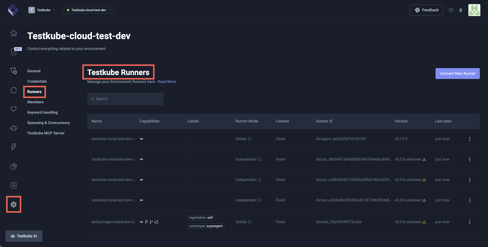
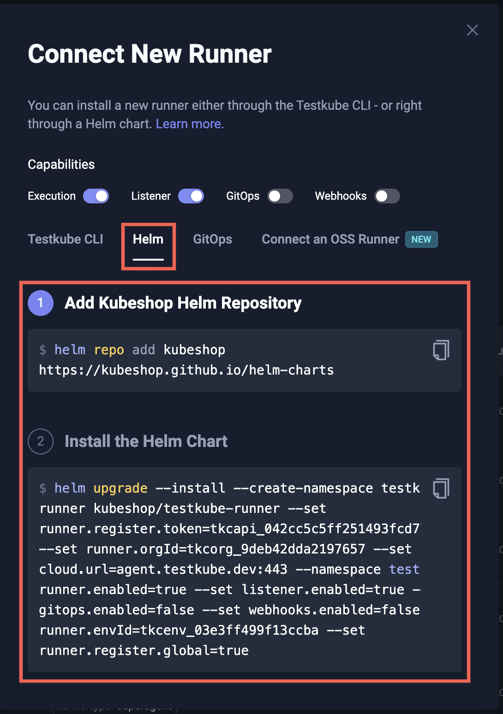
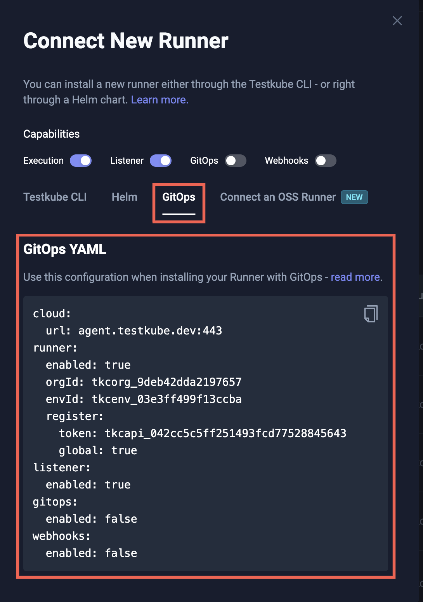
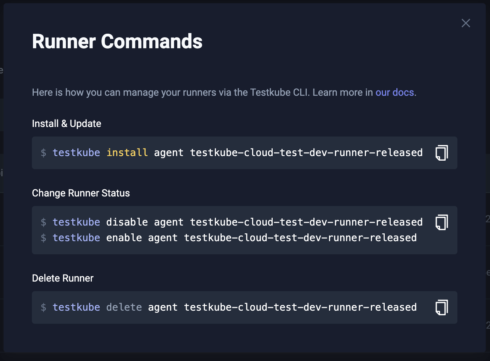
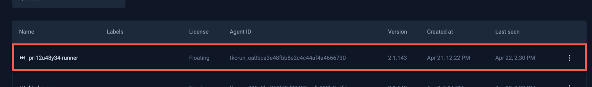

# Testkube Runners {#testkube-agents}

A Testkube Environment can contain any number of Runners to perform specific tasks. Runners are added to an Environment
via the Dashboard (see below) and then deployed into their target cluster/namespace using either the provided CLI or Helm commands.

:::tip
The Runners described here are the cluster components that execute tests and connect your infrastructure to Testkube. They are not [Testkube AI Agents](/articles/ai-agents), which run agentic workloads in your Testkube Environment.
:::

:::note
Runners were previously called Agents. Existing `agent` CLI commands, such as `testkube install agent`, and the `--runner` capability flag still work. They are deprecated in favor of `runner` commands and the `--execution` flag.
:::

### From SuperAgent to the Capability Model (Testkube 2.7.0)

As of Testkube 2.7.0, the concept of a single "superagent" (one runner holding all state when connected to the Control Plane) has been deprecated and replaced with runners that have explicit capabilities - [Read More](/articles/testkube-resource-management). Standalone mode (runner not connected to any Control Plane) remains unchanged and is still supported.

When upgrading a "superagent" from a pre 2.7.0 version to a 2.7.0+ version, that Runner will be automatically migrated to a Runner with all 4 capabilities enabled, its name will be set to `default-agent-<environment-name>`.

## Runner Capabilities {#agent-capabilities}

A Testkube Runner can have any of the following 4 capabilities:

1. **Execution** — run TestWorkflows in the cluster or namespace where the Runner is deployed. [Read more](#runner-agents).
2. **Listener** — listen for Kubernetes events. [Read more](#listener-agents).
3. **GitOps** — sync Testkube resources into the Control Plane. [Read more](#gitops-agents).
4. **Webhooks** — emit Webhooks and CDEvents. [Read more](#webhook-agents).

:::note

### Naming - Runners vs Capabilities {#naming-agents-vs-capabilities}

A Runner can have any combination of these capabilities. Say **runner with the execution capability** or **runner with the GitOps capability**. The same pattern applies to listener and webhooks. A Runner with both listener and webhooks capabilities is a runner with the listener capability and a runner with the webhooks capability.
:::

### Execution {#runner-agents}

Runners with the execution capability run Test Workflows in the cluster or namespace where they are deployed. You can have any number of them in a Testkube Environment, which lets you:

1. **Run the same Workflow in multiple namespaces/clusters**, (possibly at the same time!).
2. **Add ephemeral runners** (deployed in ephemeral infrastructure) to an Environment and run your Test Workflows on them - [Read More](/articles/ephemeral-environments).

Use-cases for this are:

- Execute the same set of tests across production, staging, or testing environments to ensure consistent test execution.
- Execute the same set of tests in geographically dispersed environments to ensure consistent application behavior.
- Execute tests in local sandbox environments during development while having access to the centralized catalog of tests.
- Execute tests from multiple geographical locations against a (single) environment for realistic performance and e2e testing.
- Execute tests in ephemeral environments created during CI/CD pipelines for testing and deployment purposes - [Read More](/articles/ephemeral-environments).

Read More about how to run Workflows on runners at [Running Test Workflows](/articles/test-workflows-running).

:::info
Runners with the execution capability require a license - [Read More](#licensing-for-runner-agents).
:::

### Listener {#listener-agents}

Runners with the listener capability are created and deployed to clusters or namespaces where you want to listen for Kubernetes events that trigger [Test Triggers](/articles/test-triggers).

Use-cases for deploying runners with the listener capability:

- Listening to application changes in a cluster(s) managed by a GitOps tool to trigger tests when the cluster state is updated.
- Listening to infrastructure changes in a cluster(s) to ensure that validation tests are run whenever a cluster is updated.

Having multiple/separate runners with the listener capability from runners allows you to listen for changes in clusters separate
from where you might want to run your tests, for example, if tests need to run from outside a cluster to validation connectivity
or network performance, you could listen for events using a runner with the listener capability in cluster A, which would trigger the execution of Workflow
on a runner deployed in cluster B.

Read more about how TestTriggers map to runners with the listener capability at [Listener capability with TestTriggers](/articles/test-triggers#listener-agents-with-testtriggers).

### GitOps {#gitops-agents}

Runners with the GitOps capability sync Testkube resources from a Kubernetes namespace into the Testkube Control Plane. This is required if you are using Testkube in a GitOps
environment and want to manage your Testkube Resources in Git together with other Kubernetes Resources - [Read More](/articles/gitops-overview).

### Webhooks {#webhook-agents}

Testkube has the capability to emit different types of events for integrating with external tools:

- [Webhooks](/articles/webhooks)
- [CDEvents](/articles/cd-events)
- [Kubernetes events](/articles/k8s-events)

These are all emitted by a dedicated runner with the webhooks capability which you can deploy anywhere in your infrastructure from where you want these events to be emitted.

Even if you have multiple runners with the webhooks capability, only the first one will actually be used to emit Webhooks. Dedicated targeting for that capability is planned for a later Testkube release.

:::note
For the emitting of CDEvents and Kubernetes Events, that corresponding functionality needs to be enabled further as described in the documents linked above.
:::

## Managing Runners {#managing-agents}

Runners are managed in the Runners tab under the Environment Settings:



The table has the following columns:

- **Name**: The name given to the runner on creation.
- **Capabilities**: Capability icons for the runner.
- **Labels**: Labels currently associated with the runner. Can be set with `testkube update runner` or via the runner's Helm values — see [Updating runner labels and mode](#updating-runner-agent-labels-and-mode) and [Using labels for runner selection](/articles/test-workflows-running#using-labels-for-runner-agent-selection).
- **Runner Mode**: The mode of a Runner with the execution capability. Can be changed with `testkube update runner` or via the runner's Helm values — see [Updating runner labels and mode](#updating-runner-agent-labels-and-mode) and [Runner modes](/articles/test-workflows-running#runner-agent-modes).
- **License**: The license assigned to a Runner with the execution capability - [Read More](#licensing-for-runner-agents)
- **Runner ID**: the Runner ID
- **Version**: The version of the Runner; a warning triangle will be shown if an updated version is available.
- **Last seen**: When the Runner was last seen.

### Adding Runners to an Environment {#adding-agents-to-an-environment}

Add a new Runner to an Environment by clicking the "Connect New Runner" button, which will open the below dialog:


As indicated, there are 3 main choices:

1. Which capabilities the Runner should have: execution, listener, GitOps, or webhooks
2. If you want to use the Testkube CLI, Helm Chart or GitOps configuration to install the Runner
3. The commands to run to install the Runner with the selected capabilities.

Selecting "Helm" as the tool for installation will show corresponding commands:



Selecting "GitOps" as the tool for installation will show the YAML to use when auto-provisioning the Runner as part of a
GitOps deployment - [Read More](/articles/multi-agent-runner-helm-chart#self-registering-agent-helm-install).



Once the Runner is installed with the select capabilities and tool, it will show up in the list of Runners and is ready for use.

### Managing an existing Runner {#managing-an-existing-agent}

Existing runners are currently managed via the Testkube CLI, use the popup menu to the right in the table
to get Runner information, Delete the Runner, or see examples of applicable CLI commands:



:::tip
Check out [Multi-runner CLI Overview](/articles/multi-agent-cli) for an overview of all Testkube CLI commands for
working with Testkube Runners, or [Runner Helm Chart Overview](/articles/multi-agent-runner-helm-chart).
:::

### Runner token masking {#agent-token-masking}

In the “Organization Management” section, under the “Product Features” tab, there is an option called “Runner token masking”.
When this toggle is enabled, the Testkube Dashboard will no longer display sensitive runner tokens in the UI.


:::warning
**Important:** This masking feature applies **only** to the Testkube Dashboard UI. Runner tokens or secret keys will still be visible in CLI outputs (e.g., when using `testkube create runner` or retrieving details for Helm chart installation as described in [Installing runner with Helm Charts](/articles/multi-agent-runner-helm-chart)) and in any direct API interactions.
:::

## Updating runner labels and mode {#updating-runner-agent-labels-and-mode}

A runner's labels and mode (`--global` / `--group`) can be managed in two ways, and both are
supported simultaneously:

1. **From the Control Plane** — using `testkube update runner <name> -l <key>=<value>` or the Dashboard.
2. **From the runner Deployment** — by setting `runner.register.labels`, `runner.register.global`, or
   `runner.register.groupName` in the Helm values (or the equivalent `RUNNER_GROUP` / `RUNNER_IS_GLOBAL`
   environment variables on the runner Deployment).

When a runner restarts (for example after a Helm upgrade or rolling update of its Deployment) it
reconnects to the Control Plane and may republish its registration metadata, but **only for the fields it
is explicitly configured to manage**:

| Runner-side configuration                                        | What gets refreshed on reconnect                                    |
| ---------------------------------------------------------------- | ------------------------------------------------------------------- |
| At least one entry in `runner.register.labels`                   | Labels are replaced with the runner's set                           |
| `runner.register.labels` is empty / unset                        | Labels are **preserved** (the runner does not touch them)           |
| `runner.register.global=true` or `runner.register.groupName` set | Runner mode is replaced with the runner's setting                   |
| Neither set (`Independent` defaults)                             | Runner mode is **preserved** (the runner does not touch it)         |
| Kubernetes API error reading the Deployment                      | Labels are preserved (warning logged); mode follows the rules above |

This means CLI-managed runners keep working unchanged after upgrade: if you have not configured labels or
mode in your runner's Helm values, the runner will not overwrite values you set with
`testkube update runner` or `testkube create runner --global` / `--group`.

### Switching to Helm as the source of truth

If you want the runner Deployment itself to be the source of truth for labels and/or mode, set the
corresponding Helm values and run `helm upgrade`:

| Field        | Helm value                  | Runner env var                                                                            |
| ------------ | --------------------------- | ----------------------------------------------------------------------------------------- |
| Labels       | `runner.register.labels`    | (label key prefix configurable via `RUNNER_LABELS_PREFIX`, default `runner.testkube.io/`) |
| Runner group | `runner.register.groupName` | `RUNNER_GROUP`                                                                            |
| Global flag  | `runner.register.global`    | `RUNNER_IS_GLOBAL`                                                                        |

Once the runner pod restarts and reconnects, the Runners list in the Dashboard will reflect the new values.
From that point on, any change you make through the CLI will be **overwritten** the next time the runner
reconnects — pick a single source of truth per runner.

### Demoting a Global or Grouped runner to Independent

Clearing `runner.register.global` / `runner.register.groupName` and reconnecting will **not** demote a
runner to Independent: an empty policy snapshot is indistinguishable from "unset," so the runner does not
touch the stored mode in that case (this prevents accidental downgrades during Helm value cleanups). To
demote a runner explicitly, use:

```sh
$ testkube update runner <name> --runner-mode independent   # or use the Dashboard
```

:::note
Upgrading from a release before this change ([kubeshop/testkube#7791](https://github.com/kubeshop/testkube/pull/7791))
is safe for environments where labels and runner policy were managed via the CLI: those values are
preserved on reconnect because the runner only refreshes fields it has been explicitly configured to
publish.
:::

## Runner key Rotation {#agent-key-rotation}

Runner secret keys can be rotated to maintain security best practices or in response to a potential compromise. When a key is rotated, the previous key remains valid for a configurable **grace period** to allow in-flight requests to complete without interruption.

### How It Works

- **Grace period**: After rotation, the old key continues to work for a configurable duration (default: 24 hours, maximum: 7 days). This ensures connected runners are not immediately disconnected.
- **Single previous key**: Only one previous key is retained at a time. If you rotate again before the grace period expires, the earlier previous key is discarded.
- **Hash-only storage**: Only the hash of the previous key is stored — the previous key value cannot be recovered from the Control Plane.

### Rotating via the CLI

Use the `testkube runner rotate-key` command to rotate a runner's secret key:

```sh
$ testkube runner rotate-key my-runner
```

To specify a custom grace period:

```sh
$ testkube runner rotate-key my-runner --grace-period 4h
```

### Rotating via the API

You can also rotate keys using the API:

```
DELETE /organizations/<organizationId>/runners/<runnerIdOrName>/secret-key
```

### Best Practices

- Rotate keys periodically as part of your security hygiene.
- Use the grace period to perform a rolling update of your runner deployments with the new key before the old key expires.
- After rotating, verify that all runners have reconnected with the new key before the grace period ends.

## Licensing for Runners {#licensing-for-runner-agents}

Testkube Runners with the execution capability require a license, which can be either Fixed or Floating.

- Runners assigned a **Fixed License** can always run Workflows independently at any time.
- Runners assigned a **Floating license** share the ability to execute Workflows concurrently; if one Runner with a floating license is executing a Workflow,
  a second runner will queue Workflow executions until the first runner is complete. If you, for example, purchase two floating licenses and assign those
  to 10 runners, two of those runners will be able to execute Workflows concurrently at any give time.

Floating licenses are useful for automated and/or [ephemeral use-cases](/articles/ephemeral-environments) where you don't know in advance how many runners
you will have at any given point in time, and/or you don’t mind if your Workflow executions get queued.

:::note
Runners that do not have the execution capability do not require a license. You can deploy as many runners with only the listener, webhooks, or GitOps capabilities as you need.
:::

### Assigning Licenses to Runners {#assigning-licenses-to-runner-agents}

Runners are assigned a fixed license by default (as in all the examples above). Use the `--floating` argument with Runner
creation commands to instead assign a floating license, for example:

```sh
# install temporary runner using a floating license
$ testkube install runner pr-12u48y34-runner --execution --create --floating
```

The runner will be shown with the License Type "Floating" in the list of Runners:



### Runner License Enforcement {#runner-agent-license-enforcement}

The runner limit for both Fixed and Floating Licenses is counted and enforced at the organization level, i.e., across all your environments. Furthermore:

- You will only be able to create as many fixed runners as you have Fixed licenses in your Testkube plan.
- You will need to have at least one Floating license in your Testkube plan to be able to create runners with the `--floating` argument.

Please don't hesitate to [Get in Touch](https://testkube.io/contact) if you have any questions/concerns about licensing.

## Migrating old Environments

If you have an existing Environment created before the Multi-runner functionality was introduced in Q2 2025, and that Environment already has Workflows being
executed by CI/CD, CronJobs, Kubernetes Event Triggers, etc., these will continue to be executed on _any_ [Global runner](/articles/test-workflows-running#global-runner-agents)
connected to your Environment unless you update the corresponding triggering commands/configuration
to target a specific runner, either by name, group or label - [Read More](/articles/test-workflows-running#runner-agent-targeting).

:::info
Existing Environments that do not make the use of runners will continue to work as before, it is only
when you start adding additional runners that you might need to adjust how your existing Workflows are triggered by external sources.
:::
