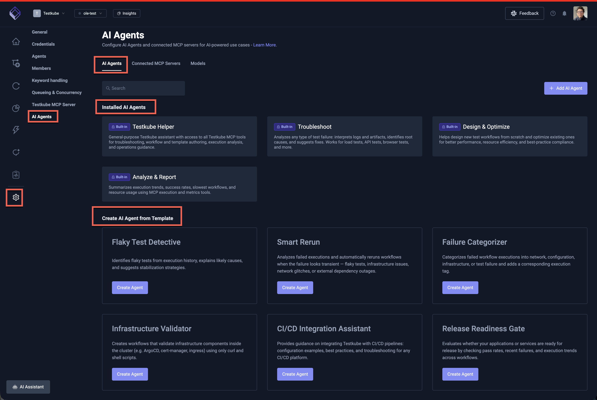

# Testkube AI Agents

Testkube allows you to define AI Agents to perform advanced test orchestration and analysis tasks, using
both the internal and external MCP Servers for whatever scenario you need. AI Agents can be triggered both manually
and automatically based on workflow execution events or schedules, allowing you to leverage AI-powered automation 
in your testing pipelines, be they CI/CD pipelines, GitOps pipelines, or other automation pipelines.

## Example Use Cases

AI Agents can address a wide range of testing and operational challenges:

**For QA & Test Engineers:**
- **Automated Remediation** — Analyze failed tests, inspect code changes, and open a fix PR (see [Remediation Agent](/articles/remediation-agent))
- **Flakiness Analysis** — Detect flaky tests across execution history and correlate with source changes (see [Flakiness Analysis Agent](/articles/flakiness-analysis-agent))
- **Dependency Impact** — When a test fails, assess which other workflows might be affected (see [Dependency Impact Agent](/articles/dependency-impact-agent))

**For DevOps & Platform Engineers:**
- **Infrastructure Triage** — Classify failures as infra issues (OOM, timeouts) vs test bugs (see [Infrastructure Triage Agent](/articles/infrastructure-triage-agent))
- **Incident Correlation** — Group simultaneous failures and identify common root causes (see [Incident Correlator Agent](/articles/incident-correlator-agent))
- **Execution Cost Analysis** — Find expensive workflows and recommend optimizations (see [Execution Cost Analyzer Agent](/articles/execution-cost-agent))

**General:**
- **Advanced Integrations** — Connect external MCP Servers (GitHub, Jira, Slack) to create issues, post notifications, or read data
- **Automated Test Generation** — Create new tests and the Workflows required to run them

See [Example Agents](/articles/ai-agent-examples-overview) for ready-to-use agent configurations and [More Ideas](/articles/ai-agent-ideas) for additional inspiration.

## Default AI Agents

Every Testkube environment comes with four pre-configured agents ready to use immediately:

| Agent | Purpose |
|-------|---------|
| **Testkube Helper** | General-purpose assistant with access to all Testkube MCP tools. Ask it anything about your workflows, executions, or environment. |
| **Troubleshoot** | Specialized in analyzing failed executions — examines logs, artifacts, and execution history to identify root causes and suggest fixes. |
| **Design & Optimize** | Helps create new Test Workflows and optimize existing ones — generates workflow definitions, suggests improvements, and applies changes (with approval). |
| **Analyze & Report** | Summarizes execution trends, workflow health, and metrics across your environment into actionable reports. |

These agents are automatically provisioned and kept up to date. They cannot be deleted but can be
supplemented with custom agents tailored to your needs.

## Agent Templates

Testkube includes a set of agent templates in the Dashboard that you can use as starting points when
creating a new agent. Templates provide pre-configured system prompts and MCP tool selections for
common use cases:

| Template | Description |
|----------|-------------|
| **Flaky Test Detective** | Analyzes execution history across many runs to detect flaky tests, correlate intermittent failures with timing or resource trends, and suggest stabilization strategies (retries, isolation, wait conditions). |
| **Smart Rerun** | Examines failed executions, classifies the failure as transient or deterministic, and automatically reruns the workflow when a retry is likely to succeed (flaky tests, infrastructure issues, network glitches). Tags both the original and rerun executions for traceability. |
| **Failure Categorizer** | Inspects logs and artifacts of failed executions and tags each one with a failure category — `network`, `configuration`, `infrastructure`, or `test_failure` — to build a searchable catalog of failure modes. |
| **Infrastructure Validator** | Creates lightweight TestWorkflows that validate in-cluster infrastructure components (e.g. ArgoCD, cert-manager, ingress controllers) using only curl and shell scripts, then runs them and reports results. |
| **CI/CD Integration Assistant** | Provides guidance on integrating Testkube with CI/CD platforms (GitHub Actions, GitLab CI, Jenkins, etc.) — generates configuration snippets, advises on workflow triggering, and recommends best practices. Read-only; does not execute workflows. |
| **Release Readiness Gate** | Evaluates whether your services are ready for release by checking pass rates, recent failures, coverage gaps, and execution trends, then delivers a GO / NO-GO / CONDITIONAL verdict with a summary report. |

Select a template when creating a new agent to get a working configuration you can use as-is or
customize further. Read more at [Creating an AI Agent from a Template](/articles/defining-ai-agents#creating-an-ai-agent-from-a-template).

The screenshot below shows the default AI Agents ("Installed AI Agents") and AI Agent Templates ("Create AI Agent from Template") available for any new Environment in the Testkube Dashboard.

## Types of AI Agents

Testkube AI Agents can be designed with two distinct approaches depending on your use case:

### Task-Focused AI Agents

Task-focused agents are designed to perform a **specific task given specific inputs**, typically as part of an 
automated pipeline. These agents:

- Receive well-defined inputs (e.g., a workflow execution ID, test results, or error logs)
- Perform a specific analysis or action
- Produce a concrete output (e.g., post a summary to Slack, create a GitHub issue, tag an execution)

**Example**: An agent that analyzes a failed workflow execution, identifies the root cause, and automatically 
posts a summary with remediation suggestions to a Slack channel.

Task-focused agents are ideal for **automation scenarios** where you want to augment your Continuous Testing pipelines with 
AI-powered analysis and actions without human intervention. Use [AI Agent Triggers](/articles/ai-triggers) to 
automatically run task-focused agents when workflow executions finish, fail, or change state.

:::tip
See the [Remediation Agent](/articles/remediation-agent) for a detailed task-focused example, or the
[Infrastructure Triage Agent](/articles/infrastructure-triage-agent) for a DevOps-oriented example.
:::

### Guidance and Support AI Agents

Guidance agents are designed to provide **interactive assistance for general tasks**, acting more like an 
AI-powered assistant or copilot. These agents:

- Help users accomplish broader goals through conversation
- Provide recommendations, best practices, and step-by-step guidance
- Can perform actions on behalf of the user when requested

**Example**: An agent that helps users create new TestWorkflows by asking clarifying questions about their 
testing requirements, suggesting appropriate configurations, and generating the workflow definition.

Guidance agents are ideal for **onboarding, exploration, and complex configuration tasks** where users benefit 
from interactive support and contextual recommendations.

### Choosing the Right Approach

| Aspect | Task-Focused | Guidance & Support |
|--------|--------------|-------------------|
| **Trigger** | Automated via [AI Agent Triggers](/articles/ai-triggers) (e.g., on execution failure) | User-initiated conversation |
| **Input** | Specific, well-defined data | Open-ended questions or goals |
| **Output** | Concrete action or artifact | Recommendations and assistance |
| **Interaction** | Fire-and-forget | Interactive, multi-turn |
| **Best for** | CI/CD/GitOps automation, alerting | Onboarding, configuration, exploration |

Both styles can leverage the same MCP Servers and tools — the difference lies in how the agent is triggered 
and how it interacts with users or systems.

## LLM and Model Selection

AI Agents use the LLM configured for your Testkube environment by default. You can also
[add custom models](/articles/ai-models) and select which model to use per conversation
in the AI Assistant or Chat panel.

See [Default LLM and Model](/articles/ai-configuration#default-llm-and-model) for platform configuration details.

## Read More

- [Defining AI Agents](/articles/defining-ai-agents) — Create custom agents with tailored prompts and MCP tool access
- [AI Agent Chats](/articles/using-ai-agents) — Manage chats, view tool calls, and handle approval requests
- [AI Agent Triggers](/articles/ai-triggers) — Automate agent execution on workflow events or schedules
- [Connected MCP Servers](/articles/mcp-servers-for-ai-agents) — Integrate external tools (GitHub, Slack, Jira, etc.)
- [Configuring AI Models](/articles/ai-models) — Add custom models
- [Example Agents](/articles/ai-agent-examples-overview) — Ready-to-use agent configurations for QA and DevOps
