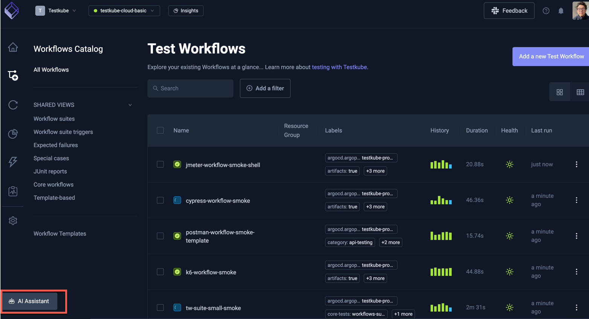
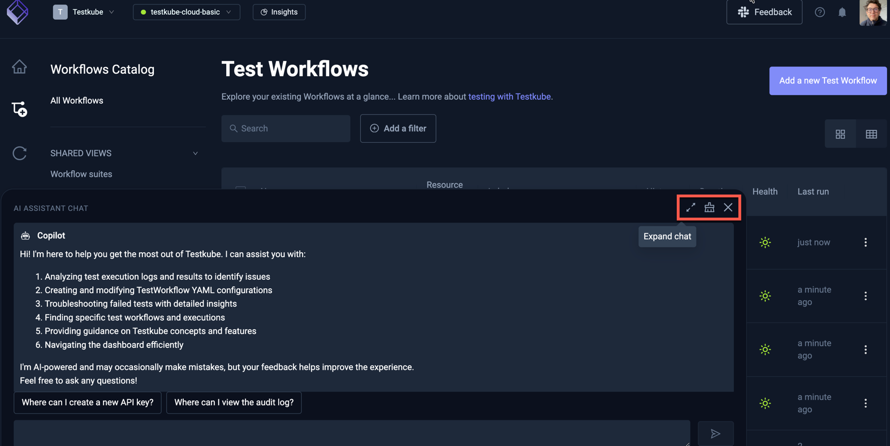

# Testkube AI Assistant Overview

> **On-Prem Installation Notice:**  
> For details on installing and enabling the AI service on On-Prem deployments, please see the [AI Configuration Reference](./ai-configuration.mdx) page.

Welcome to the documentation for the **Testkube AI Assistant** – an AI-powered assistant integrated directly into the Testkube Dashboard, 
designed to help you streamline your test orchestration by providing intelligent assistance in areas such as log analysis, dashboard navigation,
YAML configuration, and general Testkube guidance.

:::tip
Check out the [Testkube MCP Server](/articles/mcp-overview) to see how you can integrate Testkube functionality into your AI-powered workflows and agents.
:::

## Key Features

- **Log Analysis & Debugging:**  
  Summarize, analyze, and debug logs from your test workflow executions.

- **Dashboard Navigation:**  
  Quickly locate settings, audit logs, invitations, API tokens, and more using natural language queries.

- **Workflow Search Assistance:**  
  Search for test workflows using natural language queries (e.g., “find all workflows that failed”) with direct links to filtered views.

- **YAML Configuration Help:**  
  Get assistance with writing and troubleshooting YAML configurations for Test Workflows and Test Workflow Templates.

- **General Testkube Guidance:**  
  Ask questions about the Testkube Control Plane, Agents, and Dashboard, with answers referencing our detailed documentation.

## Learn more about AI Assistant

- [Configuration Reference](./ai-configuration.mdx)
- [How AI Assistant can help](./ai-assistant-can-help.md)
- [How AI Assistant is different from other chatbots](./ai-assistant-is-different.md)

## Accessing the AI Assistant

The AI Assistant is integrated into the Testkube Dashboard via a corresponding button in the bottom left corner.

Clicking it opens the prompt interface where you can interact with the Assistant any of the features described above.

The buttons in the top right corner of the AI Assistant allow you to maximize/minimize the interface, clear the prompt history or close the Assistant.

:::tip
The Testkube Dashboard provides shortcuts to the AI Assistant for the execution results of your Workflow 
Executions - [Read More](/articles/AI-test-insights).
:::
