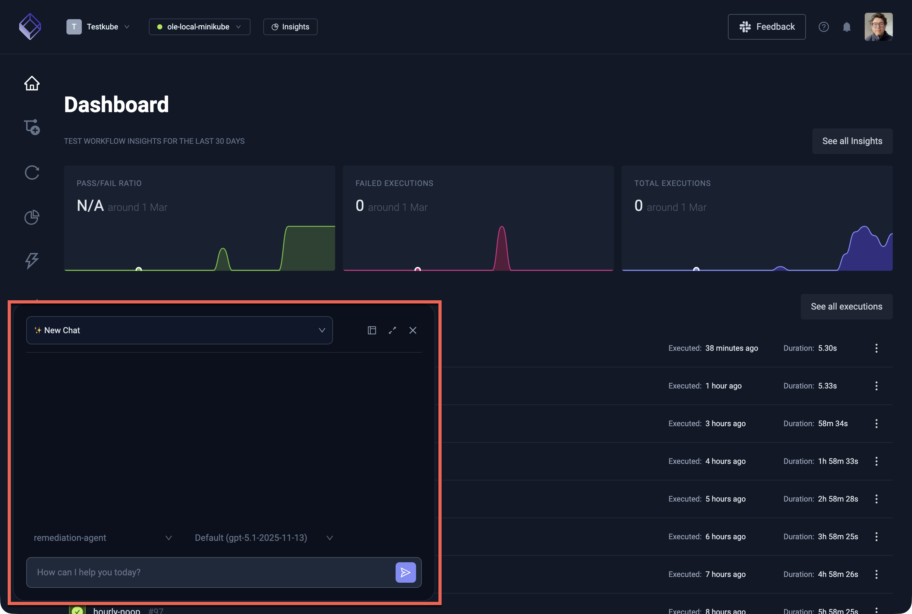
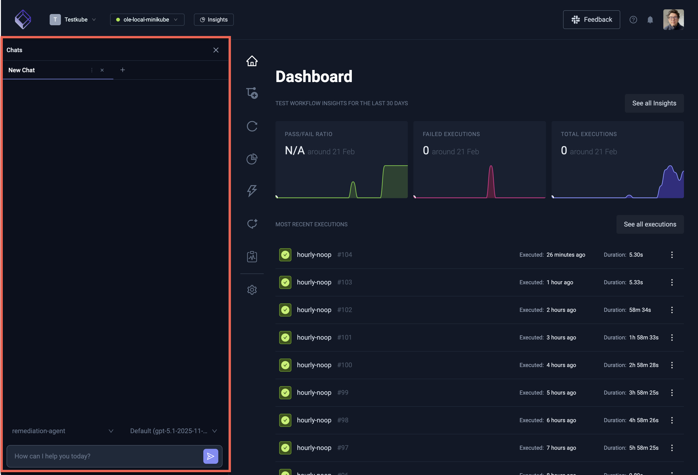
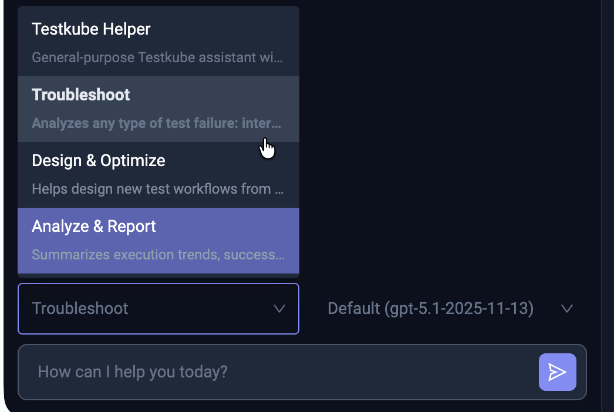

# AI Assistant

The **Testkube AI Assistant** gives you quick access to Testkube AI Agents from anywhere in the Dashboard,
without navigating to the AI Chats panel.

:::info
Check out the [AI Configuration](/articles/ai-enabling) on how to enable the AI Assistant for your Testkube instance.
:::

Once enabled, open the AI Assistant by selecting the "AI Assistant" button in the bottom left of the Testkube Dashboard.

## Overlay Mode (Default)

The AI Assistant opens as an overlay panel on top of the current Dashboard view. This is useful for quick
questions or short interactions while keeping your current context visible in the background.

## Docked Mode

For longer interactions where you want to work side-by-side with the AI Assistant, switch to docked mode
by selecting the dock icon (third icon from the top right in the AI Assistant panel). This pins the
assistant to the right side of the Dashboard, giving you a split-screen view where you can browse
workflows, executions, and other resources alongside the conversation.

## Selecting an AI Agent and Model

Use the dropdowns at the top of the AI Assistant panel to choose which AI Agent and LLM model to use
for the conversation:

- **AI Agent** — Select any of the [default agents](/articles/ai-agents#predefined-guidance-ai-agents)
  (Testkube Helper, Troubleshoot, Design & Optimize, Analyze & Report) or any
  [custom agent](/articles/defining-ai-agents) you have created.
- **Model** — Choose from the available LLM models (platform models and any
  [custom LLM providers](/articles/ai-models) you have configured).

Changing the agent or model takes effect for new messages in the current conversation.

## Navigating Between Chats

The AI Assistant keeps a history of your conversations. Use the chat list icon at the top of the panel to
see previous chats and switch between them. Each chat retains its full conversation history, so you can
pick up where you left off.

To start a fresh conversation, select the **New Chat** button. This creates a new session with the
currently selected agent and model.

:::tip
For a full-featured chat management experience — including filtering by agent, viewing tool approval
requests, and accessing triggered chats — use the dedicated [AI Chats](/articles/using-ai-agents) panel
from the left-side Dashboard menu.
:::

## Default AI Agents

Every Testkube environment comes with a set of pre-configured AI Agents ready to use:

| Agent | Purpose |
|-------|---------|
| **Testkube Helper** | General-purpose assistant with access to all Testkube MCP tools. Ask it anything about your workflows, executions, or environment. |
| **Troubleshoot** | Specialized in analyzing failed executions — examines logs, artifacts, and execution history to identify root causes and suggest fixes. |
| **Design & Optimize** | Helps create new Test Workflows and optimize existing ones — generates workflow definitions, suggests improvements, and applies changes (with approval). |
| **Analyze & Report** | Summarizes execution trends, workflow health, and metrics across your environment into actionable reports. |

These agents are automatically provisioned and cannot be deleted. You can create additional agents
tailored to your specific needs — see [Defining AI Agents](/articles/defining-ai-agents) and
[Example Agents](/articles/ai-agent-examples-overview) for inspiration.
