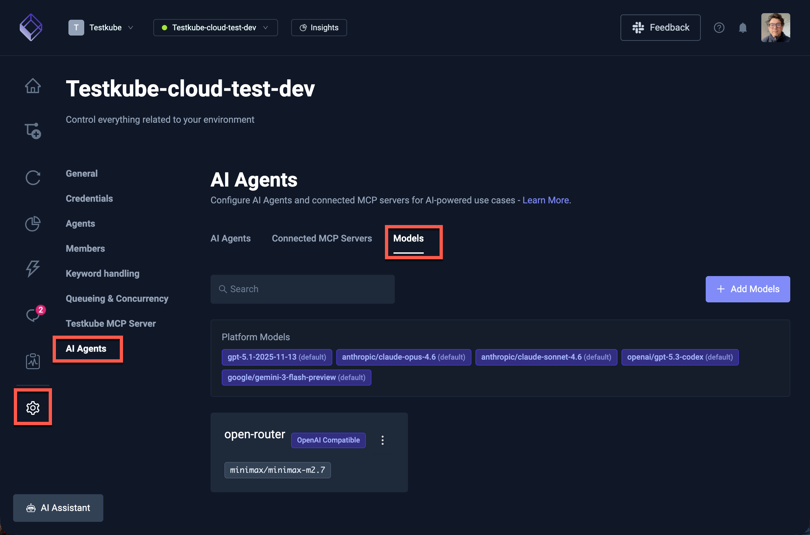
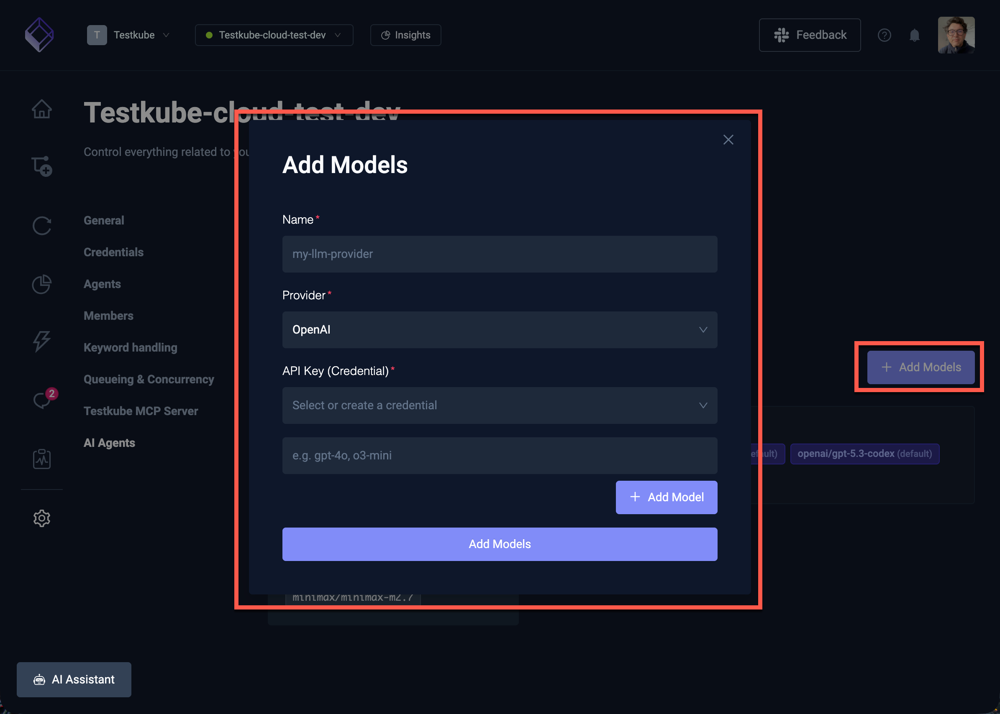
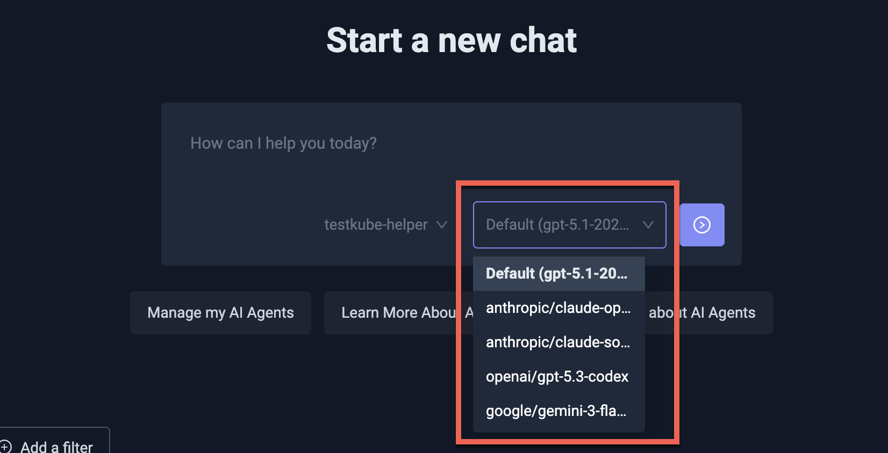

# Configuring AI Models

Testkube AI uses Large Language Models (LLMs) to power the [AI Assistant](/articles/ai-assistant-overview) and
[AI Agents](/articles/ai-agents). The **Models** tab in the AI Agents settings panel allows you to see which
models are available and add your own models for use in AI Chats.

## Accessing the Models Tab

Navigate to **Environment Settings** → **AI Agents** and select the **Models** tab.

This tab shows two categories of models:

- **Platform Models** — Models configured at the platform level (via Helm values or by Testkube for Cloud users). These are read-only and available to all users in the environment.
- **Custom Models** — Additional models that you add directly from the Dashboard, each with their own connection settings.

## Platform Models

Platform models are configured by your platform administrator and appear as read-only entries in the Models tab.

For Cloud Control Plane users, these are managed by Testkube and include the default model used for AI functionality.

For On-Prem installations, platform models are configured through Helm values — see the
[Advanced Model Configuration](/articles/ai-configuration#advanced-model-configuration) section of the AI Configuration
Reference for details on configuring models via Helm.

## Custom Models

You can add your own models to make them available for AI Chats. This is useful when you want to:

- Use a specific model from OpenAI or another provider alongside the platform defaults.
- Connect to a self-hosted or third-party LLM service that implements the OpenAI-compatible API.
- Give your team access to models tailored for specific tasks.

### Adding a Model

Select the **Add Model** button to open the model configuration modal with the following fields:

| Field | Description |
|-------|-------------|
| **Name** | A name for the model (must be unique and comply with Kubernetes naming conventions). |
| **Provider** | The model provider — `OpenAI` for direct OpenAI API access, or `OpenAI Compatible` for any service that implements the OpenAI API specification (e.g., Azure OpenAI, LiteLLM, vLLM). |
| **Base URL** | The API endpoint URL. Required for `OpenAI Compatible` providers; leave empty for direct OpenAI access. |
| **Credentials** | Select an existing API key credential or create a new one. The API key is stored securely as a Kubernetes secret. |

### Configuring Model Names

After adding a model, configure the model names that you want to make available:

- For **OpenAI** providers, use model names like `gpt-4o`, `o3-mini`, etc.
- For **OpenAI Compatible** providers, use the model identifiers expected by your service (e.g., `anthropic/claude-opus-4.6`, `google/gemini-3-flash`).

### Editing and Deleting Models

Select a model from the list to edit its connection settings or model names. Use the actions menu to delete a model
that is no longer needed.

## Using Models in AI Chats

Once configured, all available models (both platform and custom) appear in the model selector when starting or
continuing an AI Chat. You can select which model to use for each conversation, making it easy to compare
results or use specialized models for different tasks.

## Further Reading

- [AI Configuration Reference](/articles/ai-configuration) — Helm-based model configuration for On-Prem installations
- [AI Assistant Overview](/articles/ai-assistant-overview) — Using the AI Assistant in the Dashboard
- [AI Agents Overview](/articles/ai-agents) — Creating and managing AI Agents
