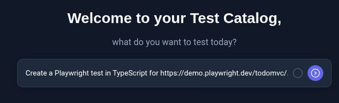
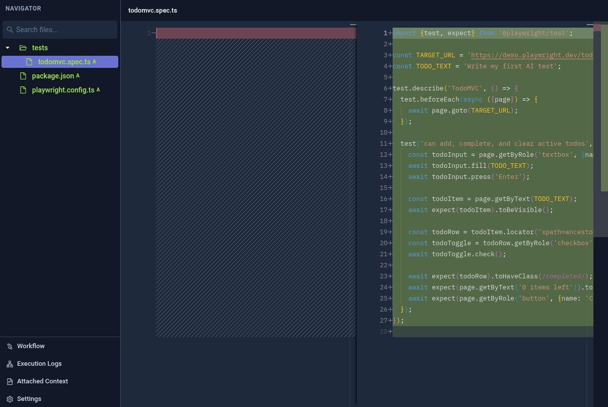

# Create your first test with AI

Use AI Test Creation to describe a test, review the generated code and results, and add coverage through chat.

You can follow this guide with your own application and testing framework, or try the example prompts for the public [Playwright TodoMVC demo](https://demo.playwright.dev/todomvc/). The demo needs no application or GitHub repository of your own.

## Before you start

You need:

- A Testkube plan or license that includes AI Test Creation, with the feature enabled for your organization.
- Permission to create tests and run them in your environment, with a connected runner available for execution.

Your test environment must be able to reach the application and dependencies needed by your chosen tests.

For a self-hosted installation, an administrator must also complete the [AI Test Creation setup](/articles/ai-test-creation#install-ai-test-creation-on-testkube-on-prem). Installation configuration does not replace the plan or license requirement.

## 1. Describe the test you want to create

Open the Testkube Dashboard, select your environment, and open **Test Catalog** from the navigation menu.

In **Describe your test**, describe one small scenario for your application. Include its URL, your preferred testing framework, the actions to perform, and the expected result. Say whether you want the AI to run the test too.

To try the TodoMVC example, you can use this prompt:

```text
Create a Playwright test in TypeScript for https://demo.playwright.dev/todomvc/.

Add a todo called "Write my first AI test", verify it appears in the list,
mark it complete, and verify that no active todos remain.

Use Chromium, set up what is needed to run the test in Testkube, and run it.
Use a fresh browser context so the test can run repeatedly.
```



Select the arrow button (**Create test**) to submit your request.

:::tip Write a specific first prompt

Describe an observable result, such as a confirmation message appearing or an API returning the expected response. You can add more coverage after the first test runs. To extend tests already in a repository, follow [Work with a GitHub repository](/articles/ai-test-creation-github).

:::

## 2. Follow the AI's progress

Testkube creates a **Test Bundle** and opens its first chat. The bundle groups related test creation work; the chat is where you discuss the task, answer questions, and ask for changes.

The AI may ask you to clarify the expected behaviour, test data, or how you want it to proceed. You can state your preference in the initial prompt or a follow-up. For example, ask it to propose the test cases and wait for your approval before editing, or to implement the agreed scenario, run it, and investigate failures.

Follow the progress in the chat and answer any questions there. Keep follow-ups about the same test in that conversation. You can start a separate chat for another task while this one is working; see [Work with Test Bundles and multiple chats](/articles/ai-test-creation-test-bundles).

## 3. Review the generated tests

The **Navigator** shows the test files created during your task, or the repository files if you imported existing tests. Expand the file tree and select a file to inspect its contents. File names and structure depend on your framework and request.



Check that the tests:

- Exercise the application and scenario you requested.
- Assert the expected result, rather than only performing actions.
- Set up the required test data and can run repeatedly.
- Preserve existing coverage when extending a test suite.

For the TodoMVC example, this means checking that the test creates the requested todo, verifies it appears, marks it complete, and asserts that no active todos remain.

Use the chat to request changes to the generated files. For example:

```text
Explain how this test verifies the requested behaviour and how it keeps
its test data independent of earlier runs.
```

## 4. Inspect the test results

If you asked the AI to run the tests, inspect the execution result and **Execution Logs**. Otherwise, ask it to run them when you are ready. You can also start an execution with **Run tests** at the top of the bundle.

Check which tests ran, whether they passed, and any failure details. Confirm that the assertions cover your requested behaviour. The screenshot shows a passing execution of the TodoMVC example.


The generated code and number of iterations can vary. If the run fails, ask the AI to investigate the actual execution:

```text
Inspect the latest failed execution and explain why it failed. Fix the cause
and run the test again. Keep the assertions that check the requested behaviour.
```

## 5. Add another test case

Continue in the same chat to add another scenario or an edge case for your application. Describe the new expected behaviour and ask the AI to preserve the existing tests.

If you are following the TodoMVC example, you could add a deletion test:

```text
Add a second Playwright test that creates a todo called "Review the results",
deletes it, and verifies that the todo list is empty. Keep the first test.
Run both tests and show me the results.
```

Review the updated files and execution results, including the existing tests. If a test fails, continue the inspection and repair loop in the same chat. In the TodoMVC example, the two tests now cover completing and deleting a todo.

## Continue building coverage

- Use **Attached Context** to add reusable project guidance, such as test conventions, business rules, and test data requirements.
- Follow [Work with Test Bundles and multiple chats](/articles/ai-test-creation-test-bundles) to organize related tasks and understand what is shared between chats.
- To work with existing tests, follow [Work with a GitHub repository](/articles/ai-test-creation-github) to import a repository, review changes, and open a pull request.
- To configure or automate execution, use **Open Workflow** and see [scheduling](/articles/scheduling-tests), [GitHub Actions](/articles/github-actions), and the [Playwright workflow example](/articles/examples/playwright-basic).

For the architecture and self-hosted configuration behind this workflow, see [AI Test Creation](/articles/ai-test-creation).
