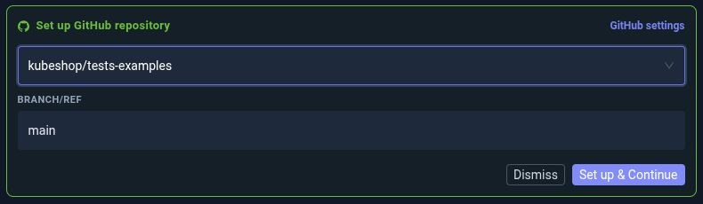
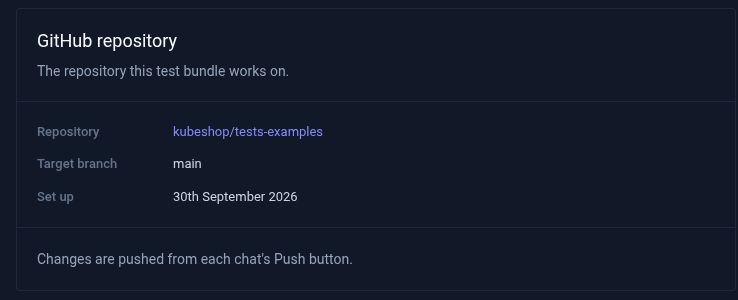
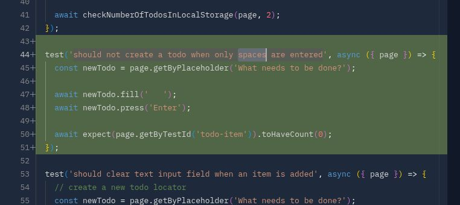
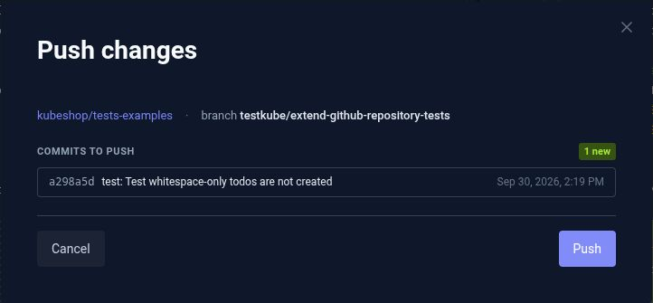

# Work with a GitHub repository

Use AI Test Creation to extend tests in an existing GitHub repository. In this guide, you will import a repository into a Test Bundle, ask the AI to make a focused change, review and run the tests, and push the changes to a branch for a pull request.

The screenshots use the public [kubeshop/tests-examples](https://github.com/kubeshop/tests-examples) repository. Select a repository that your team owns or contributes to when following the guide. For a practice run, use a fork that your Testkube GitHub App can access.

## Before you start

You need:

- A Testkube plan or license that includes AI Test Creation, with the feature enabled for your organization and a Test Creation seat assigned if your organization requires one.
- Permission to create and update Test Bundles and run Test Workflows in your environment.
- A GitHub repository available through your organization's Testkube GitHub App connection. The app also needs repository write access when you push changes.
- A connected runner and access to the application, dependencies, and container images needed by your tests.

If GitHub is not connected yet, ask a Testkube organization Admin or Owner to follow [Connect a GitHub organization](/articles/github-app-auth#connect-a-github-organization). The GitHub App installation must include the repository you want to use. Self-hosted installations also need the [GitHub App configuration](/articles/github-app-auth#self-hosted--enterprise).

## 1. Start a repository-based test task

Open **Test Catalog** in the Testkube Dashboard. Describe what you want to do with your existing tests. For example:

```text
I want to extend tests in an existing GitHub repository. Help me select and
import the repository, then review its test structure and configuration.
Do not change files until we have agreed on a test to add.
```

Select **Create test**. Testkube creates a Test Bundle and opens a chat. Answer any clarification questions until the **Set up GitHub repository** card appears. If needed, ask the AI to show the repository picker.

## 2. Choose the repository and target branch

In the **Set up GitHub repository** card:

1. Search for and select your repository.
2. Check **Branch/ref**, which is filled with the repository's default branch when you select it. For this walkthrough, choose the branch you want the eventual pull request to target, such as `main`.
3. Select **Set up & Continue** and wait for the import to finish.



The repository's files become available in the **Navigator**. Ask the AI to identify the existing test framework, test directory, and command used to run the tests before making changes.

:::note Choose the repository before you start editing

Repository setup is fixed for the Test Bundle and cannot be changed later. Start a new bundle if you need a different repository or target branch.

The target branch is the starting point for your work and the destination for the pull request. Each chat has its own publishing branch; pushing your changes does not merge them into the target branch.

:::

For an existing bundle with the Navigator available, you can also open **Settings → GitHub repository**, choose **Repository** and **Target branch/ref**, and select **Set up repository**. Review and confirm the selection. Wait for any active chat in the bundle to finish before setting up the repository.

After setup, this section shows the repository and target branch for the bundle:



## 3. Ask for one focused change

Tell the AI which tests to extend and what behaviour to verify. Include the relevant directory when the repository contains several test projects.

For example, the `tests-examples` repository contains a Playwright TodoMVC project in `playwright/todomvc`. After reviewing it, you could ask:

```text
Extend the Playwright tests in playwright/todomvc.

Add a test that enters a todo containing only spaces, presses Enter,
and verifies that no todo item is created.

Follow the existing test structure and locator conventions. Keep the
existing tests and avoid unrelated changes. Create or update the Testkube
workflow needed to run this test, then run it in Chromium.
```

For your own repository, replace the directory and scenario with the behaviour you want to cover. Answer any questions about the application URL, test data, or workflow name in the same chat.

## 4. Review the changes and run the tests

Select the changed test file in the **Navigator**. When the original content is available, the file viewer shows a diff so you can inspect additions and removals. Newly created files appear as additions.



Check that the change:

- Tests the behaviour you requested with meaningful assertions.
- Follows the repository's existing fixtures, helpers, and naming conventions.
- Preserves existing coverage and avoids unrelated file changes.

Use the chat to request corrections. The file viewer is for reviewing the code; ask the AI to make edits.

The example prompt asks the AI to run the new test. Inspect **Execution Logs** and use **Open Workflow** to confirm the execution status. To run it again yourself, select **Run tests** and choose a runner if needed.

If the test fails, continue in the same chat:

```text
Inspect the latest failed execution, explain the cause, and fix it.
Keep the assertion that checks the requested behaviour. Run the test again
and show me the result.
```

Before pushing, also ask the AI to run the relevant existing tests and review those results. A passing new test alone does not establish that the rest of the suite still passes.

## 5. Push the changes to GitHub

Wait for the AI to finish, then select **Push changes** at the top of the bundle.

Review the repository, the chat's publishing branch, and the commits listed in the dialog. Testkube uses a branch with a `testkube/` prefix for the chat's work. Select **Push** to send the commits to GitHub.



If the dialog says that a GitHub owner must approve write access, ask an owner to approve the Testkube GitHub App's requested permission. After approval, select **Check again** in the dialog.

A successful push shows **Published** and the pushed commit. This saves the changes on the chat's GitHub branch; opening and merging the pull request are separate steps.

## 6. Open and review the pull request

Select **Open a pull request** in the push result. Testkube opens GitHub's comparison page with the target and publishing branches selected.

On GitHub:

1. Confirm the base branch is the target you chose during repository setup.
2. Review the changed files and commits.
3. Add a title and description, including what the tests cover and the execution results.
4. Create the pull request and follow your team's usual review and CI process.

If a pull request already exists for the chat's branch, the dialog shows its link and status instead. To address feedback while the pull request is open, continue in the same chat, review and run the updated tests, and push again to update that branch.

## If something blocks you

| What you see                                           | What to do                                                                                                                                             |
| ------------------------------------------------------ | ------------------------------------------------------------------------------------------------------------------------------------------------------ |
| The repository does not appear in the picker           | Check that its GitHub organization is connected and that the Testkube GitHub App installation includes the repository.                                 |
| Repository setup says a chat is still working          | Wait for that chat to finish, then retry setup.                                                                                                        |
| Push changes says there is no finished import          | Complete repository setup before trying to push.                                                                                                       |
| Push changes says you are not a participant            | Publish from a chat you created or have worked in. Organization administrator access alone does not grant permission to publish another person's chat. |
| The GitHub App is waiting for approval or is suspended | Ask a GitHub owner or administrator to resolve the state shown, then select **Check again**.                                                           |
| Every commit is already on the branch                  | Open the existing pull request or make and review another change before pushing again.                                                                 |

For organization-level connection problems, see [GitHub App troubleshooting](/articles/github-app-auth#troubleshooting). To automate the resulting workflow, see [GitHub Actions](/articles/github-actions) or [scheduling tests](/articles/scheduling-tests).

To start another task using the same repository setup, follow [Work with Test Bundles and multiple chats](/articles/ai-test-creation-test-bundles).
