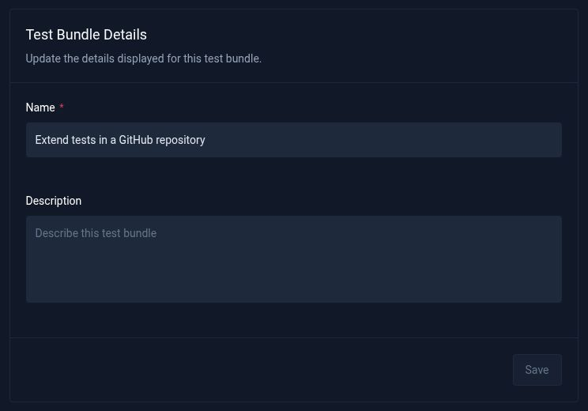
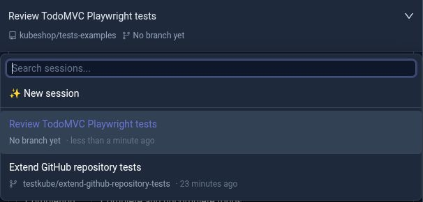
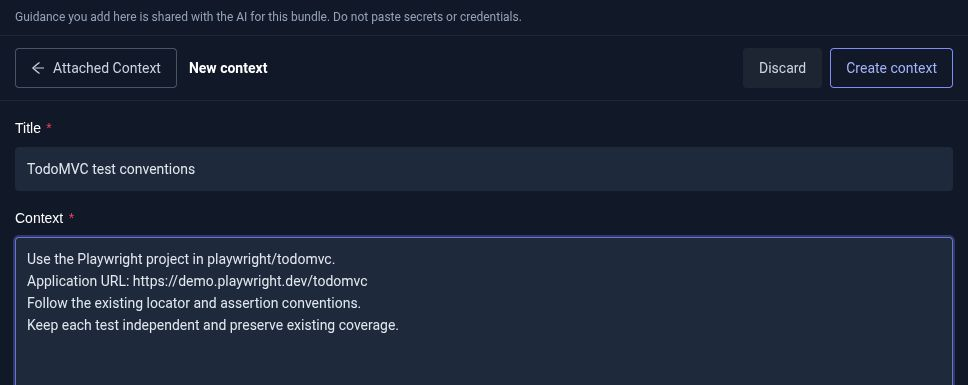

# Work with Test Bundles and multiple chats

A Test Bundle keeps related AI test creation work together. Use separate chats to explore another test case or review a different part of the same project, then return to an earlier chat when you want to continue its work.

In this guide, you will open an existing bundle, start a second chat, switch between tasks, and add guidance that both chats can use. The example continues with the public TodoMVC tests from [Work with a GitHub repository](/articles/ai-test-creation-github).

## Before you start

You need access to AI Test Creation and an existing Test Bundle in your environment. If you have not created one yet, follow [Create your first test with AI](/articles/ai-test-creation-getting-started) or the [GitHub repository guide](/articles/ai-test-creation-github).

The Dashboard calls chats **sessions** in the chat selector. Each session is a separate conversation within the bundle.

## 1. Open your Test Bundle

Open **Test Catalog** and select the bundle you want to continue working on. Check the bundle name at the top of the page and the selected chat above the conversation.

When the **Navigator** is available, open **Settings** to review the bundle's name, description, and GitHub repository configuration. Give the bundle a name that describes the project or test area, so you can find it again later.



Before starting another chat, decide how it relates to the work you already have:

| What you want to do                                                                                        | Where to work                           |
| ---------------------------------------------------------------------------------------------------------- | --------------------------------------- |
| Fix a failure, refine generated tests, or add coverage using files created in the current chat             | Continue in the same chat.              |
| Review another area or start an independent test task using the same repository setup                      | Start a new session in the same bundle. |
| Work on a different project, use a different repository or target branch, or keep a separate Test Workflow | Create a new bundle from Test Catalog.  |

Repository setup is fixed for a bundle. Starting another chat does not let you select a different repository or target branch.

## 2. Start a second chat

Open the session selector above the conversation and choose **New session**. Wait for the new chat to open, then describe one focused task.

For the TodoMVC repository example, start with a review:

```text
Review the Playwright TodoMVC tests in playwright/todomvc and suggest one
useful test case to add next. First inspect the files available in this chat.
Do not change files, update the workflow, run tests, or push to GitHub.
```

The new chat starts with an empty conversation. You do not need to import the repository again. Include the relevant test directory and requirements in your request, even if you discussed them in another chat.

Once the AI replies, review its findings before asking it to implement a change. Keep follow-up questions about that task in this chat.

:::note A new chat has its own working files

A new session does not copy the previous chat's edits or conversation. For a GitHub-backed bundle, it starts from the configured target branch, using the bundle's saved repository state if the branch cannot be refreshed. Existing chats keep their own files when you switch between them.

To extend tests you just generated, continue in the chat that created them. This also applies to bundles created without a GitHub repository: opening a new session does not bring across another chat's generated files.

:::

## 3. Switch between tasks

Open the session selector again. You should see both the original chat and your new review chat.



Select the original chat to return to its conversation and working files. Select the review chat to continue that task. Use **Search sessions...** to find a conversation as the bundle grows.

For bundles connected to GitHub, the selector also shows each chat's publishing branch. A discussion-only chat can show **No branch yet**; the branch is allocated when the AI completes a file-changing task. Later changes in that chat use the same publishing branch.

For example, the screenshot shows one chat with a `testkube/` branch and a second chat that has only reviewed the repository. Switching between them does not combine their changes.

## 4. Add guidance for all chats

Put reusable project guidance in **Attached Context**, so it is available to AI authoring work across the bundle. Keep requests for a particular change in that change's chat.

In the **Navigator**:

1. Select **Attached Context**.
2. Select **Create context**.
3. Enter a title and the guidance you want to reuse.
4. Select **Create context** to save it.

For example, use the title `TodoMVC test conventions` and this context:

```text
Use the Playwright project in playwright/todomvc.
Application URL: https://demo.playwright.dev/todomvc
Follow the existing locator and assertion conventions.
Keep each test independent and preserve existing coverage.
```



Switch to the other chat and open **Attached Context** again. The same saved entry is available there. You can edit the entry as your conventions change; the updated guidance is used for subsequent AI authoring work. Do not put secrets or credentials in context entries.

Attached Context supplies guidance. It does not copy test files or another chat's conversation into the selected chat.

## 5. Review and run the selected chat's work

When you are ready to implement a suggestion, continue in that chat and ask for the specific change. Review the resulting files in the **Navigator**, then run the tests and inspect **Execution Logs**.

Before running or publishing, check the selected chat and its files. Use **Open Workflow** to inspect the bundle's Test Workflow and execution history.

:::note The Test Workflow is shared

Chats in a bundle have separate working files and publishing branches, but use the same Test Workflow. A workflow configuration change made from one chat affects the bundle. Coordinate changes to the test command, container image, and execution settings across your tasks.

Use separate bundles when tasks need independently managed workflows.

:::

For GitHub-backed work, select **Push changes** from the chat whose changes you want to publish. Check its branch and commit list before pushing. Follow the [GitHub guide](/articles/ai-test-creation-github#5-push-the-changes-to-github) to open or update a pull request. Each chat publishes its own changes; pushing one chat does not publish the other chats in the bundle.

## What belongs to the bundle or the chat?

| Belongs to the bundle                          | Belongs to each chat                              |
| ---------------------------------------------- | ------------------------------------------------- |
| Bundle name and description                    | Conversation and task-specific instructions       |
| Configured GitHub repository and target branch | Working files and changes                         |
| Attached Context entries                       | Publishing branch and commits                     |
| Test Workflow                                  | The task you continue when selecting that session |

You can now keep several focused conversations under one project, return to the work you want to extend, and maintain common guidance in one place.
