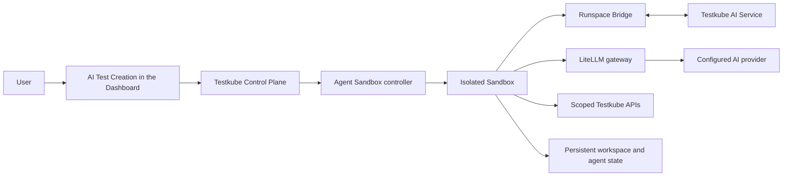

# AI Test Creation

AI Test Creation provides an isolated, persistent workspace where you can create, update, run, and save tests with an AI agent. Each session is connected to an environment called a **Sandbox**, where the agent can inspect files, make changes, and run tests while you review its progress in the Testkube Dashboard.

:::warning Early Access Program only

AI Test Creation is currently available only to customers accepted into the Testkube AI Early Access Program (EAP). [Apply for EAP access](https://testkube.io/eap).

:::

Some implementation identifiers still use `runspace`, including API fields, Helm values, generated resource names, and the Runspace Bridge component. This page uses **Sandbox** for the environment shown to users and preserves those implementation identifiers exactly where you need to configure or operate them.

:::info Agent sandboxing

AI Test Creation uses the open-source [Kubernetes SIGs agent-sandbox](https://github.com/kubernetes-sigs/agent-sandbox) project to create and manage the isolated Kubernetes Sandbox where each AI agent runs. The Testkube Helm chart installs the agent-sandbox controller and connects its lifecycle to AI Test Creation sessions.

:::

## How AI Test Creation works

### Session flow



When you start an AI Test Creation session:

1. The Testkube Control Plane creates the session and provisions a Sandbox for it.
2. The Agent Sandbox controller creates the isolated Kubernetes workload and its persistent storage.
3. The Runspace Bridge opens an authenticated outbound connection to the Testkube AI Service and starts the AI agent inside the Sandbox.
4. The agent examines the test files, updates the workspace, and runs tools or tests in that environment.
5. Model requests go through the LiteLLM gateway to the configured AI provider. The Sandbox uses its own limited model-access key rather than the provider credential.
6. For a TestBundle, the Sandbox can use a workflow-scoped Testkube token to update and run the workflow associated with that bundle.
7. Testkube can checkpoint an idle session and remove its active workload. When the session is resumed, a replacement Sandbox restores the saved workspace.

Each session has one active Sandbox. When you resume a session, Testkube may create a new Sandbox and restore the files from its checkpoint.

### Main components

| Component                                                                        | Responsibility                                                                                                                            |
| -------------------------------------------------------------------------------- | ----------------------------------------------------------------------------------------------------------------------------------------- |
| **AI Test Creation UI**                                                          | Provides the chat, file navigation, test output, and session controls in the Testkube Dashboard.                                          |
| **Testkube Control Plane**                                                       | Owns session metadata and lifecycle, provisions Sandboxes, issues scoped credentials, and coordinates checkpoints and cleanup.            |
| **[Agent Sandbox](https://github.com/kubernetes-sigs/agent-sandbox) controller** | Trusted cluster infrastructure that creates and manages the Kubernetes workloads and storage used by Sandboxes.                           |
| **Sandbox**                                                                      | The isolated environment where the AI agent reads and changes files and runs tools or tests.                                              |
| **Runspace Bridge**                                                              | Maintains the authenticated connection between a Sandbox and the AI Service and carries agent events and workspace operations.            |
| **Testkube AI Service**                                                          | Coordinates the AI Test Creation conversation and communicates with the agent running in the Sandbox.                                     |
| **[LiteLLM](https://docs.litellm.ai/) gateway**                                  | Routes model requests, applies model selection and per-Sandbox limits, and keeps provider credentials outside Sandboxes.                  |
| **Persistent storage**                                                           | Holds workspace files and private agent state so the session can be checkpointed or resumed according to the configured retention policy. |

The component responsibilities and Sandbox isolation boundary are the same in Testkube Cloud and Testkube On-Prem. The Sandbox is the primary security boundary for a session and is separate from the Testkube Control Plane, Agent Sandbox controller, and other Sandboxes. See [Secure AI Sandbox configuration](#secure-ai-sandbox-configuration) for the controls that enforce this boundary on-prem.

## Install AI Test Creation on Testkube On-Prem

On an on-prem installation, the Testkube Enterprise Helm chart installs and connects the AI Service, an internal LiteLLM gateway, the Agent Sandbox controller, and the Sandbox runtime.

:::info Version availability

You need Testkube Enterprise **2.13 or later**, with AI Test Creation included in your Enterprise license. If you are not sure whether your license includes AI Test Creation, contact your Testkube account representative or [Testkube Support](https://testkube.io/contact) before installation.

:::

## Before you enable AI Test Creation

Confirm the following requirements:

- There is only one AI Test Creation-enabled Enterprise release in the Kubernetes cluster. The Agent Sandbox CRDs are cluster-scoped and its controller has cluster-wide ownership; an install or upgrade preflight rejects a second active owner.
- The cluster meets the [base installation requirements](/articles/install/install-with-helm#prerequisites), has a default `StorageClass` or an explicitly configured one, and uses a CNI that enforces Kubernetes `NetworkPolicy` resources.
- One supported PostgreSQL path is configured: the bundled PostgreSQL chart, the CloudNativePG cluster, or an external PostgreSQL database for LiteLLM.
- The cluster can reach an OpenAI or OpenAI-compatible inference endpoint.
- Your registry policy allows all [eight AI Test Creation image repositories](#private-registry-and-air-gapped-installations), including images used by Helm hook jobs and dynamically created Sandboxes.

The chart creates a dedicated Sandbox namespace. Its generated name is `<release-name>-runspaces` by default. The Agent Sandbox controller uses a separate controller namespace. Only one Agent Sandbox controller can manage the cluster.

## Minimal configuration

Create a Secret containing your OpenAI API key in the same namespace as the Enterprise release:

```bash
kubectl create secret generic testkube-ai-test-creation-provider \
  --namespace testkube \
  --from-literal=OPENAI_API_KEY='<openai-api-key>'
```

Add the feature switch and one default model to your Enterprise values:

```yaml title="values.yaml"
global:
  testAuthoring:
    enabled: true
  ai:
    inference:
      defaults:
        secretRef: testkube-ai-test-creation-provider
        secretRefKey: OPENAI_API_KEY
      agent:
        - model: <model-id>
          default: true
```

Then install or upgrade the existing Enterprise release:

```bash
helm upgrade --install \
  --namespace testkube \
  --create-namespace \
  --values values.yaml \
  testkube \
  oci://us-east1-docker.pkg.dev/testkube-cloud-372110/testkube/testkube-enterprise \
  --version <chart-version>
```

`global.testAuthoring.enabled: true` is the single AI Test Creation installation switch. It enables and connects the AI Test Creation backend and UI, AI Service, internal LiteLLM gateway, Agent Sandbox controller, Runspace Bridge, required RBAC, namespace isolation, and lifecycle cleanup. You do not need to enable those components separately.

The chart validates the configuration before install and upgrade. Inline `apiKey` values are rejected. Keep credentials in a Kubernetes Secret and use `secretRef` and `secretRefKey`.

### Selecting a provider model

AI Test Creation initially supports OpenAI and OpenAI-compatible endpoints. Add one model under `global.ai.inference.agent` and mark it with `default: true`.

Although `default: true` is optional when the list contains only one model, setting it explicitly makes the intended default clear. If you configure multiple models, exactly one of them must have `default: true`.

Every entry requires `model`. The chart does not silently choose a provider model for you.

For an OpenAI-compatible endpoint, set an absolute HTTP or HTTPS URL and provide the provider's model identifier:

```yaml title="values.yaml"
global:
  testAuthoring:
    enabled: true
  ai:
    inference:
      defaults:
        secretRef: testkube-ai-test-creation-provider
        secretRefKey: OPENAI_API_KEY
        url: https://llm.example.com/v1
      agent:
        - model: <provider-model-id>
          default: true
          litellm:
            inputCostPerToken: 0.000001
            outputCostPerToken: 0.000004
```

The default per-Sandbox virtual-key budget is `1` provider currency unit. When a custom endpoint is used with a positive budget, both `litellm.inputCostPerToken` and `litellm.outputCostPerToken` are required and must be finite, non-negative numbers. If you cannot provide pricing and accept having no spend budget, set `global.testAuthoring.litellm.virtualKey.maxBudget: 0`.

## PostgreSQL configuration

The internal LiteLLM gateway for AI Test Creation requires PostgreSQL. Use exactly one of these paths:

1. `postgresql.enabled: true` for the bundled PostgreSQL chart.
2. `postgresqlCluster.enabled: true` for the CloudNativePG-managed cluster.
3. `global.testAuthoring.litellm.database.existingSecret` for an external database.

When a chart-managed PostgreSQL server is enabled, the installation hooks create a dedicated `litellm` role and database and run the LiteLLM schema migrations. The application does not receive the PostgreSQL administrator credentials.

### External PostgreSQL

Create a dedicated database and principal with permission to create and migrate the LiteLLM schema. Store its complete PostgreSQL DSN in a Secret:

```bash
kubectl create secret generic testkube-ai-test-creation-litellm-db \
  --namespace testkube \
  --from-literal=DATABASE_URL='<postgresql-dsn>'
```

Reference it from the chart:

```yaml title="values.yaml"
global:
  testAuthoring:
    enabled: true
    litellm:
      database:
        existingSecret: testkube-ai-test-creation-litellm-db
        existingSecretKey: DATABASE_URL
```

The preflight opens a read-only connection to validate the DSN. The migration job then requires write access to its own database or schema. URL-encode reserved characters in the username and password. For TLS, use the appropriate PostgreSQL `sslmode`; `verify-full` provides certificate and hostname verification.

## Custom certificate authorities

Place the PEM-encoded CA bundle in a Secret in the Enterprise release namespace:

```bash
kubectl create secret generic enterprise-ca \
  --namespace testkube \
  --from-file=ca.crt=./enterprise-ca.pem
```

Configure the global CA reference:

```yaml title="values.yaml"
global:
  customCaSecretRef: enterprise-ca
  customCaSecretKey: ca.crt
```

The chart mounts this CA for the AI Service, the LiteLLM provider connection, and the database preflight and migration jobs. A custom CA establishes trust; it does not add NetworkPolicy egress to a private endpoint.

## Secure AI Sandbox configuration

Each AI Test Creation session runs in a dedicated Sandbox in `<release-name>-runspaces` by default. The chart creates the namespace, security labels, NetworkPolicies, resource limits, a tokenless ServiceAccount, and the RBAC required to provision Sandboxes.

Before using AI Test Creation with sensitive code or data, confirm that your cluster enforces Kubernetes `NetworkPolicy` resources and Pod Security Admission. Use an encrypted `StorageClass` for Sandbox PVCs and limit administrative access to the Sandbox and Agent Sandbox controller namespaces.

### Pod and container isolation

Every Sandbox pod is created with the following controls:

- It runs as non-root user and group `10001`.
- Privileged mode and privilege escalation are disabled.
- All Linux capabilities are dropped.
- The container root filesystem is read-only.
- Host networking, host PID, and host IPC access are disabled.
- The `runspace-sandbox` ServiceAccount does not mount a Kubernetes API token.
- Kubernetes service environment variables are disabled.
- Writable paths are limited to the workspace and private agent-state PVCs, plus size-limited `emptyDir` volumes for `/tmp`, `/home/runspace`, and `/dev/shm`.

The chart also creates a `LimitRange` that caps each Sandbox container at 2 CPUs, 4 GiB of memory, and 10 GiB of ephemeral storage. It does not create a namespace `ResourceQuota`. Add a `ResourceQuota` appropriate for your expected number of concurrent sessions so Sandboxes cannot exhaust cluster-wide CPU, memory, storage, or PVC capacity.

### Seccomp and Pod Security

By default, the Sandbox namespace enforces the Kubernetes `baseline` Pod Security level and audits and warns against `restricted`. The other pod and container protections listed above remain enabled.

To apply the container runtime's `RuntimeDefault` seccomp profile and enforce the `restricted` Pod Security level, enable:

```yaml title="values.yaml"
global:
  testAuthoring:
    runspace:
      seccompProfileEnabled: true
```

Enable this for production after testing the browser and other tools used by your AI Test Creation sessions. Some browser runtimes create Linux user namespaces and may require syscalls blocked by the runtime's default seccomp profile. If that happens, keep this setting disabled until you have a compatible runtime profile; do not remove the non-root, read-only filesystem, capability, or privilege-escalation controls.

The Agent Sandbox controller is separate from user Sandboxes. Its namespace enforces `restricted` Pod Security, and its pod runs non-root with `RuntimeDefault` seccomp, a read-only root filesystem, no privilege escalation, and all capabilities dropped. The controller requires its Kubernetes API token and cluster-scoped RBAC to create and manage Sandbox resources. Do not bind users or Sandbox ServiceAccounts to the controller's roles.

### Network isolation and egress

The chart creates namespace-wide and per-Sandbox default-deny policies for both ingress and egress. A generated policy for each Sandbox allows only:

- DNS over TCP and UDP port 53 to cluster DNS.
- The internal AI Service over TCP port 9091.
- The internal LiteLLM gateway over TCP port 4000.
- The in-cluster Testkube API over its application port.
- HTTP and HTTPS to public IPv4 destinations, excluding private, loopback, link-local, carrier-grade NAT, documentation, multicast, and other special-purpose ranges.

No inbound connection to a Sandbox is allowed by the generated policy. This boundary is effective only when the cluster CNI enforces Kubernetes NetworkPolicy.

Public HTTP and HTTPS egress is enabled so AI Test Creation tools can reach package registries, source repositories, and test targets. Add sensitive public destinations to `deniedEgressCIDRs`. If a Sandbox must reach a private provider, proxy, repository, or test endpoint, add only the required IPv4 CIDRs to `additionalEgressCIDRs`:

```yaml title="values.yaml"
global:
  testAuthoring:
    runspace:
      deniedEgressCIDRs:
        - <blocked-public-ip-or-cidr>
      networkPolicy:
        additionalEgressCIDRs:
          - <private-endpoint-ip-or-cidr>
```

Additional private CIDRs are opened only on TCP ports 80 and 443. Both settings currently support IPv4 CIDRs only. Keep the ranges narrow and verify access from a real Sandbox.

If your cluster DNS does not use the standard `kube-system` and `k8s-app: kube-dns` labels, set its IPv4 address explicitly with `global.testAuthoring.runspace.clusterDNS`. This adds only that address to the DNS egress rule.

Kubernetes NetworkPolicies are additive. Adding another policy cannot remove egress already allowed by the generated Sandbox policy. If your security policy requires a strict destination allowlist instead of public web egress with exclusions, enforce that boundary with your CNI, an egress gateway or proxy, or a cluster firewall.

### Credentials and Sandbox key isolation

The OpenAI provider key remains in the Enterprise release namespace and is used by the internal LiteLLM gateway. It is not copied into Sandbox pods. Each Sandbox receives its own LiteLLM virtual key, restricted to the selected model and configured with a spend budget and request and token rate limits. The LiteLLM administrator key is available only to the Control Plane API.

Each Sandbox also receives a dedicated bootstrap Secret containing its connection credential and LiteLLM virtual key. A TestBundle-bound Sandbox also receives a Testkube API token scoped to its organization, environment, and workflow. The Secret is referenced by the pod rather than embedded in the SandboxTemplate and is deleted with the Sandbox resources. The Sandbox ServiceAccount itself remains tokenless.

Review the per-Sandbox key limits for your environment:

```yaml title="values.yaml"
global:
  testAuthoring:
    litellm:
      virtualKey:
        maxBudget: 1
        rpmLimit: 30
        tpmLimit: 200000
```

Delete Sandboxes through Testkube instead of deleting only Kubernetes objects. The application deletion path revokes the Testkube API token, removes the backing Sandbox resources, and requests deletion of the LiteLLM virtual key as one lifecycle operation. Monitor Control Plane logs for failed key revocations; Sandbox virtual keys do not expire automatically, so a LiteLLM outage during cleanup can leave a key active until it is removed operationally.

The chart generates stable random bootstrap, LiteLLM administrator, LiteLLM encryption, and database credentials when existing Secrets are not supplied. These Secrets are retained across Helm uninstall. In production, back them up or manage them with your existing secret-management process by setting `global.testAuthoring.bootstrapSecret.existingSecret` and the corresponding `global.testAuthoring.litellm.*.existingSecret` values. Do not rotate the LiteLLM administrator key or encryption salt without a coordinated migration.

### Storage, cleanup, and capacity

Sandboxes use a 5 GiB `ReadWriteOnce` workspace PVC and a 1 GiB `ReadWriteOnce` private agent-state PVC by default. Configure `global.testAuthoring.runspace.storageClass` to use a class with encryption, access controls, and a reclaim policy that matches your data-retention requirements.

Idle Sandboxes are checkpointed and removed after 24 hours by default. Shorten `global.testAuthoring.runspace.cleanup.idleTTL` if your policy requires a smaller window for active credentials and writable environments. Coordinate this with checkpoint, backup, and PVC retention requirements so cleanup does not remove data that users expect to resume.

For a production installation, review at least these settings together:

```yaml title="values.yaml"
global:
  testAuthoring:
    runspace:
      storageClass: <encrypted-storage-class>
      seccompProfileEnabled: true
      cleanup:
        idleTTL: 8h
      deniedEgressCIDRs:
        - <blocked-public-ip-or-cidr>
      networkPolicy:
        additionalEgressCIDRs:
          - <required-private-endpoint-ip-or-cidr>
    litellm:
      virtualKey:
        maxBudget: 1
        rpmLimit: 30
        tpmLimit: 200000
```

Omit `additionalEgressCIDRs` when Sandboxes do not need private network access. Replace all placeholders before installing; invalid CIDRs or a nonexistent `StorageClass` prevent the environment from working correctly.

## Private registry and air-gapped installations

The general [image inventory](/articles/inventory/images) covers the complete Enterprise installation. Enabling AI Test Creation adds or exercises these eight repositories:

| Image used by AI Test Creation             | Default source reference                                                                                                                                       | Override values                                                                                                                                     |
| ------------------------------------------ | -------------------------------------------------------------------------------------------------------------------------------------------------------------- | --------------------------------------------------------------------------------------------------------------------------------------------------- |
| Control Plane API and Sandbox provisioning | `docker.io/kubeshop/testkube-enterprise-api:<VERSION>`                                                                                                         | `testkube-cloud-api.image.registry`, `.repository`, `.tag`, `.digest`                                                                               |
| API database migration job                 | `docker.io/kubeshop/testkube-migration:<VERSION>`                                                                                                              | `testkube-cloud-api.migrationImage.registry`, `.repository`, `.tag`, `.digest`                                                                      |
| AI Service                                 | `docker.io/kubeshop/testkube-ai-copilot:<VERSION>`                                                                                                             | `testkube-ai-service.image.registry`, `.repository`, `.tag`, `.digest`                                                                              |
| Runspace bridge                            | `docker.io/kubeshop/testkube-runspace-bridge:<VERSION>`                                                                                                        | `global.testAuthoring.runspace.bridge.image.repository`, `.tag`, `.digest`, `.pullPolicy`                                                           |
| LiteLLM                                    | `ghcr.io/berriai/litellm-database@sha256:16fc9e92b7d1e5e78b892fb37663d80abf575b8af6865eac17358327eb6a1f8f`                                                     | `global.testAuthoring.litellm.image.registry`, `.repository`, `.tag`, `.digest`; `litellm.image.pullPolicy`                                         |
| PostgreSQL bootstrap and migration tools   | `docker.io/kubeshop/testkube-postgres:18.3`                                                                                                                    | `litellm.postgresToolsImage.registry`, `.repository`, `.tag`, `.digest`, `.pullPolicy`                                                              |
| Agent Sandbox controller                   | `registry.k8s.io/agent-sandbox/agent-sandbox-controller@sha256:c2e75539c8c6ac50075cf190cc2ab50e653482e05cba5770a015d469d97e6a4d`                               | `global.testAuthoring.agentSandbox.image.registry`, `.repository`, `.tag`, `.digest`; `agentSandbox.image.pullPolicy`                               |
| Kubernetes hook helper                     | `docker.io/kubeshop/testkube-kubectl:1.35.4` and `docker.io/kubeshop/testkube-kubectl@sha256:ecaef65c1f671e3e053f6982e77c85652228a0d546b247037364579aa61c2ab6` | `global.testAuthoring.agentSandbox.ownershipPreflight.image.*`, `sharedSecretGenerator.image.*`; `agentSandbox.ownershipPreflight.image.pullPolicy` |

`<VERSION>` must match the application version packaged by your selected Enterprise chart.
