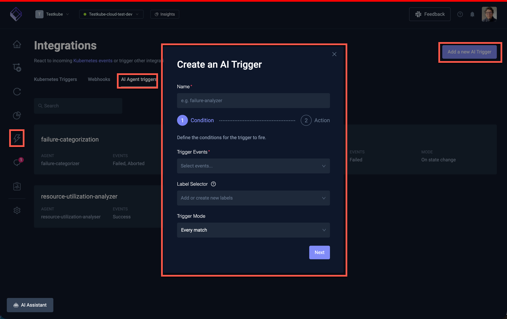
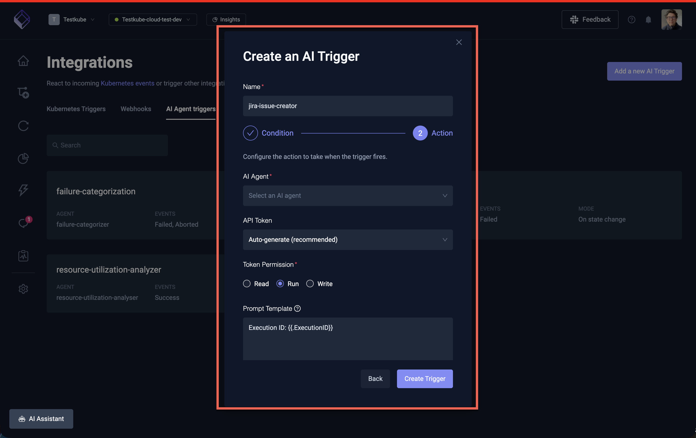
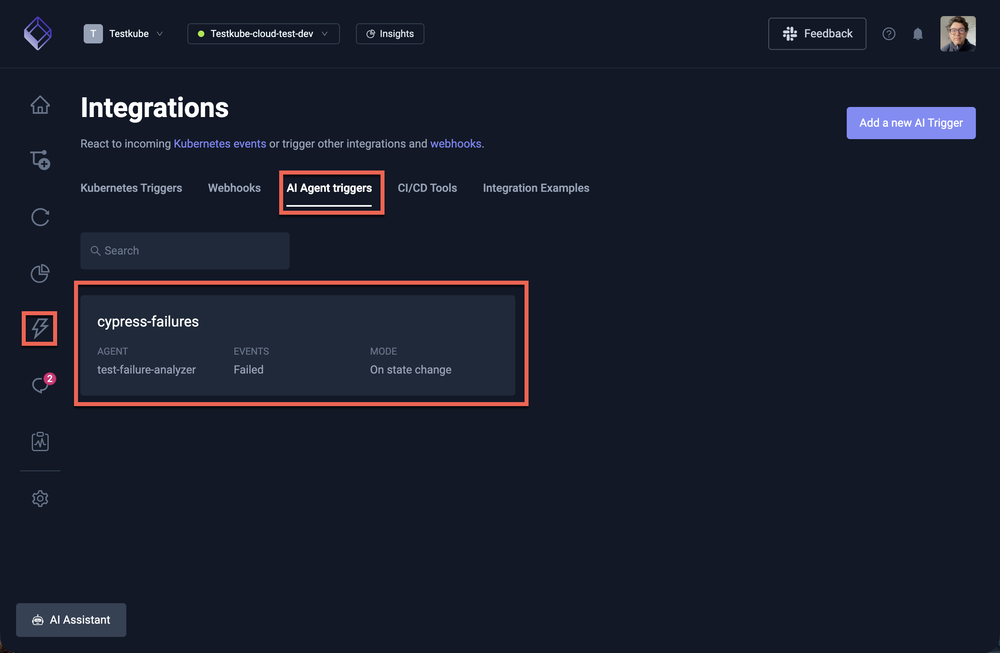
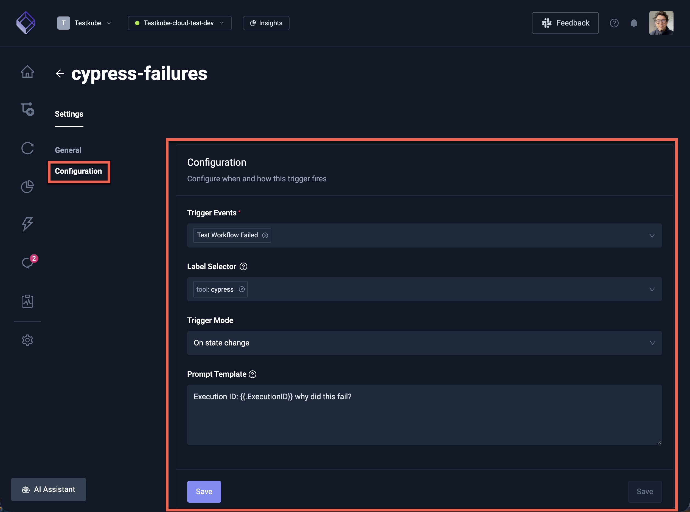
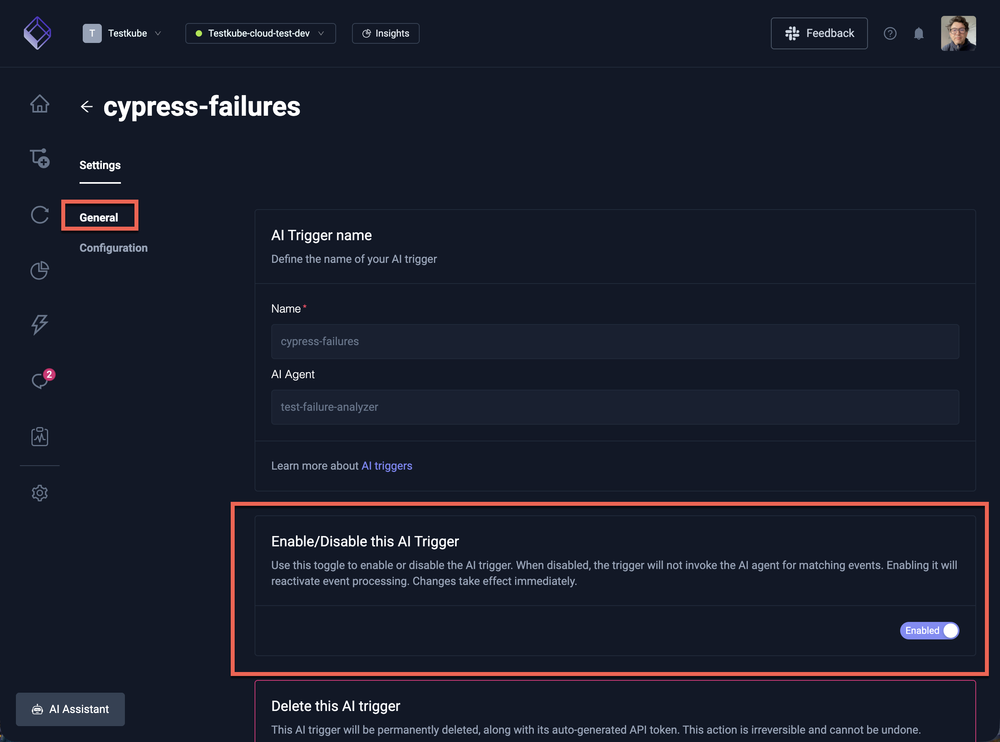

# AI Agent Triggers

AI Agent Triggers allow you to automatically run AI agents in response to workflow execution events — for example,
triggering failure analysis when a test fails, or running a release readiness check when all tests pass.

Triggers turn AI agents from interactive chat assistants into **automated pipeline components** that react to 
events in your testing infrastructure without human intervention.

## How Triggers Work

When a Test Workflow execution finishes, Testkube evaluates all enabled triggers in the environment:

1. **Event matching** — the execution's final status (failed, passed, aborted, canceled) is compared against the trigger's configured events.
2. **Label selector** — if the trigger has a label selector, the workflow's labels must match. An empty selector matches all workflows.
3. **Trigger mode** — determines whether the trigger fires on every match or only on state changes.
4. **Session creation** — if all conditions match, Testkube creates a new AI agent session with the rendered prompt template and starts it automatically.

The resulting session appears in the AI Agent Chats list and can be monitored or continued interactively.

## Creating a Trigger

Navigate to **Integrations → AI Triggers** in the Testkube Dashboard and click **Create new trigger** which will start a two-step wizard to configure the trigger.

### Step 1 - Basic Configuration




| Field | Description | Required |
|-------|-------------|----------|
| **Name** | A unique name for the trigger (must be a valid Kubernetes resource name) | Yes |
| **Trigger Events** | Which execution outcomes activate the trigger | Yes |
| **Label Selector** | Filter which workflows can activate the trigger based on their labels | No |
| **Trigger Mode** | When to fire: every match or only on state changes | Yes |

#### Trigger Events

Select one or more events that should activate the trigger:

| Event | Fires when |
|-------|------------|
| **Test Workflow Failed** | A workflow execution finishes with a `failed` status |
| **Test Workflow Success** | A workflow execution finishes with a `passed` status |
| **Test Workflow Aborted** | A workflow execution is aborted |
| **Test Workflow Canceled** | A workflow execution is canceled |

:::tip
The most common setup is triggering on **Test Workflow Failed** to automatically analyze failures.
You can select multiple events — for example, both Failed and Aborted.
:::

#### Label Selector

The label selector filters which workflows can activate the trigger. Only workflows whose labels match the
selector will fire the trigger.

- Leave empty to match **all workflows** in the environment
- Use label key-value pairs to target specific workflows (e.g. `suite=smoke`, `team=payments`)
- Multiple labels are combined with AND logic — all must match

**Examples:**
- `suite=critical` — only trigger for workflows labeled with `suite=critical`
- `team=backend, type=api` — only trigger for backend team API test workflows
- *(empty)* — trigger for all workflows

#### Trigger Mode

| Mode | Behavior |
|------|----------|
| **Every match** | Fires every time a matching event occurs. Use this when you want analysis on every failure regardless of history. |
| **On state change** | Fires only when the execution status differs from the previous execution of the same workflow. For example, if a workflow goes from passing to failing, or from failing to passing. Use this to avoid repeated triggers for workflows that are consistently failing. |

:::note
**On state change** compares the current execution's status against the most recent previous finished execution
of the same workflow. The first execution of a workflow is always considered a state change.
:::


### Step 2 - Agent, Prompt Template & API Token



| Field | Description | Required |
|-------|-------------|----------|
| **Name** | A unique name for the trigger (must be a valid Kubernetes resource name) | Yes |
| **AI Agent** | The AI agent to run when the trigger fires | Yes |
| **API Token** | The API token to use for authentication when the trigger fires | Yes |
| **Prompt Template** | Instructions sent to the agent, with template variables for execution context | No |

#### Trigger API Tokens 

AI Agent Triggers require an API token to authenticate the automatically created sessions. When creating a trigger,
Testkube generates a dedicated API token. This token is used internally to start the AI agent session
on behalf of the trigger. You can also use an existing API token by selecting it from the dropdown.

:::warning
If the API token associated with a trigger is deleted or expires, the trigger will stop firing. 
Check the trigger's API token configuration if sessions are not being created as expected.
:::


#### Prompt Template

The prompt template defines the instructions sent to the AI agent when the trigger fires. You can use
Go template variables to include execution context:

| Variable | Description | Example value |
|----------|-------------|---------------|
| `{{.WorkflowName}}` | Name of the workflow that was executed | `my-api-tests` |
| `{{.ExecutionName}}` | Name of the specific execution | `my-api-tests-42` |
| `{{.ExecutionID}}` | Unique ID of the execution | `6721a3b2...` |
| `{{.Status}}` | Final status of the execution | `failed` |

**Default template** (used when no custom template is provided):

```
Execution ID: {{.ExecutionID}}
```

**Custom template example** for a failure analysis trigger:

```
Analyze the failed execution of workflow {{.WorkflowName}}.
Execution ID: {{.ExecutionID}}
Status: {{.Status}}

Focus on identifying the root cause and suggest actionable fixes.
If the failure looks transient (flaky test, infrastructure issue), recommend a rerun.
```

## Example: Auto-Analyze Failed Tests

This example sets up a trigger that automatically runs the **Troubleshoot** agent whenever a critical test workflow fails.

1. Navigate to **Integrations → AI Triggers** and click **Create new trigger**
2. Configure:
   - **Name**: `analyze-critical-failures`
   - **AI Agent**: Select the **Troubleshoot** agent (or any failure analysis agent)
   - **Trigger Events**: Test Workflow Failed
   - **Label Selector**: `priority=critical`
   - **Trigger Mode**: Every match
   - **Prompt Template**:
     ```
     A critical test workflow has failed. Analyze execution {{.ExecutionID}} of {{.WorkflowName}} 
     and provide a root cause analysis with suggested fixes.
     ```
3. Click **Create Trigger**

Now whenever a workflow with the label `priority=critical` fails, the Troubleshoot agent will automatically
start a session analyzing the failure. You can find the resulting analysis in **AI Agents → Chats**.

## Example: State-Change Notifications

This example triggers analysis only when a workflow's status changes — for example, when a previously passing
workflow starts failing:

1. **Name**: `detect-new-failures`
2. **AI Agent**: Select your preferred analysis agent
3. **Trigger Events**: Test Workflow Failed
4. **Label Selector**: *(leave empty for all workflows)*
5. **Trigger Mode**: On state change
6. **Prompt Template**:
   ```
   Workflow {{.WorkflowName}} has changed state to {{.Status}}.
   This was previously passing. Analyze execution {{.ExecutionID}} to determine what changed.
   Check recent workflow definition changes and execution logs for the root cause.
   ```

This avoids generating repeated analysis sessions for workflows that are consistently failing.

## Scheduled AI Agent Triggers

AI Agent Triggers fire in response to workflow execution events — but what if you want to run an AI agent
on a **fixed schedule** (daily, weekly, etc.) rather than in response to a specific workflow's outcome?

Since triggers require a workflow execution event to fire, the pattern is to create a lightweight
**scheduler workflow** that runs on a cron schedule and exists solely to activate the trigger.

### Step 1: Create a Scheduler Workflow

Create a minimal workflow that completes immediately and carries a label identifying its purpose.
This workflow does no actual testing — it simply acts as a clock signal for the trigger.

```yaml title="ai-scheduler-daily.yaml"
kind: TestWorkflow
apiVersion: testworkflows.testkube.io/v1
metadata:
  name: ai-scheduler-daily
  labels:
    purpose: ai-scheduler
    schedule: daily
spec:
  events:
  - cronjob:
      cron: "0 8 * * *"
  steps:
  - name: noop
    shell: 'echo "AI agent scheduler tick"'
```

:::tip
You can create multiple scheduler workflows for different intervals — for example,
`ai-scheduler-weekly` with `cron: "0 8 * * 1"` (Mondays at 8am) or `ai-scheduler-hourly` with
`cron: "0 * * * *"`. Give each a distinct `schedule` label value so triggers can target the right one.

See [Scheduling Workflows](/articles/scheduling-tests) for more details on cron expressions and timezone
configuration.
:::

### Step 2: Create an AI Agent Trigger for the Schedule

Create a trigger that listens for the scheduler workflow's completion:

1. Navigate to **Integrations → AI Triggers** and click **Create new trigger**
2. Configure:
   - **Name**: `daily-health-audit` (or whatever describes the agent's task)
   - **AI Agent**: Select the agent you want to run on schedule (e.g. Environment Health Auditor)
   - **Trigger Events**: Test Workflow Success
   - **Label Selector**: `purpose=ai-scheduler, schedule=daily`
   - **Trigger Mode**: Every match
   - **Prompt Template**: The instructions for the scheduled run, for example:
     ```
     Produce a daily health report for this environment.
     Cover agent health, execution error rates for the last 24 hours,
     stuck executions, and workflows with declining health scores.
     ```
3. Click **Create Trigger**

The label selector `purpose=ai-scheduler, schedule=daily` ensures this trigger only fires for the
scheduler workflow — not for any of your actual test workflows.

### Reusing a Single Scheduler for Multiple Agents

You can attach multiple triggers to the same scheduler workflow. For example, if you want both a
health audit and a cost analysis to run daily:

- Create **one** scheduler workflow (`ai-scheduler-daily`) with labels `purpose=ai-scheduler, schedule=daily`
- Create **two** triggers, both with label selector `purpose=ai-scheduler, schedule=daily`, each pointing to a different agent with its own prompt template

Both agents will be triggered every time the scheduler workflow completes.

### Example: Weekly Compliance Audit

A complete example using this pattern for a weekly workflow standardization audit:

**Scheduler workflow:**

```yaml title="ai-scheduler-weekly.yaml"
kind: TestWorkflow
apiVersion: testworkflows.testkube.io/v1
metadata:
  name: ai-scheduler-weekly
  labels:
    purpose: ai-scheduler
    schedule: weekly
spec:
  events:
  - cronjob:
      cron: "0 9 * * 1"
      timezone: America/New_York
  steps:
  - name: noop
    shell: 'echo "Weekly AI agent scheduler tick"'
```

**Trigger configuration:**

- **Name**: `weekly-compliance-audit`
- **AI Agent**: Workflow Standardization agent
- **Trigger Events**: Test Workflow Success
- **Label Selector**: `purpose=ai-scheduler, schedule=weekly`
- **Trigger Mode**: Every match
- **Prompt Template**:
  ```
  Run a full compliance audit of all workflows in this environment.
  Check naming conventions, required labels (team, type), resource limits,
  timeouts, and artifact collection. Produce a compliance report with the
  overall compliance rate and a prioritized list of violations.
  ```

## Managing Triggers

### Viewing Triggers

All triggers are listed at **Integrations → AI Triggers**. Each trigger card shows:
- The trigger name and enabled/disabled status
- The linked AI agent
- The configured events (Failed, Success, Aborted, Canceled)
- The trigger mode (Every match or On state change)



Selecting a trigger will open the trigger details panel, where you can see the trigger's configuration and edit it.



### Enabling and Disabling

Click on a trigger to open its details, where you can toggle the **Enabled** switch. Disabled triggers
are not evaluated and will not fire.



### API Token Requirement

AI Agent Triggers require an API token to authenticate the automatically created sessions. When creating a trigger,
Testkube generates a dedicated API token. This token is used internally to start the AI agent session
on behalf of the trigger.

:::warning
If the API token associated with a trigger is deleted or expires, the trigger will stop firing. 
Check the trigger's API token configuration if sessions are not being created as expected.
:::

## Best Practices

- **Start with "On state change" mode** for general failure detection — this avoids flooding your AI agent chats
  with repeated analysis of the same broken workflow.
- **Use "Every match" mode** for critical workflows where you want analysis of every single failure, or for
  agents that take action (like the Smart Rerun agent).
- **Use label selectors** to scope triggers to specific workflow groups rather than triggering on everything.
  This keeps AI usage focused and costs manageable.
- **Customize prompt templates** to give the agent specific instructions relevant to your trigger scenario.
  Generic prompts produce generic analysis — specific prompts produce actionable insights.
- **Combine triggers with specialized agents** — for example, use the Troubleshoot agent for failure analysis,
  the Smart Rerun agent for automatic retries, or the Failure Categorizer for tagging failures.
