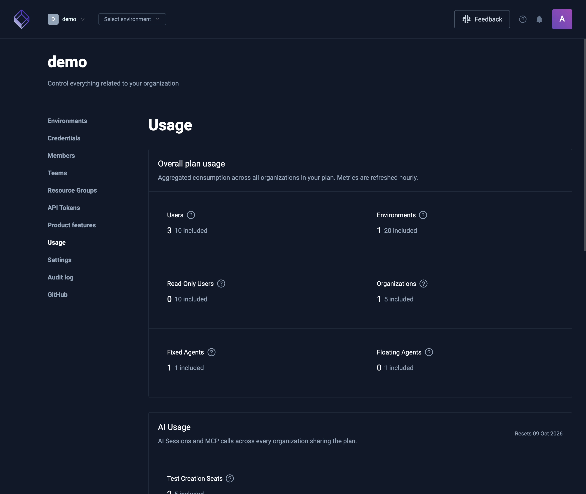
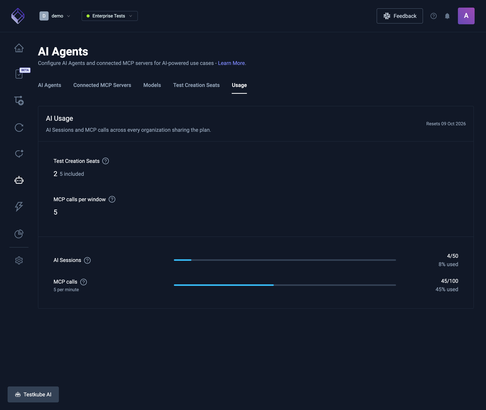
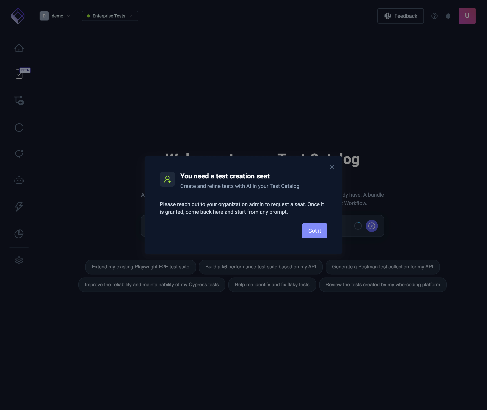
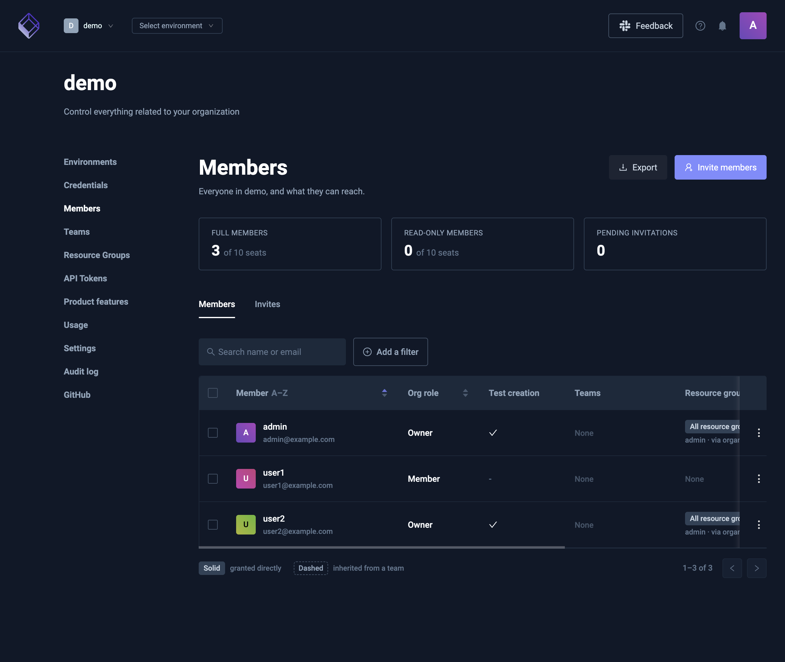
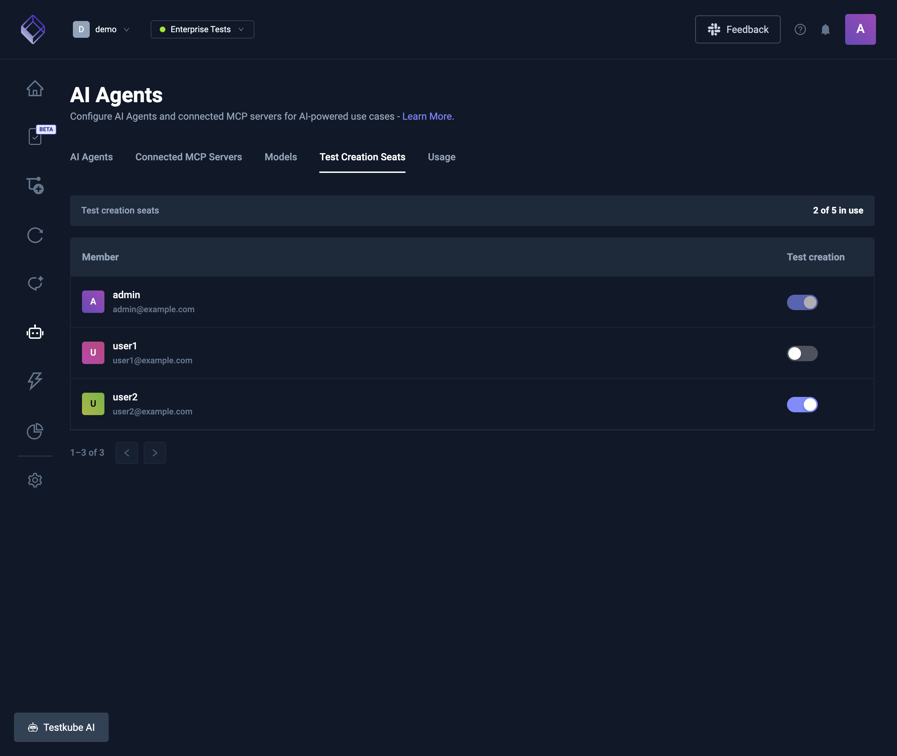
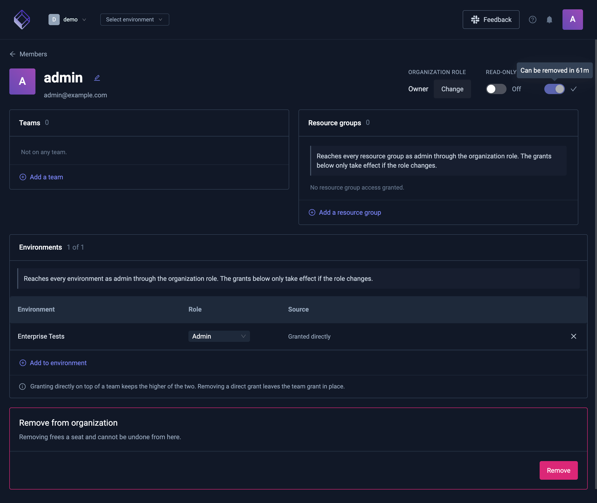
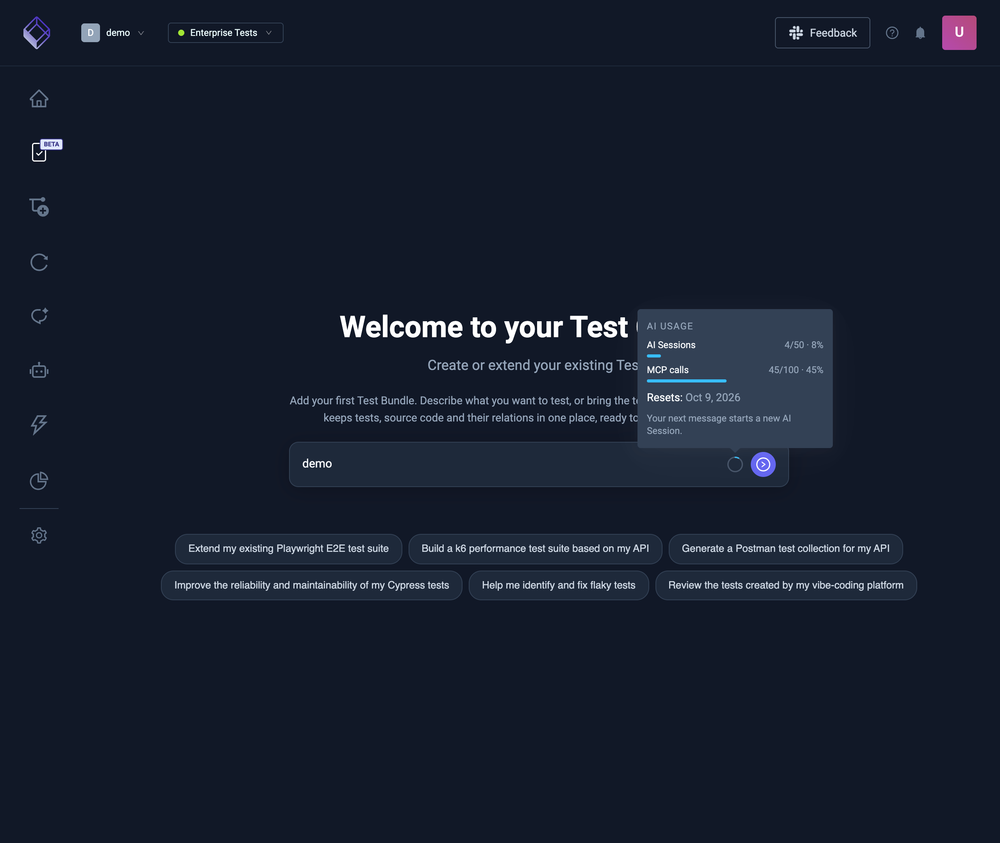

# AI usage, seats, and limits

Some plans meter AI. The dashboard is where you see the allowance, how much of it is used, and the switches that grant or remove a test creation seat. This page explains what those meters mean.

Allowances are part of the plan. They are not listed here, and they can differ from one plan to another. The usage page in your organization is the number that applies to you. Organizations that share a plan also share these allowances. When an allowance is unlimited, the page says so and that meter does not stop you. To change an allowance, [contact us](https://testkube.io/contact).

These seats are not the [full and read-only member seats](/articles/member-management). A person can be a member and still not have a test creation seat.

## Where to look

| What you want                                     | Where it is                                                                                              |
| ------------------------------------------------- | -------------------------------------------------------------------------------------------------------- |
| Who has a test creation seat                      | Organization management → **Members**. The **Test creation** column is a check or a dash                 |
| Grant or remove one person's seat                 | Open that member. **Test creation** is a switch                                                          |
| Grant or remove seats for the whole organization  | Environment → **AI Settings** → **Test Creation Seats**. Only people who can manage members see this tab |
| How many sessions the chat you have open has used | The ring on the chat header. Hover it for the period total                                               |
| Sessions, MCP calls, and seat count for the plan  | Organization management → **Usage & Billing** (labeled **Usage** on a self-hosted control plane)         |
| The same meters, next to agents and models        | Environment → **AI Settings** → **Usage**. This tab is there when the plan includes the AI add-on        |

The plan totals, including the AI usage block, are on **Usage & Billing**:

The same AI usage block is on **AI Settings** → **Usage**:

## Test creation seats

A test creation seat lets that person author tests: create and change tests in the Test Catalog, and use the authoring workspace that writes them. It does not change their organization role, and it does not by itself grant the AI assistant, workflow runs, or MCP access.

The catalog can be visible without a seat. Starting authoring without one asks for a seat. A member without a seat is told to request one from an organization admin. Someone who can manage members can grant a free seat from Members, or [contact us](https://testkube.io/contact) when every seat is taken.

One person holds one seat. The pool is shared by every organization on the plan. A check in the members table means the seat is on. A dash means it is off.

### Who can change a seat

- People who can manage members can change someone else's seat.
- An owner can change their own seat. An admin cannot.
- When the organization is managed by an identity provider through SCIM, the switch stays disabled. The identity provider owns the change.
- The **Test Creation Seats** tab is hidden from people who cannot manage members.

### Cooldown

Granting a seat is immediate. Taking it away is not. After a seat is granted, it stays on until a short hold ends. The switch tells you how long is left (for example, that it can be removed in a few minutes). Until then it cannot be revoked. The usual hold is one hour; the switch is the time that applies.

A full pool blocks new grants. It does not block removing a seat whose hold has already ended. After that revoke, the usage count updates and the freed seat can be given to someone else.

## AI sessions

An AI session is 15 minutes of continued use of one chat, not the chat itself.

- The first message in a chat opens a session.
- Further messages inside those 15 minutes do not open another.
- A message at or after 15 minutes from when the current window started opens a new session and counts again.
- A new chat always starts a new session.
- A long chat can therefore count as several sessions. Leaving a chat idle does not, by itself, open another one. The next message does, once the 15 minutes have passed.

The ring on the chat header is that chat's sessions. The usage page is the total for the plan during the current period, across every organization that shares the plan. Both show the date the period resets. When the allowance is used up, a new session is refused until the period resets or the allowance is raised. Messages that stay inside an already open window are not a new session.

## MCP calls

An MCP call is one tool call through the [hosted Testkube MCP endpoint](/articles/mcp-hosted). Connecting a client, listing tools, or chatting in the dashboard does not count. Tool use inside a dashboard chat counts as an [AI session](#ai-sessions), not as an MCP call.

There are two caps, and either one can stop a call:

- **This period.** How many tool calls the plan allows until the reset date on the usage page.
- **The rolling rate.** How many tool calls are allowed in a short window. The usage page states the window under **MCP calls** (for example, per minute). A burst can be refused while the period allowance still has room. The next call is allowed when that window has moved on.

A refused call does not consume a unit. The same counters cover every organization on the plan. On the usage block above, the rate is the line under **MCP calls**.

## Prices

What you pay, and how large each allowance is, lives on the plan. This page does not quote either. Read the allowance on **Usage & Billing**. When it says Unlimited, there is no cap on that meter. When it shows a count, that count is the cap until the reset date. Raising a cap, adding seats, or moving to a different plan is a conversation with Testkube, not a control in the dashboard.
