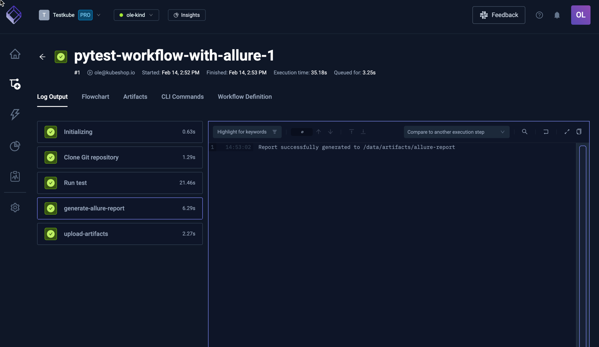
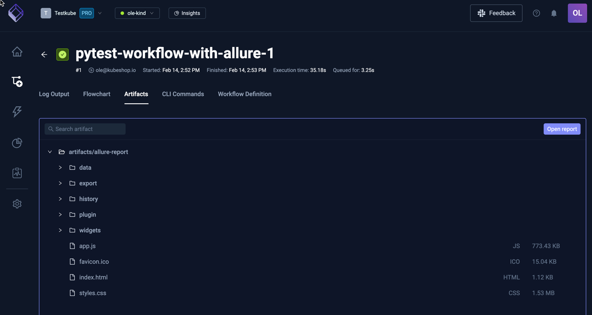
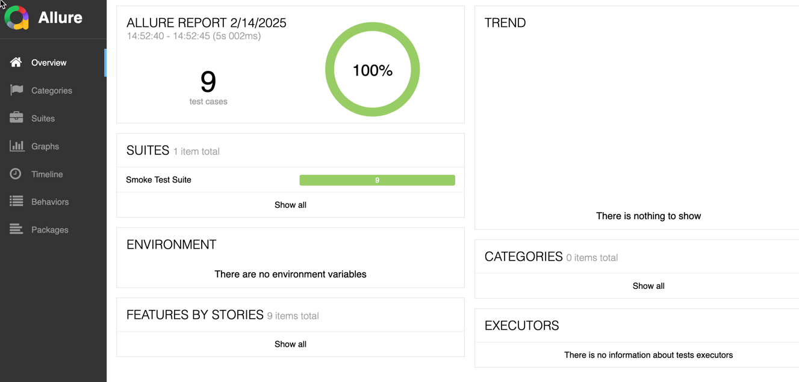

# Using Allure Reports in your Workflows

Allure Reports is a popular [open-source tool](https://github.com/allure-framework/allure2) for generating reports for individual test results, and 
can be easily added to any Test Workflow in Testkube to generate corresponding reports for your 
Tests Executions.

## PyTest Example

The below Workflow first runs tests with Pytest and then invokes Allure to generate corresponding reports.

```yaml
kind: TestWorkflow
apiVersion: testworkflows.testkube.io/v1
metadata:
  name: pytest-workflow-with-allure
  namespace: testkube-agent
  labels:
    core-tests: workflows
spec:
  content:
    git:
      uri: https://github.com/kubeshop/testkube
      revision: main
      paths:
      - test/pytest/pytest-project
  container:
    workingDir: /data/repo/test/pytest/pytest-project
    image: python:3.12.6-alpine3.20
    resources:
      requests:
        cpu: 256m
        memory: 256Mi
  steps:
  - name: Run test
    shell: |
      pip install -r requirements.txt
      mkdir /data/artifacts
      pytest tests/success --junit-xml=/data/artifacts/pytest-report.xml
  - name: generate-allure-report
    run:
      image: tobix/allure-cli:latest
      env:
      - name: ALLURE_NO_ANALYTICS
        value: "1"
      args:
      - generate
      - /data/artifacts
      - -o
      - /data/artifacts/allure-report
      - --clean
  - name: upload-artifacts
    condition: always
    artifacts:
      paths:
      - /data/artifacts/allure-report/**
```

:::tip
Add `condition: failed` to the `generate-allure-report` step if you only want to generate reports for failed tests.
:::

Running this Workflow results in the following Log Output: 



Selecting the Artifacts tab shows the uploaded Allure report files:



And selecting the "Open Report" button (or the `index.html` file in the listing) opens the report:


