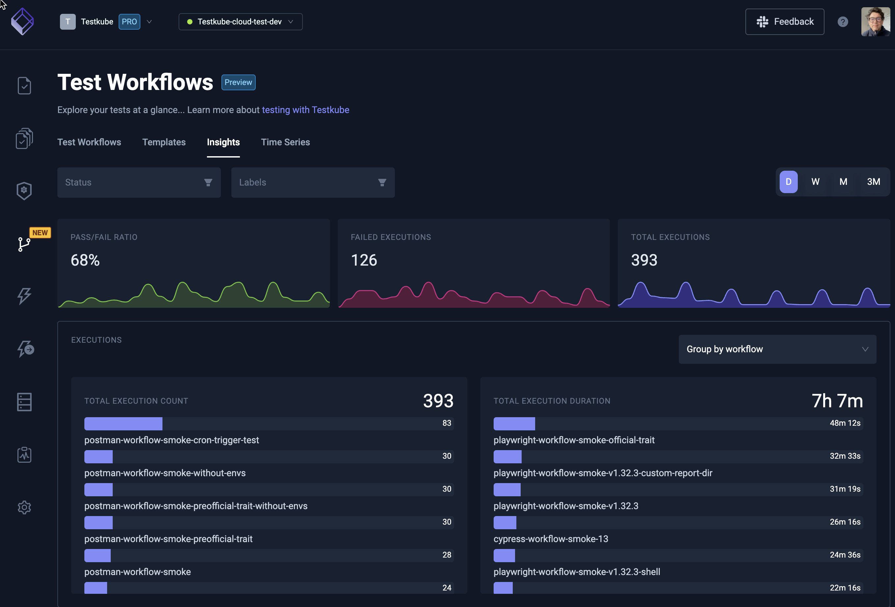

# Analyzing Results

## Reporting Overview

Once your test results are in, you’ll need to analyze them to determine the appropriate actions. Reporting can be divided into two main categories:

### Tactical Reporting

- **Focus:**  
  Fixing immediate problems with your tests.
- **Examples:**
  - Test failures
  - Flaky tests
  - Long execution times
  - High resource consumption

### Strategic Reporting

- **Focus:**  
  Planning and optimizing your overall testing strategy.
- **Examples:**
  - Identifying areas of your applications that need more testing.
  - Tracking trends such as increasing failure rates or prolonged test durations.
  - Adjusting focus based on which components or test types need more attention.

_Note:_  
CI/CD tooling often supports tactical analysis, but it typically lacks robust features for strategic reporting, especially when multiple testing tools or non-traditional test triggers are involved. External tools can help if configured to ingest the outputs from your tests.

## Importance of Analysis

Effective analysis of test results is critical for:

- **DevOps Teams:**  
  For optimizing and analyzing test execution infrastructure.
- **QA Teams:**  
  For planning tactical and strategic testing activities.

## Analyzing Test Results with Testkube

Testkube includes a powerful [Test Insights](test-insights) module that collects detailed metrics from each test execution, enabling both operational and strategic decision-making. With Test Insights you can answer questions such as:

- Which tests are consuming the most time or resources?
- How are overall testing efforts trending in terms of pass/fail ratios, test counts, or flakiness?
- Which components or test types require increased focus?

## Further Considerations

Use the insights gathered to continuously improve your testing processes, ensuring that your teams remain agile and responsive to both immediate issues and long-term trends.
