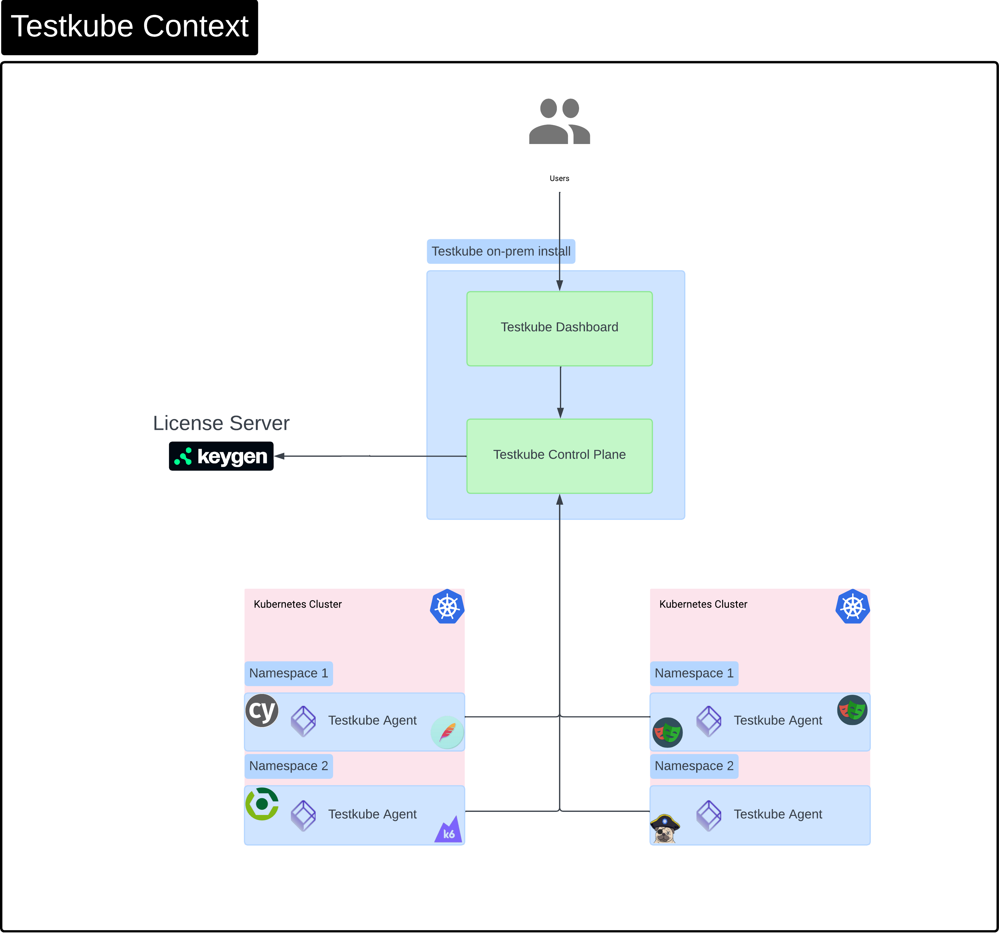
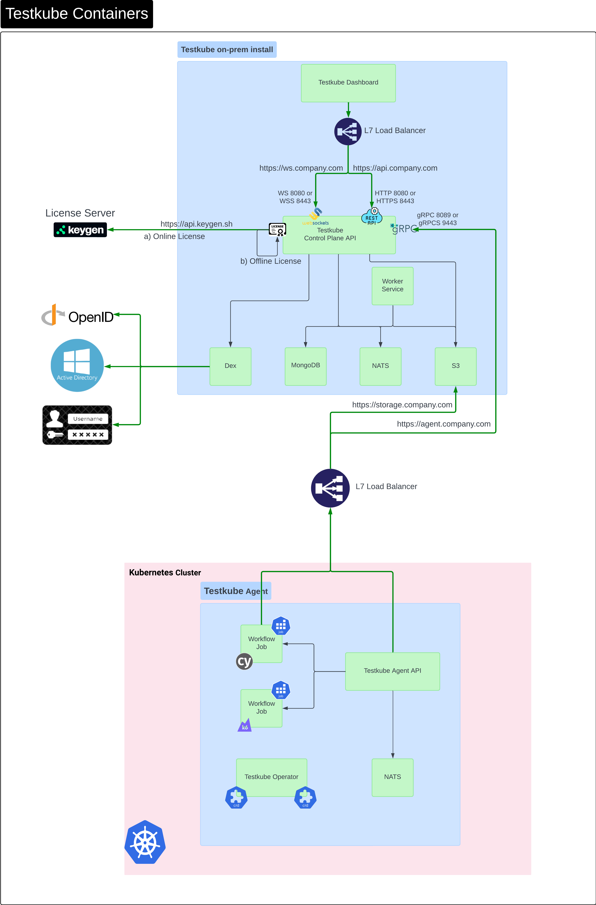
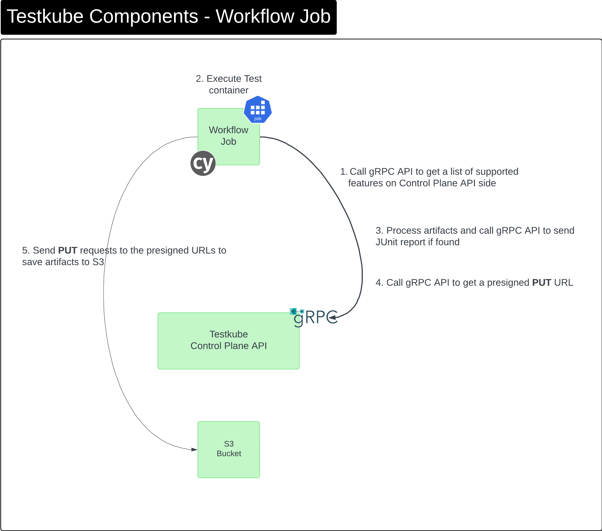
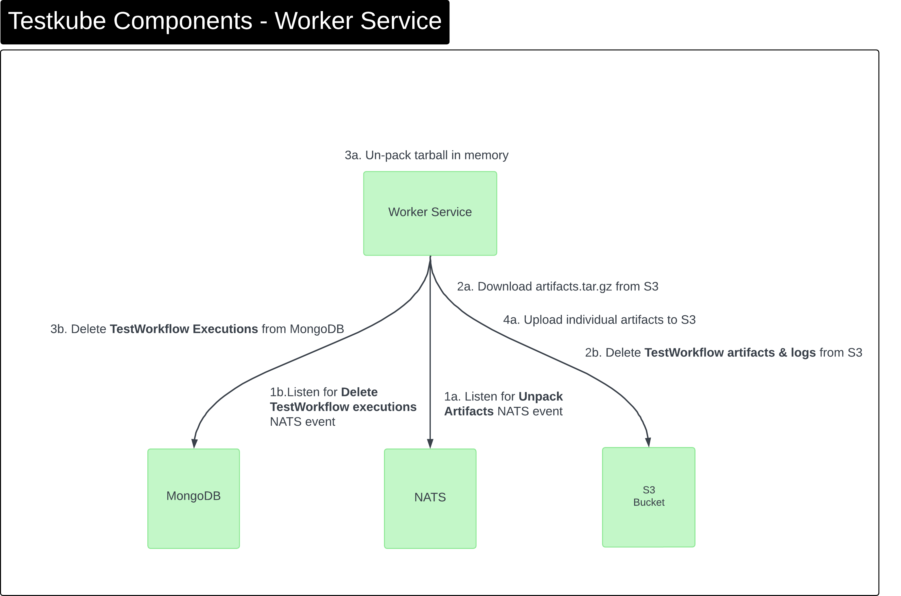

# Testkube Architecture

Testkube contains two sub-systems:

- A **Control Plane** which includes the Dashboard, Storage for Results/Artifacts, Cluster Federation, etc
- An **Agent** running in your cluster that manages Testkube resources, runs tests, gathers results, etc.

The below diagrams explain this architecture using [C4 diagrams](https://c4model.com/) - please
don't hesitate to reach out on our Slack if you have questions.

Also check out the [Installation Overview](/articles/install/overview) document for more details on
how Testkube can be deployed, and the [Workflow Architecture](/articles/test-workflows-high-level-architecture)
document for an overview of how the Workflow engine works.

## Context

High level overview of Testkube components when running Testkube entirely on-prem. When using Testkube
Cloud, the Dashboard and control-plane are hosted and entitlement is done internally (without a License Server).

## Testkube Containers

The diagram below shows a breakdown of Testkube components and their network connections/dependencies
when running Testkube entirely on-prem. As in the previous diagram, the License Server does not
apply when using the Testkube Cloud Control Plane.

The Testkube Dashboard connects to the Control Plane API via an L7 Load Balancer that needs to
expose ports for both HTTPS and WSS endpoints.

The main 3rd party dependencies that are required by the Control Plane are:

- NATS
- MongoDB - [Read more](mongodb-administration)
- S3 (via Minio)
- Dex for federated authentication

These are all installed by the Testkube Helm Chart and configured accordingly.

### Integration Details

#### License Server

By default, Testkube Control Plane API reach Keygen public API, it requires network access to domain `api.keygen.sh` port 443. In case of an air-gapped installations, this integration is skipped.

#### Testkube Control Plane

It provides 2 main interfaces:

* **Testkube Dashboard:** users from their local/remote workstations reach this component that exposes a graphic user intergace through port `443` with TCP protocol.
* **Testkube Control Plane API:** this component exposes 3 types of service:
    * **REST service:** users who are using Testkube Dashboard must have network access to this service exposed through port `443` with TCP protocol.
    * **WebSocker service:** users who are using Testkube Dashboard must have network access to this service exposed through port `443` with WebSocket protocol.
    * **gRPC service:** Testkube Agent API connects to Testkube Control Plane API through port `443` when agent is running in other cluster, direct to service port `9443` when it's in the same cluster, in both cases using gRPC protocol.

> **Important!**
>
> By default all Testkube Control Plane interfaces are exposed using TLS cryptographic protocol, some of the requirements mentioned above may change if the installation is customized to disable this behavior, **it's not recommended to disable TLS as it represents a security vulnerability.**

This component also integrates with:

* **Dex:** using port `5556` and `5557` with TCP protocol.
* **MongoDB:** using default port `27017` with TCP protocol.
* **NATS**: using port `4222` with TCP protocol. It also apply to Testkube Agent API, unless it's configured to have embedded NATS.

#### S3 or Object storage

As the graph above shows, several components of the Testkube architecture integrates with S3 service:

|Component|Behavior|Description|
|---------|------------|-------|
|Testkube Control Plane API|Read/Write/Delete|<ul><li>To access execution artifacts and logs.</li><li>To save executions resource metrics.</li><li>To rotate old logs and artifacts.</li></ul>|
|Testkube Agent API|Read/Write|To publish and access execution artifacts and logs|
|Users (from Testkube CLI)|Read|To access execution artifacts and logs|

Only Testkube Control Plane API manages access/secret keys to authenticate against S3 service, all other components use [presigned URLs](https://min.io/docs/minio/linux/integrations/presigned-put-upload-via-browser.html) generated by Testkube Control Plane API.

Requirements to esure this integration is working properly:

* Testkube Control Plane API has the right access/secret keys configured, as well as network access.
* Testkube Agents API have network access from the cluster and namespace where they are deployed, if execution namespaces is configured, ensure those namespaces have network access as well.
* Users who is running Testkube CLI from their local/remote workstations must have network access.

## Components - Workflow Job

Description of components/interactions when Testkube runs a Test Workflow.

(This applies to both on-prem and cloud deployments.)

## Components - Worker Service

The Worker service is responsible for

- unpacking artifact tarballs and uploads individual files
- cleaning up Test Workflow logs and artifacts when deleting Test Workflow executions

This processing is done asynchronously and triggered via NATS events.

(This applies to both on-prem and cloud deployments.)
