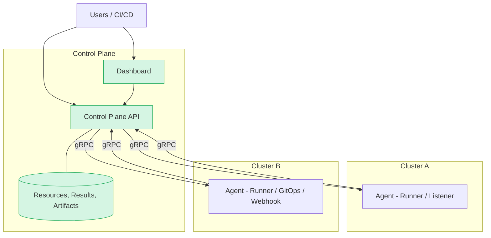
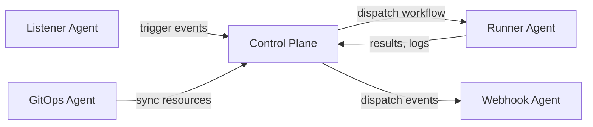
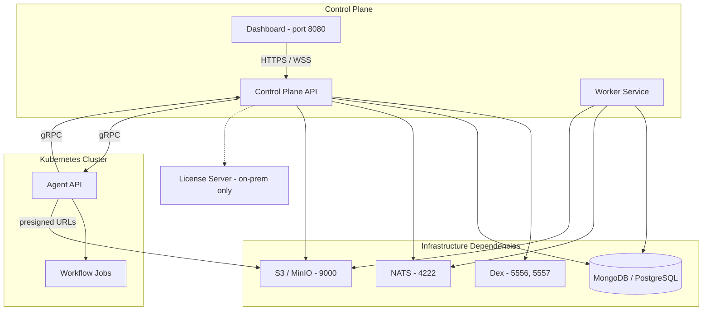
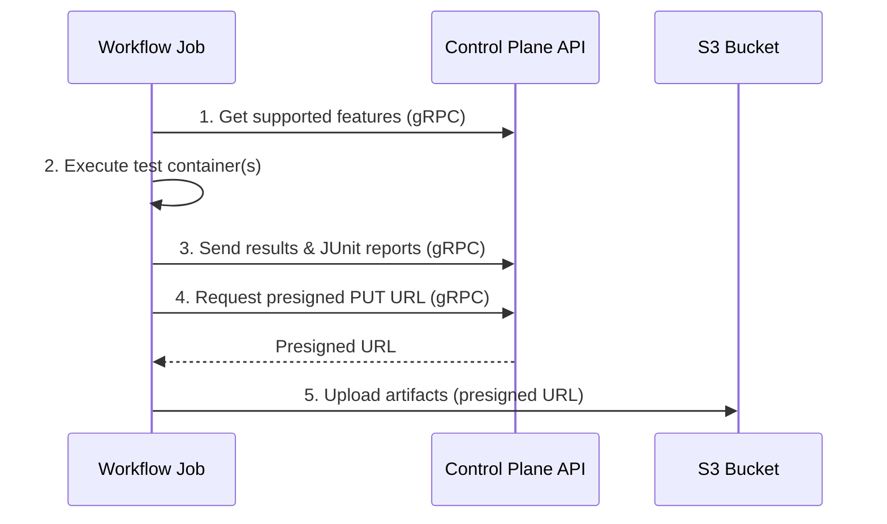
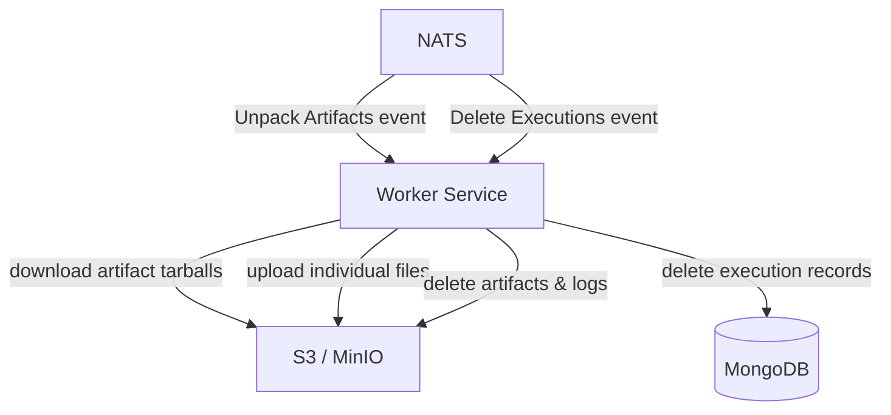

# Testkube Architecture

Testkube contains two sub-systems:

- A **Control Plane** which includes the Dashboard, Storage for Resources/Results/Artifacts, Scheduling, Cluster Federation, etc - [Read More](/articles/testkube-resource-management)
- One or more **Agents** running in your cluster(s) that execute Test Workflows, listen for Kubernetes events, sync resources via GitOps, and emit webhooks/CDEvents - [Read More](/articles/agents-overview)

Check out the [Installation Overview](/articles/install/overview) document for more details on
how Testkube can be deployed, and the [Workflow Architecture](/articles/test-workflows-high-level-architecture)
document for an overview of how the Workflow engine works.

## System Overview

The Control Plane is the source of truth for all Testkube Resources and is always accessible,
even when no agents are connected. Agents are deployed into your Kubernetes clusters and connect
to the Control Plane via gRPC to execute workflows, listen for events, sync resources, and emit webhooks.

When using Testkube Cloud, the Control Plane is hosted by Testkube. For on-prem installations,
all components are deployed in your own infrastructure.

```mermaid
flowchart TB
    Users["Users / CI/CD"]

    subgraph Control Plane
        Dashboard["Dashboard"]
        CPAPI["Control Plane API"]
        Store[("Resources, Results, Artifacts")]
    end

    subgraph Cluster A
        A1["Agent - Runner / Listener"]
    end

    subgraph Cluster B
        A2["Agent - Runner / GitOps / Webhook"]
    end

    Users --> Dashboard
    Users --> CPAPI
    Dashboard --> CPAPI
    CPAPI --- Store
    A1 -- "gRPC" --> CPAPI
    CPAPI -- "gRPC" --> A1
    A2 -- "gRPC" --> CPAPI
    CPAPI -- "gRPC" --> A2

    style CPAPI fill:#d5f5e3,stroke:#27ae60
    style Store fill:#d5f5e3,stroke:#27ae60
    style Dashboard fill:#d5f5e3,stroke:#27ae60
```

## Agent Capabilities

Agents connect to the Control Plane via gRPC and can have one or more capabilities enabled.
The following diagram shows the data flow for each capability type.
See [Testkube Agents](/articles/agents-overview) for full details.

```mermaid
flowchart LR
    CP["Control Plane"]

    Runner["Runner Agent"]
    Listener["Listener Agent"]
    GitOps["GitOps Agent"]
    Webhook["Webhook Agent"]

    CP -- "dispatch workflow" --> Runner
    Runner -- "results, logs" --> CP
    Listener -- "trigger events" --> CP
    GitOps -- "sync resources" --> CP
    CP -- "dispatch events" --> Webhook
```

## Component Breakdown

The diagram below shows a detailed breakdown of Testkube components and their dependencies
when running Testkube on-prem. The License Server does not apply when using the Testkube
Cloud Control Plane.

The Testkube Dashboard connects to the Control Plane API via an L7 Load Balancer that needs to
expose ports for both HTTPS and WSS endpoints.

The main infrastructure dependencies required by the Control Plane are:

- NATS
- MongoDB - [Read more](mongodb-administration) or PostgreSQL
- S3 (via Minio)
- Dex for federated authentication

These are all installed by the Testkube Helm Chart and configured accordingly.

```mermaid
flowchart TB
    subgraph Control Plane
        Dashboard["Dashboard - port 8080"]
        API["Control Plane API"]
        Worker["Worker Service"]
    end

    subgraph Infrastructure Dependencies
        Dex["Dex - 5556, 5557"]
        DB[("MongoDB / PostgreSQL")]
        NATS["NATS - 4222"]
        S3["S3 / MinIO - 9000"]
    end

    LS["License Server - on-prem only"]

    subgraph Kubernetes Cluster
        AgentAPI["Agent API"]
        WF["Workflow Jobs"]
    end

    Dashboard -- "HTTPS / WSS" --> API
    API --> Dex
    API --> DB
    API --> NATS
    API --> S3
    API -.-> LS
    Worker --> DB
    Worker --> NATS
    Worker --> S3
    API -- "gRPC" --> AgentAPI
    AgentAPI -- "gRPC" --> API
    AgentAPI --> WF
    AgentAPI -- "presigned URLs" --> S3
```

### Integration Details

#### Components Integration Details

Despite the Testkube components visible in the diagram above, in the following table there is a reference to **User Browser** which means that Provider must be available from users network.

Check the table to know each of the integrations between Testkube Components:

|Consumer|Provider|Description|Component port in use|
|--------|--------|-----------|---------------------|
|User Browser|Testkube Dashboard|Users will reach Testkube Dashboard|8080|
|User Browser|Testkube Control Plane API|Users will reach directly Testkube Control Plane API|8088 (if HTTPS, 9443)|
|User Browser|Dex|User will reach Dex service for authentication process|5556|
|User Browser|S3|User will reach Dex service for pulling test execution artifacts|9000|
|Testkube Control Plane API|Dex|To verify user token and ensure authenticated access to Testkube platform|5556, 5557|
|Testkube Control Plane API|MongoDB|To store the state of the whole platform objects (Test Workflows, Test Triggers, Webhooks, etc.)|27017 (If it's the default MongoDB deployed together with Testkube platform)|
|Testkube Control Plane API|NATS|To manage events happening into the platform|4222|
|Testkube Control Plane API|S3|To store artifacts (test workflow execution results, logs, and metrics)|9000 (If is MinIO)| 
|Testkube Control Plane API|_License Server **_|To validate license configured in instance, License Server is an external service managed by Testkube|443|
|Worker Service|NATS|To manage events happening into the platform|4222|
|Worker Service|MongoDB|To manage the state of the whole platform objects (Test Workflows, Test Triggers, Webhooks, etc.) generating metrics|27017 (If it's the default MongoDB deployed together with Testkube platform)|
|Testkube Agent API|Testkube Control Plane API|To receive instructions on Test Workflow and other features execution in the specific environment and Kubernetes cluster|8089 (if HTTPS, 8443)|
|Testkube Agent API|S3|To store artifacts (test workflow execution results, logs, and metrics)|9000 (If is MinIO)|
|Testkube Agent API|NATS|To manage events happening into the platform|4222|

_** Only for installation using Online Testkube License._

For some specific integration Testkube Control Plane API must be exposed and available for the Consumer if it's in the same or out of the Testkube network, check all the different integrations [here](./integrations.md).

#### License Server

By default, Testkube Control Plane API requires network access to domain `license.testkube.io` on port 443. In case of an air-gapped installations, this integration is skipped.

#### Testkube Control Plane

It provides 2 main interfaces:

* **Testkube Dashboard:** users from their local/remote workstations reach this component that exposes a graphic user intergace through port `443` with TCP protocol.
* **Testkube Control Plane API:** this component exposes 3 types of service:
    * **REST service:** users who are using Testkube Dashboard must have network access to this service exposed through port `443` with TCP protocol.
    * **WebSocker service:** users who are using Testkube Dashboard must have network access to this service exposed through port `443` with WebSocket protocol.
    * **gRPC service:** Testkube Agent API connects to Testkube Control Plane API through port `443` when agent is running in other cluster, direct to service port `9443` when it's in the same cluster, in both cases using gRPC protocol.

> **Important!**
>
> By default all Testkube Control Plane interfaces are exposed using TLS cryptographic protocol, some of the requirements mentioned above may change if the installation is customized to disable this behavior, **it's not recommended to disable TLS as it represents a security vulnerability.**

This component also integrates with:

* **Dex:** using port `5556` and `5557` with TCP protocol.
* **MongoDB:** using default port `27017` with TCP protocol.
* **PostgreSQL:** using default port `5432` with TCP protocol.
* **NATS**: using port `4222` with TCP protocol. It also apply to Testkube Agent API, unless it's configured to have embedded NATS.

#### S3 or Object storage

As the graph above shows, several components of the Testkube architecture integrates with S3 service:

|Component|Behavior|Description|
|---------|------------|-------|
|Testkube Control Plane API|Read/Write/Delete|<ul><li>To access execution artifacts and logs.</li><li>To save executions resource metrics.</li><li>To rotate old logs and artifacts.</li></ul>|
|Testkube Agent API|Read/Write|To publish and access execution artifacts and logs|
|Users (from Testkube CLI)|Read|To access execution artifacts and logs|

Only Testkube Control Plane API manages access/secret keys to authenticate against S3 service, all other components use [presigned URLs](https://min.io/docs/minio/linux/integrations/presigned-put-upload-via-browser.html) generated by Testkube Control Plane API.

Requirements to esure this integration is working properly:

* Testkube Control Plane API has the right access/secret keys configured, as well as network access.
* Testkube Agents API have network access from the cluster and namespace where they are deployed, if execution namespaces is configured, ensure those namespaces have network access as well.
* Users who is running Testkube CLI from their local/remote workstations must have network access.

## Components - Workflow Job

The following diagram shows the interaction between a Workflow Job, the Control Plane API,
and S3 storage during Test Workflow execution. This applies to both on-prem and cloud deployments.

```mermaid
sequenceDiagram
    participant WF as Workflow Job
    participant CP as Control Plane API
    participant S3 as S3 Bucket

    WF->>CP: 1. Get supported features (gRPC)
    WF->>WF: 2. Execute test container(s)
    WF->>CP: 3. Send results & JUnit reports (gRPC)
    WF->>CP: 4. Request presigned PUT URL (gRPC)
    CP-->>WF: Presigned URL
    WF->>S3: 5. Upload artifacts (presigned URL)
```

## Components - Worker Service

The Worker Service handles asynchronous background tasks triggered via NATS events:

- Unpacking artifact tarballs and uploading individual files to S3
- Cleaning up Test Workflow logs and artifacts when deleting Test Workflow executions

This applies to both on-prem and cloud deployments.

```mermaid
flowchart TB
    NATS["NATS"]
    WS["Worker Service"]
    DB[("MongoDB")]
    S3["S3 / MinIO"]

    NATS -- "Unpack Artifacts event" --> WS
    NATS -- "Delete Executions event" --> WS
    WS -- "download artifact tarballs" --> S3
    WS -- "upload individual files" --> S3
    WS -- "delete artifacts & logs" --> S3
    WS -- "delete execution records" --> DB
```
