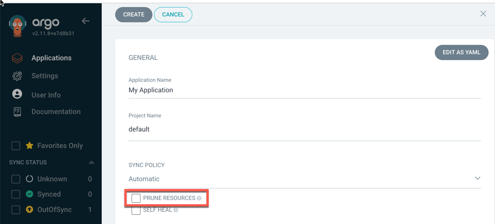
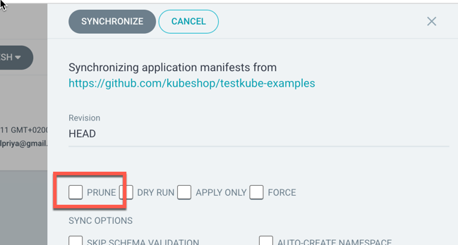

# Using Testkube with ArgoCD

This document will describe different ways you can use Testkube with ArgoCD. As a prerequisite you should have good understanding
of both Testkube, ArgoCD and GitOps principles. 

:::tip
For a high-level introduction to using Testkube with ArgoCD including a step-by-step tutorial, please check out
our [GitOps blogpost](https://testkube.io/blog/a-gitops-powered-kubernetes-testing-machine-with-argocd-and-testkube).
:::

## Managing Testkube CRDs with ArgoCD

Testkube stores its core resources (Workflows, Triggers, etc.) as Custom Resources in your Kubernetes Cluster -
[Read More about Testkube CRDs](/articles/crds). This makes it straight forward to manage them using a GitOps approach with a tool
like ArgoCD.

To use your Testkube Resources in the synced cluster, the target namespace will need to have the Testkube Agent installed since 
the Agent can currently only work with Testkube Resources in its own namespace. There are two approaches to making this
work with ArgoCD:

1. Preinstall the Agent in the target namespace and disable pruning in ArgoCD.
2. Include the Testkube Agent manifests or Helm Chart in your ArgoCD Application.

### Pre-install the Agent and disable Pruning

This option is more suited for long-lived namespaces - for example a dedicated namespace for a staging or development environment.

When pre-installing the Testkube Agent in your target namespace, it is important to NOT select the `prune` option when auto-syncing your
Application with Argo, otherwise Argo will remove the Agent from your namespace when syncing.



Same applies to manual synchronization - do NOT select the `prune` option:



### Include Agent in your GitOps Repo

For ephemeral namespaces it can be more convenient to include the Agent manifests in your GitOps repo so the Agent 
gets installed and synced together with any other resources you are managing with ArgoCD. You can simply use `helm template` 
with the [Testkube Helm Chart](/articles/install/standalone-agent) to generate 
the manifests to be added to your repository.

In this case you can either make use
of the [Multiple Source for an Application](https://argo-cd.readthedocs.io/en/stable/user-guide/multiple_sources/#helm-value-files-from-external-git-repository)
feature of ArgoCD, including the Testkube Helm chart as an external source

```yaml
apiVersion: argoproj.io/v1alpha1
kind: Application
spec:
  sources:
  - repoURL: 'https://kubeshop.github.io/helm-charts'
    chart: testkube
    targetRevision: 2.1.22
    helm:
      valueFiles:
      - $values/charts/testkube-agent/values.yaml
  - repoURL: 'https://git.example.com/org/test-repository.git'
    targetRevision: dev
    ref: values
```

This example installs the Testkube Agent Helm Chart version `2.1.22` together with Kubernetes resources defined in the
`https://git.example.com/org/test-repository.git` repository. A values file at `/charts/testkube-agent/values.yaml`
in this repository is used to configure the Helm installation of the Agent.

## Triggering Test Executions 

Once any Testkube Workflows have been synced to your cluster(s) it is likely that you will want to trigger these to execute
corresponding Tests. You can of course trigger them manually through the CLI or Dashboard, it will probably make more 
sense to trigger them either using an ArgoCD Resource Hook or a Testkube Kubernetes Trigger. 

- Using a Kubernetes Trigger has the advantage of being disconnected from ArgoCD; however a resource gets updated in your Cluster, by it by ArgoCD or
  some other process (possibly manual), your tests will always execute. The downside is that they will execute even if your resources are part
  of a larger application, which might fail synchronizing or not be initialized correctly when the test is triggered.
- Using a Resource Hook handles the downside of Kubernetes Triggers by being more attune to the overall ArgoCD sync status; if ArgoCD for some reason 
  fails to sync your application resources with your cluster, it won't run your tests unnecessarily (unless you want it to).

Let's have a quick look on how to set up these two approaches.

### Trigger from an ArgoCD Resource Hook

Post-sync Resource hooks are executed by Argo after it has successfully synced resources within an Application - [Read More](https://argo-cd.readthedocs.io/en/stable/user-guide/resource_hooks/). 

Creating a Post-sync hook as a Kubernetes Job that runs Testkube Tests using the Testkube CLI is straight-forward; the Job would be 
defined together with your Testkube Resource in your Git repo and ArgoCD will execute it if the synchronization of Git Resources 
to your Cluster is successful. 

The general outline of such a Post-Sync Job is as follows:

```yaml
apiVersion: batch/v1
kind: Job
metadata:
  generateName: testkube-testworkflows-execution-
  namespace: default
  annotations:
    argocd.argoproj.io/hook: PostSync
    argocd.argoproj.io/hook-delete-policy: HookSucceeded
spec:
  template:
    spec:
      containers:
      - name: execute-testworkflows
        image: kubeshop/testkube-cli:2.1.19
        command:
        - /bin/sh
        - -c
        - |
          testkube set context \
            --api-key tkcapi_ZZZZ \
            --root-domain testkube.io \
            --org-id tkcorg_XXXX \
            --env-id tkcenv_YYYY

          testkube run tw <name-of-workflow> -f
      restartPolicy: Never
```

The Job first sets the Testkube CLI context and then simply invokes the `testkube run` command for each Workflow that was synced, with the -f option to capture the output.
(here you can obviously run any combination of Testkube CLI commands).

- The `tkcorg_XXXX` and `tkcenv_YYYY` identifiers can be found on the [Environment Settings](/testkube-pro/articles/environment-management#general) page. 
- The `tkcapi_ZZZZ` api-key needs to created as described under [API Token Management](/testkube-pro/articles/api-token-management).
- the `root-domain` should be `testkube.io` if you're using Testkube Cloud, or your local Testkube API endpoint for on-prem installations.

:::tip
This [blog-post](https://testkube.io/blog/a-gitops-powered-kubernetes-testing-machine-with-argocd-and-testkube) contains a complete example of a Post-Sync Resource Hook 
with video and screenshots.
:::

### Trigger using a Kubernetes Event Trigger

Defining a Kubernetes Trigger to react to resources being updated by ArgoCD is equally straightforward. See [Kubernetes Triggers](/articles/test-triggers) for
a walkthrough of the Testkube Triggering functionality, let's just look at a short example below:

```yaml
apiVersion: tests.testkube.io/v1
kind: TestTrigger
metadata:
  name: testtrigger-example
  namespace: default
spec:
  resource: deployment
  resourceSelector:
    labelSelector:
      matchLabels:
        testkube.io/tier: backend
  event: modified
  conditionSpec:
    timeout: 100
    delay: 2
    conditions:
      - type: Progressing
        status: "True"
        reason: "NewReplicaSetAvailable"
        ttl: 60
      - type: Available
        status: "True"
  action: run
  execution: workflow
  concurrencyPolicy: allow
  testSelector:
    name: frontend-sanity-tests
```

This will trigger the execution of the "frontend-sanity-tests" Test Workflow when any Kubernetes deployment with the 
label `testkube.io/tier: backend` has been modified in the default namespace, which includes updates performed by ArgoCD 
during resource synchronization.
