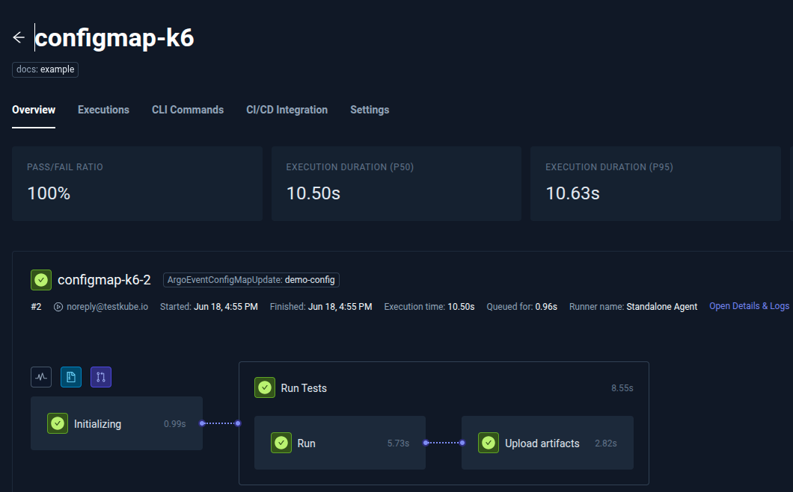
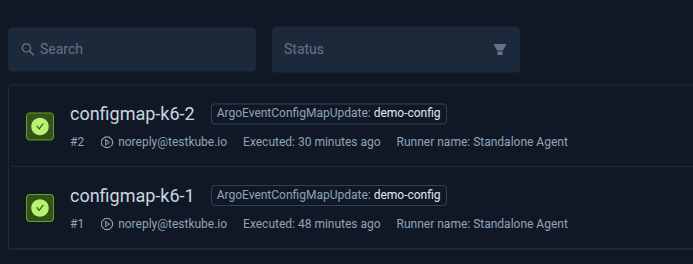
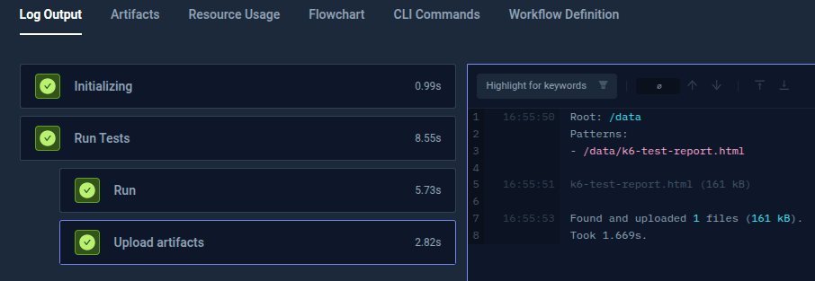
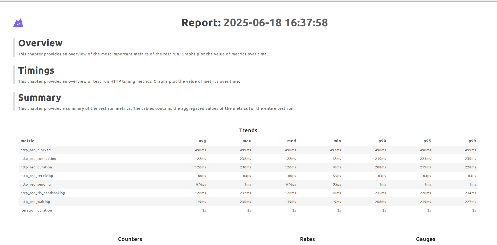
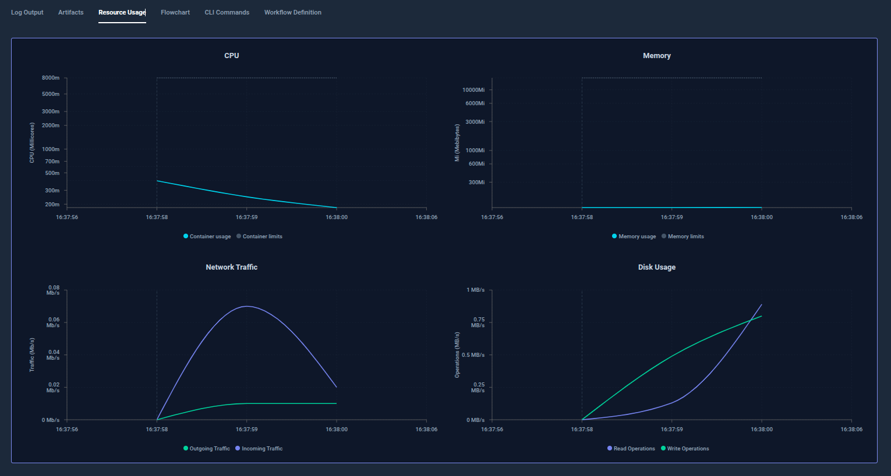

# Integrating Testkube with Argo Events

Tools like [Argo Events](https://argoproj.github.io/argo-events/) help capture Kubernetes resource lifecycle events, such as CREATE, UPDATE, or DELETE.
 It is capable of detecting and responding to a wide range of cluster events. These events can then be integrated into cloud-native test orchestration
 platforms like [Testkube](https://testkube.io/), allowing teams to automatically run tests that validate the impact of changes, ensuring faster feedback
  and safer deployments.

This document describes how you can use Testkube with Argo Events. As a prerequisite, you should have good understanding
of Testkube, [Argo Events](https://argoproj.github.io/argo-events/#documentation) and GitOps principles. 

:::tip
For a high-level introduction to using Testkube with Argo Events including a step-by-step tutorial, please check out
our integration blogpost.
:::

## Prerequisites

* A Kubernetes cluster with [Testkube Installed](/articles/install/overview).
* A Kubernetes cluster with [Argo Events installed](https://argoproj.github.io/argo-events/installation/).
* [Testkube API Token generated](/articles/api-token-management) and stored as a `secret` in `argo-events` namespace.
* A Test Workflow created and execution [webhook generated](/openapi/cloud/Agent-Operations----test-workflows#operation/abortAllTestWorkflowExecutions).

[Here](https://github.com/kubeshop/testkube-examples/tree/main/ArgoEvents) is an example GitHub repository with all required configuration manifests.

## Execute Testkube Test Workflow with Argo Events

For Argo Events to trigger test execution using Test Workflow, make sure Argo Events is running on a cluster with **EventBus** configured.

### 1. Create a Service Account with RBAC

This SA with RBAC will authorize the Argo Events Sensors to monitor `ConfigMap` in `default` namespace. Update the `rules.resources` in `Role` with resources that you want to authorize access by Argo Events.

```yaml
# argo-events-sa.yaml
apiVersion: v1
kind: ServiceAccount
metadata:
  name: argo-events-sa
  namespace: argo-events
---
apiVersion: rbac.authorization.k8s.io/v1
kind: Role
metadata:
  name: argo-events-role
  namespace: default
rules:
  - apiGroups: [""]
    resources: ["configmaps"]
    verbs: ["get", "list", "watch"]
---
apiVersion: rbac.authorization.k8s.io/v1
kind: RoleBinding
metadata:
  name: argo-events-rb
  namespace: default
subjects:
  - kind: ServiceAccount
    name: argo-events-sa
    namespace: argo-events
roleRef:
  kind: Role
  name: argo-events-role
  apiGroup: rbac.authorization.k8s.io
```

### 2. Create a resource to monitor for events

This will create a `ConfigMap` named `demo-config` in `default` namespace. Set a set label like `watch: "true"`
for Argo Events to filter it on event occurrence.

```yaml
# sample-configmap.yaml
apiVersion: v1
kind: ConfigMap
metadata:
  name: demo-config
  namespace: default
  labels:
    watch: "true"
    component: "testkube"
data:
  key: initial-value-1
```

### 3. Create a Test Workflow in Testkube Dashboard

Based on the test you want to run, [configure a Test Workflow in the Testkube Dashboard using the examples provided by Testkube](https://testkube.io/learn/getting-started-with-test-workflows-for-kubernetes-testing#test-workflows-in-action).
[Here](https://github.com/kubeshop/testkube-examples/blob/main/ArgoEvents/configmap-k6.yaml) is a Test Workflow \`configmap-k6\` that will execute a k6 test and store the artifacts. You can perform test using any [testing tool supported by Testkube](https://docs.testkube.io/articles/examples/overview) or Bring your own Test(BYOT).

### 4. Create an EventSource

Configure an [EventSource](https://argoproj.github.io/argo-events/concepts/event_source/) that will watch the resources like a ConfigMap for ADD, UPDATE, and DELETE events and filter them if they have required label set.

```yaml
apiVersion: argoproj.io/v1alpha1
kind: EventSource
metadata:
 name: configmap-eventsource
 namespace: argo-events
spec:
 template:
   serviceAccountName: argo-events-sa
   container:
     resources:
       requests:
         cpu: "100m"
         memory: "128Mi"
       limits:
         cpu: "500m"
         memory: "512Mi"
 eventBusName: default
 resource:
   demo-configmap:
     namespace: default
     group: ""
     version: v1
     resource: configmaps
     eventTypes:
       - ADD
       - UPDATE
       - DELETE
     filter:
       labels:
         - key: watch
           value: "true"
```

### 5. Create a Sensor

Configure a [Sensor](https://argoproj.github.io/argo-events/concepts/sensor/) that:

* Connects to the EventSource resource and provides details of the Kubernetes resource under watch.

* Sets Testkube Test Workflow execution webhook as http trigger with headers containing Testkube API Token as `secret`.

* Adds a label to the Test Workflow with the name of the resources for which the event is triggered.

You can customize the `Sensor` configuration based on your use case.

```yaml
apiVersion: argoproj.io/v1alpha1
kind: Sensor
metadata:
 name: configmap-webhook-sensor
 namespace: argo-events
spec:
 template:
   serviceAccountName: argo-events-sa
   container:
     resources:
       requests:
         cpu: "100m"
         memory: "128Mi"
       limits:
         cpu: "500m"
         memory: "512Mi"
 eventBusName: default
 dependencies:
 - name: configmap-dep
   eventSourceName: configmap-eventsource
   eventName: demo-configmap
   filters:
     data:
     - path: body.metadata.labels.watch
       type: string
       value:
       - "true"
 triggers:
 - template:
     name: testkube-webhook-trigger
     conditions: "configmap-dep"
     http:
       url: https://api.testkube.io/organizations/tkcorg_b8ddc820d498888/environments/tkcenv_94cb6305566666/agent/test-workflows/<Test_Workflow_Name>/executions
       payload:
       - src:
           dependencyName: configmap-dep
           dataKey: body.metadata.name
         dest: tags.ArgoEventConfigMapUpdate
       method: POST
       headers:
         Content-Type: application/json
       secureHeaders:
         - name: Authorization
           valueFrom:
             secretKeyRef:
               name: <testkube-auth-secret>
               key: <TESTKUBE_API_TOKEN>
     retryStrategy:
       steps: 3
       duration: 10s
       backoff:
         duration: 6s
         factor: 2
         jitter: 0.1
```

### 6. Verify

a. Verify using the following command that the EventSource and Sensor are running:

```sh  
$ kubectl get eventsource,sensor -n argo-events  
NAME                                            AGE  
eventsource.argoproj.io/configmap-eventsource   50m

NAME                                          AGE  
sensor.argoproj.io/configmap-webhook-sensor   10m  
```

b. Update the ConfigMap to trigger the execution of the TestWorkflow.

```sh  
$ kubectl patch configmap demo-config -n default --type merge -p '{"data":{"dummyKey":"test-'"$(date +%s)"'"}}'  
configmap/demo-config patched  
```

c. View Sensor logs to verify that Testkube Test Workflow is triggered.

```sh
$ kubectl logs -n argo-events -l sensor-name=configmap-webhook-sensor --tail=2
{"level":"info","ts":"2025-06-18T11:25:41.968855251Z","logger":"argo-events.sensor","caller":"http/http.go:193","msg":"Making a http request...","sensorName":"configmap-webhook-sensor","triggerName":"testkube-webhook-trigger","triggerType":"HTTP","url":"https://api.testkube.io/organizations/tkcorg_b8ddc820d498888/environments/tkcenv_94cb6305566666/agent/test-workflows/configmap-k6/executions"}
{"level":"info","ts":"2025-06-18T11:25:43.512504542Z","logger":"argo-events.sensor","caller":"sensors/listener.go:449","msg":"Successfully processed trigger 'testkube-webhook-trigger'","sensorName":"configmap-webhook-sensor","triggerName":"testkube-webhook-trigger","triggerType":"HTTP","triggeredBy":["configmap-dep"],"triggeredByEvents":["e09792772c454a038a7b02efeadc86b2"]}
```

d. View Test Workflow execution details using [Testkube CLI](/articles/install/cli) or [Testkube Dashboard](/articles/testkube-dashboard-explore). Use the following command.

```sh
testkube get testworkflow <Test_Workflow_Name>
```

```sh
$ testkube get testworkflow configmap-k6

Context: cloud (2.1.152)   Namespace: testkube   Org: xxxxxxxx-personal-org   Env: xxxxxxx-personal-env
--------------------------------------------------------------------------------------------------------------------------
Test Workflow:
Name:      configmap-k6
Namespace: testkube
Created:   2025-06-18 11:03:24 +0000 UTC

Labels:    docs=example

Test Workflow Execution:
Name:                 configmap-k6
Execution ID:         6852a23726359da589bcb641
Execution name:       configmap-k6-2
Execution namespace:  
Execution number:     2
Requested at:         2025-06-18 11:25:43.041 +0000 UTC
Disabled webhooks:    false

Tags:                 ArgoEventConfigMapUpdate=demo-config
Running context:     
Interface:             
  Type:                 api
Actor:                 
  Name:                 noreply@testkube.io
  Email:                noreply@testkube.io
  Type:                 user
Status:               passed
Queued at:            2025-06-18 11:25:44 +0000 UTC
Started at:           2025-06-18 11:25:44 +0000 UTC
Finished at:          2025-06-18 11:25:53.537 +0000 UTC
Duration:             10.496s
```

The above output shows the Tags added by Argo Event, status and duration of test execution.

Check Testkube Dashboard for deeper insights like execution logs, artifacts and resource utilisation during test execution.



The execution of the Test Workflow is triggered and completed successfully.
The `tags` configured in the Sensor configuration helps verify that the request is coming from ArgoEvent.
Check the Executions in Testkube Dashboard to see if the tag is added.



Tag `ArgoEventConfigMapUpdate` is added to the execution along with the name of the ConfigMap `demo-config`.

Select Test Workflows execution and view the Log Output.



Select the Artifacts and view the test results.



Monitor Resource Usage including CPU, memory, network traffic and disk usage across each test execution.



This setup enables a reliable, event-driven testing workflow in Kubernetes by integrating Argo Events with Testkube.
It ensures that any resource change automatically triggers targeted tests, helping teams validate changes early and maintain application stability.