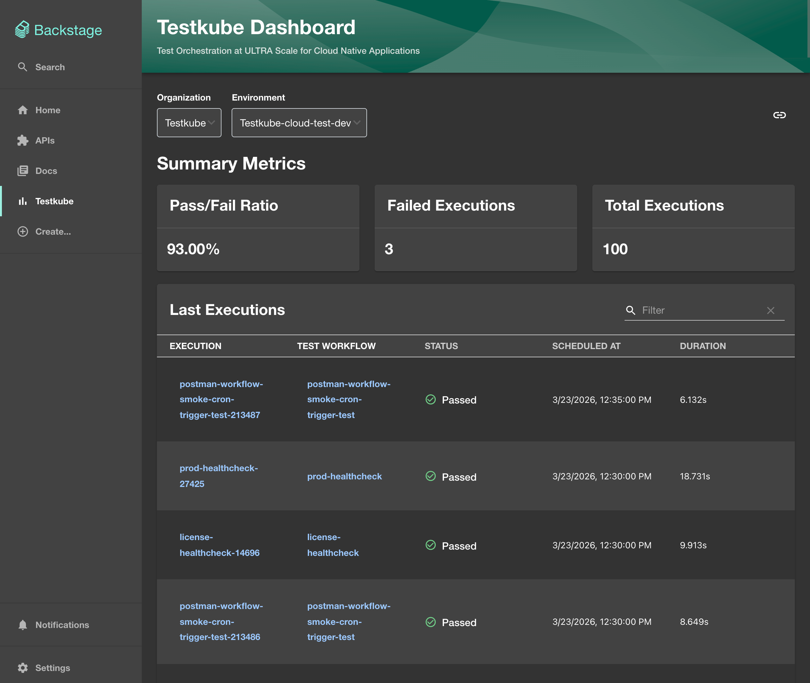
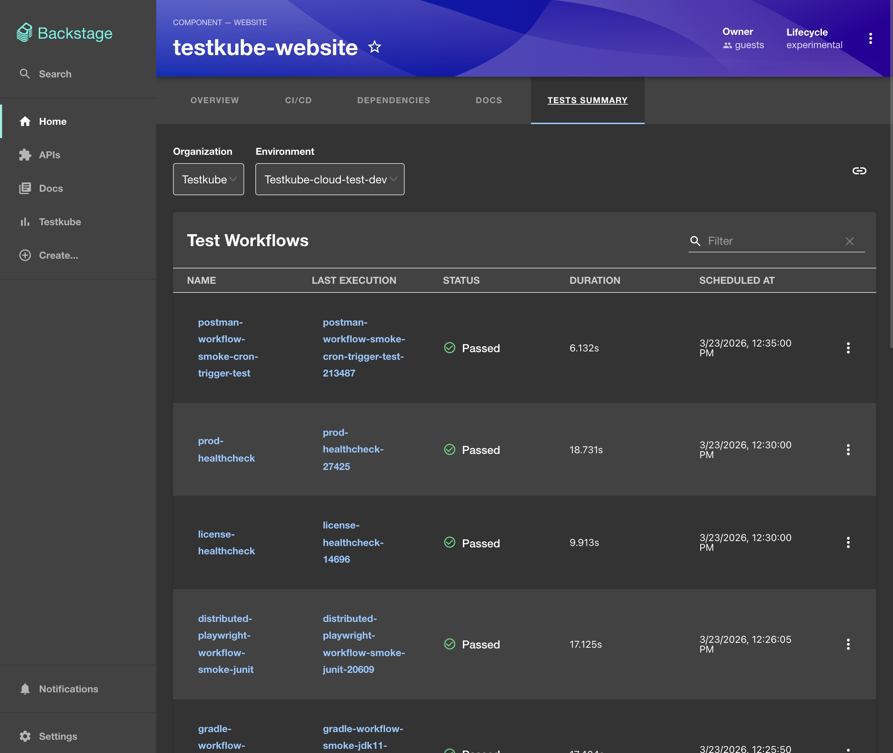

import Admonition from "@theme/Admonition";
import Tabs from "@theme/Tabs";
import TabItem from "@theme/TabItem";

# Backstage Integration

Testkube provides official [Backstage](https://backstage.io) plugins that bring test execution visibility directly into your developer portal. The integration consists of two plugins:

- **UI plugin** (`@testkube/backstage-plugin`) — adds a Testkube dashboard page and entity-level test summary tabs to your Backstage frontend.
- **Backend plugin** (`@testkube/backstage-plugin-backend`) — exposes a `testkube` backend service that proxies requests to the Testkube API and provides metadata endpoints used by the UI plugin.

The source code and a working example app are available at [github.com/kubeshop/testkube-backstage-plugin](https://github.com/kubeshop/testkube-backstage-plugin).

## Features

- **Testkube Dashboard** — a global page with an overview of the latest test workflow executions, including success/failure metrics, execution times, statuses, and workflow names.
- **Testkube Entity Page** — an entity-level tab showing test workflows related to a specific catalog entity (filtered by annotation). It includes:
  - Metrics panels (success/failure rate, failed executions, total executions).
  - Test workflow list with last execution info (duration, date, status).
  - View workflow definitions in YAML.
  - View execution logs and execution history.
  - Trigger test workflow runs directly from Backstage.

## Installation

Install both plugins in your Backstage project:

```bash
# UI plugin
yarn workspace packages/app add @testkube/backstage-plugin

# Backend plugin
yarn workspace packages/backend add @testkube/backstage-plugin-backend
```

## Backend Setup

Register the backend plugin in `packages/backend/src/index.ts`:

```ts
import { createBackend } from "@backstage/backend-defaults";

const backend = createBackend();

// ... other plugins
backend.add(import("@testkube/backstage-plugin-backend"));

backend.start();
```

## Configuration

The plugin reads its configuration from the `testkube` section of your `app-config.yaml`.

<Tabs>
<TabItem value="enterprise" label="Testkube Enterprise" default>

When using Testkube Enterprise, configure multiple organizations with API tokens:

```yaml
testkube:
  # Base URL of the Testkube API
  apiUrl: "https://api.testkube.io"

  # Enable enterprise mode
  enterprise: true

  # Base URL of the Testkube UI (used for redirect URLs)
  uiUrl: "https://app.testkube.io"

  # Organizations this Backstage instance can access
  organizations:
    - id: tkcorg_XXXXXXXXX
      apiKey: ${TESTKUBE_ORG_API_TOKEN}
```

<Admonition type="warning" title="API Token Permissions">
  Use an [API token](/articles/api-token-management) with **read-only** access. Avoid embedding tokens with write
  permissions directly in configuration files — use environment variables
  instead.
</Admonition>

<Admonition type="info" title="Enterprise Requirements">
  For enterprise mode to work, `enterprise` must be set to `true`, `uiUrl` must
  be provided, and at least one organization with an `id` and `apiKey` must be
  configured.
</Admonition>

</TabItem>
<TabItem value="oss" label="Standalone Agent (OSS)">

For a local or self-hosted Testkube Standalone Agent:

```yaml
testkube:
  apiUrl: "http://localhost:8088"
```

This should point to the HTTP endpoint of your Testkube API server. If you are using port forwarding:

```bash
kubectl port-forward svc/testkube-api-server -n testkube 8088:8088
```

</TabItem>
</Tabs>

## Adding the Testkube Dashboard Page

Edit `packages/app/src/App.tsx` to add the Testkube dashboard route:

```tsx
import { TestkubeDashboardPage } from "@testkube/backstage-plugin";

const routes = (
  <FlatRoutes>
    {/* ... other routes */}
    <Route path="/testkube" element={<TestkubeDashboardPage />} />
  </FlatRoutes>
);
```

The dashboard will be available at `/testkube` in your Backstage app.



To add it to the sidebar, edit `packages/app/src/components/Root/Root.tsx`:

```tsx
import BarChartIcon from "@material-ui/icons/BarChart";

export const Root = ({ children }: PropsWithChildren<{}>) => (
  <SidebarPage>
    <Sidebar>
      <SidebarGroup label="Menu" icon={<MenuIcon />}>
        {/* ... other items */}
        <SidebarItem icon={BarChartIcon} to="testkube" text="Testkube" />
      </SidebarGroup>
    </Sidebar>
    {children}
  </SidebarPage>
);
```

<Admonition type="tip" title="Feature Flags">
  You can conditionally show the sidebar item using Backstage feature flags by wrapping it with `FeatureFlagged`:

```tsx
<FeatureFlagged with="testkube">
  <SidebarItem icon={BarChartIcon} to="testkube" text="Testkube" />
</FeatureFlagged>
```

</Admonition>

## Adding the Entity Page Tab

To show test workflows related to a specific catalog entity, edit `packages/app/src/components/catalog/EntityPage.tsx`:

```tsx
import {
  TestkubeEntityPage,
  isTestkubeAvailable,
} from "@testkube/backstage-plugin";

const testkubeSummaryPage = (
  <Grid container spacing={3} alignItems="stretch">
    <Grid item xs={12}>
      <TestkubeEntityPage />
    </Grid>
  </Grid>
);

const websiteEntityPage = (
  <EntityLayout>
    {/* ... other tabs */}
    <EntityLayout.Route
      path="/tests-summary"
      title="Tests Summary"
      if={isTestkubeAvailable}
    >
      {testkubeSummaryPage}
    </EntityLayout.Route>
  </EntityLayout>
);
```

The **Tests Summary** tab will only appear for entities that have the `testkube.io/labels` annotation.



### Annotating Catalog Entities

Add the `testkube.io/labels` annotation to any catalog entity to link it with Testkube test workflows. The annotation value should match the labels applied to your test workflows:

```yaml
apiVersion: backstage.io/v1alpha1
kind: Component
metadata:
  name: testkube-website
  annotations:
    testkube.io/labels: app=testkube-website
spec:
  type: website
  lifecycle: experimental
  owner: guests
```

This entity will display only test workflows that have the label `app=testkube-website`.

## Backend API Endpoints

The backend plugin registers an HTTP router for the `testkube` service with the following endpoints:

| Endpoint                                 | Description                                                            |
| ---------------------------------------- | ---------------------------------------------------------------------- |
| `GET /config`                            | Returns Testkube configuration summary (enterprise enabled, org count) |
| `GET /organizations`                     | Lists organizations the UI can select from                             |
| `GET /organizations/:index/environments` | Lists environments for a given organization                            |
| `GET /redirect`                          | Returns a redirect URL into the Testkube UI                            |
| `ALL /*`                                 | Proxies all other requests to the configured Testkube API              |

All routes are protected using Backstage's `httpAuth` service.
