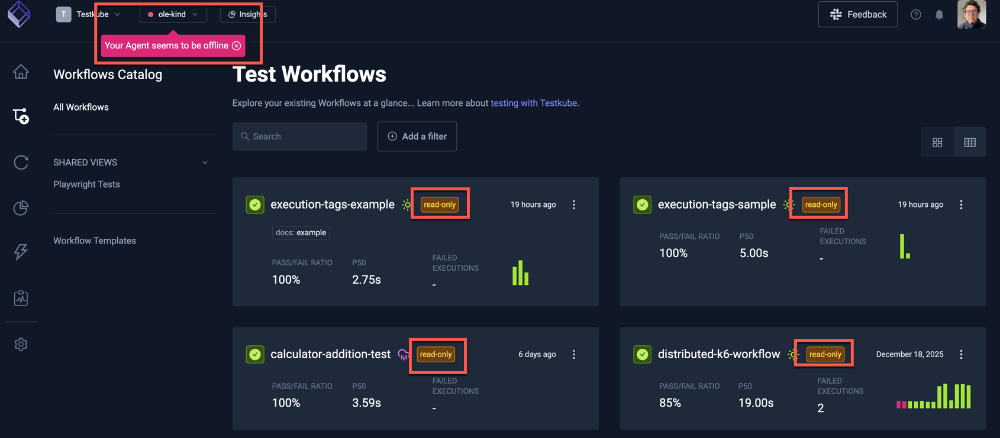
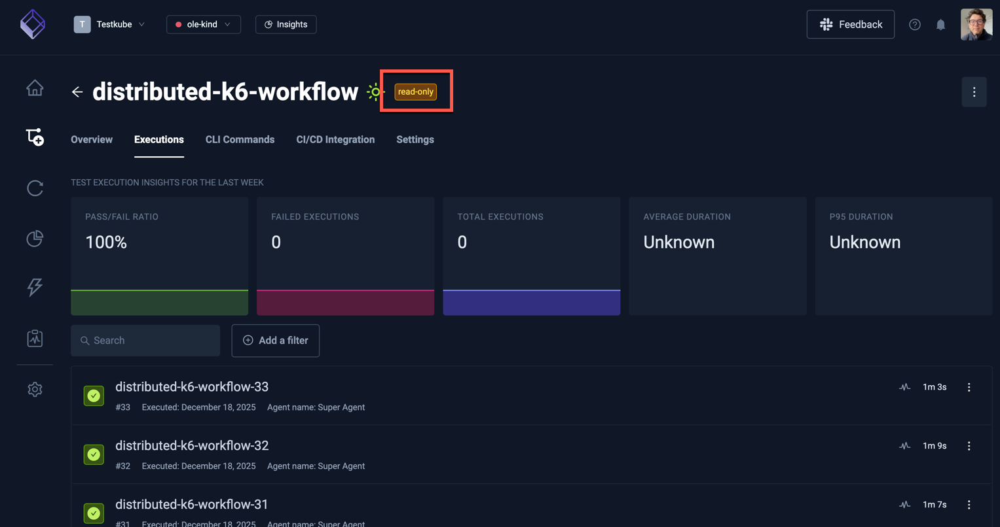
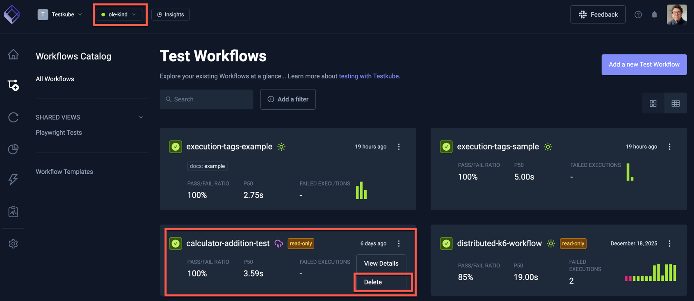

# Cached TestWorkflow Results

The Testkube Standalone Agent manages all Testkube Environment Resources (Workflows, WorkflowTemplates, Webhooks and TestTriggers) as
CRDs in the namespace where it is installed - [Read More](/articles/agents-overview#the-standalone-agent). All corresponding Workflow 
Execution results are stored in the database either configured for the Testkube Control Plane or for the Agent when running in standalone mode.

When using the Testkube Control Plane and the Standalone Agent is offline, the Testkube Dashboard still allows you to view previous 
Workflow Execution results, while the Workflow itself is in read-only mode (since the agent is offline, no changes can be made).

## Accessing Cached Results

When your agent is offline, Workflows are shown as offline:

It is still possible to drill down into the settings and results of each Workflow, but no changes can be made to the Workflow itself.

For example, selecting the distributed-k6-workflow seen above allows you to view each execution, with the "Read Only" marker at the top indicating
that the Workflow is in read-only mode:

## Accessing results for deleted Workflows

If your Standalone Agent is _online_ and Control Plane contains Workflow Executions for a TestWorkflow that has been deleted from the Agent 
namespace, that Workflow will also be shown as offline in the Dashboard, allowing you to view its execution results. 

:::note
You can use the "Delete" command from the popup shown above to delete all Workflow Executions for a deleted TestWorkflow. 
:::
