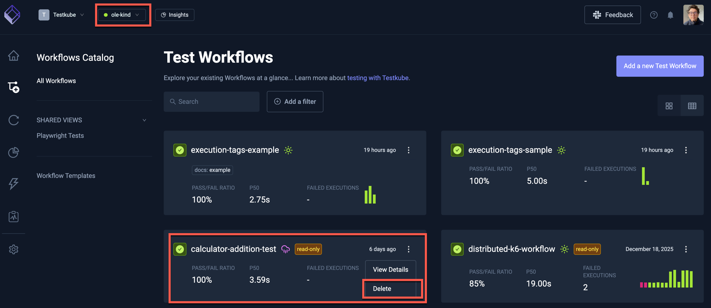

# Cached TestWorkflow Results

:::info
As of Testkube v2.7, all Testkube Resources are stored in the Control Plane - [Read More](/articles/control-plane-source-of-truth).
The Dashboard remains fully functional even when no agents are connected. The behavior described below
only applies to environments running a pre-v2.7 Agent that has not yet been migrated.
:::

Workflow Execution results are stored in the database configured for the Testkube Control Plane
(or locally for the Agent when running in [standalone mode](/articles/install/standalone-agent)).

Since the Control Plane is the source of truth for all Testkube Resources, the Dashboard
remains fully functional even when no agents are connected. You can always view, create,
and modify Workflows, Triggers, and Webhooks. Execution of Workflows and event listening
will be unavailable while the relevant [Runner or Listener Agents](/articles/agents-overview) are offline.

## Viewing Results When Agents Are Offline

When all Runner Agents are offline, you can still browse and manage Workflows and view previous execution results
in the Dashboard. Workflows will indicate that no Runner Agent is available for execution.

## Accessing Results for Deleted Workflows

If the Control Plane contains Workflow Executions for a TestWorkflow that has been deleted,
that Workflow will be shown as offline in the Dashboard, allowing you to view its execution results.

:::note
You can use the "Delete" command from the popup shown above to delete all Workflow Executions for a deleted TestWorkflow.
:::
