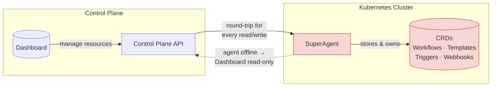
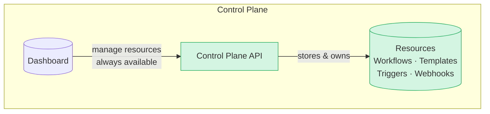
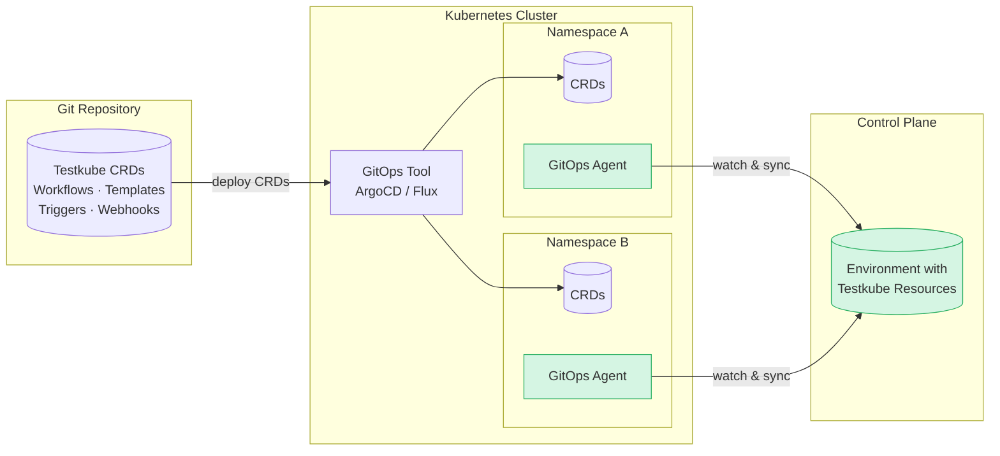

# Control Plane Source of Truth (v2.7)

Starting in Testkube `v2.7`, connected deployments use the Control Plane as the default source of truth for orchestration state.

## Background

### The Testkube Agent as the Source-of-Truth

Up until this version of the Testkube Control Plane, all Testkube Resources available in an Environment were stored and managed as CRDs in the
namespace where the initial Environment Agent was deployed. This design worked well for standalone agent deployments, but became increasingly 
problematic for deployments using the Testkube Control Plane:

- Whenever the initial Agent became unavailable (for example for networking reasons), the Control Plane and Dashboard would no longer have access to 
  the Testkube Resources in that Environment, resulting in the "Read Only" behaviour in the Dashboard.
- Any action in the Testkube Dashboard that involved the retrieval/update of a Testkube Resources (for example updating a Workflow), would require 
  a round-trip to the Agent where the Resource was actually stored - which in large deployment would result in sluggish and sometimes fragile functionality.
- Performing bulk actions on Testkube Resources in the Dashboard (for example search or find/replace across Workflows) was not technically feasible as all 
  Resources would first have to be retrieved from the Agent, and updating them atomically would not be possible.



### Testkube Control Plane as the Source-of-Truth

The new architecture introduced in this release moves the storage and management of all Testkube Resources from the Agent to the Control Plane itself, resulting in:

- An agent is no longer required to create and manage an Environment and its resources in the Testkube Dashboard, it is first when you actually want to 
  run a Workflow, or start listening to Kubernetes Events that you will need to deploy a Runner or Listener Agent - [Read More about Testkube Agents](/articles/agents-overview)
- The Dashboard will no longer exhibit "Read Only" behaviour - it is always connected to the Control Plane where all Resources are stored.
- Latency and reliability for working with Testkube Resources in large deployments should be greatly improved.
- Bulk actions on Resources is now possible - which will allow us to add corresponding functionality going forward.



## What happens when migrating to 2.7.0

As described above, state ownership for all Testkube Resources moves from the Agent to the Control Plane for connected environments.

On upgrade, the Agent runs the SuperAgent migration so existing data can be aligned with the new control-plane-driven model.

As part of that migration, the agent sync path covers the CRDs used for connected orchestration configuration:

- `TestWorkflow` (`testworkflows.testkube.io/v1`)
- `TestWorkflowTemplate` (`testworkflows.testkube.io/v1`)
- `TestTrigger` (`tests.testkube.io/v1`)
- `Webhook` (`executor.testkube.io/v1`)
- `WebhookTemplate` (`executor.testkube.io/v1`)

This gives existing environments a consistent starting point when moving to Control Plane ownership.

## What This Means for Users

For most users, this change simplifies day-to-day operations:

- Workflow updates made in the Control Plane are the authoritative connected state.
- Environment health no longer depends on continuous connection to SuperAgent.
- Environments no longer automatically switch to read-only mode when the SuperAgent connection is unavailable.
- Scheduling is managed centrally from the Control Plane.
- Webhooks and Kubernetes-event triggers continue to execute through agents via the agent capability model (for triggers, see [Listener Agents](/articles/agents-overview#listener-agents)).
- Control Plane metrics are available by default for observability (see [Control Plane Metrics](/articles/control-plane-metrics)).

## Workflow Definitions and GitOps

Allthough Testkube Resources are now stored in the Control Plane, they can still be provided and managed as CRDs in a GitOps setup by using 
the new GitOps Agent capability introduced as part of this release. 

Once deployed in a namespace, a GitOps-Agent will monitor that namespace for any Testkube Resources 
and copy those to its Environment in the Control-Plane. Coupled with a GitOps tool like ArgoCD or Flux, this can be used to effectively sync Testkube Resources
from any number of deployments/namespaces into your Testkube Environment(s).



### Unidirectional Sync

Syncing is uni-directional, i.e. from GitOps Agent to Control Plane only - changes in the Control Plane are not synced back to the Resource in the Agent Namespace.

### Resource Update Behaviour

The GitOps Agent will currently overwrite any existing/conflicting Testkube Resources already in the Control Plane:

- If you make changes to a Resource via the Testkube Dashboard or any other mechanism, those changes will be overwritten when a new version of the Resource is detected
  and synced by a GitOps Agent.
- If you have multiple GitOps Agents syncing the same Teskube Resources into the same Testkube Environment, these will overwrite each other.

### Deleting Resources

A GitOps Agent will only delete Resources in the Control Plane if those are initially available and deleted locally, i.e. it won't delete 
resources not initially available in its namespace. For example:

> A GitOps Agent is deployed inte Namespace A which contains Workflow B. The Testkube Environment the Agent is connected to already contains another Workflow C.
>
> - the Agent will sync Workflow B to the Environment, Workflow C will be left as is
> - if Workflow B is deleted from Namespace A, the Agent will delete it from the Testkube Environment also

### Enable GitOps agent flow via Helm

Enable Kubernetes-to-Control-Plane sync in your agent Helm values.

If you install the full `testkube` chart:

```yaml
testkube-api:
  next:
    gitops:
      syncKubernetesToCloud: true
```

Notes:

- Migration backfills existing CRD-based configuration into Control Plane.
- Ongoing Kubernetes-to-Control-Plane synchronization is an explicit GitOps capability choice.

## Agent Capability Cookbook (v2.7)

In `v2.7`, connected environments still use agent capabilities for eventing and optional sync paths.

Use this section as a practical cookbook when deciding which capabilities to enable on each connected agent.

### Listener capability

Use Listener capability when you need Kubernetes-event triggers (`TestTrigger`) to be evaluated from cluster events.

For self-registering Runner Agents (`testkube-runner` chart):

```yaml
listener:
  enabled: true
```

For namespace-scoped and cluster-wide listening patterns, see [Listener Agent Cookbook](/articles/multi-agent-runner-helm-chart#listener-agent-cookbook).

CLI example:

```bash
testkube install agent <name> --create --listener
```

### GitOps capability

Use GitOps capability when your source of truth for Workflows/Triggers/Webhooks remains in Kubernetes manifests and you want those CRD changes synchronized into connected Control Plane state.

For self-registering Runner Agents (`testkube-runner` chart):

```yaml
gitops:
  enabled: true
```

CLI example:

```bash
testkube install agent <name> --create --gitops
```

### Webhooks capability

Use Webhooks capability when webhook-triggered execution should run through the agent path in connected mode.

For self-registering Runner Agents (`testkube-runner` chart):

```yaml
webhooks:
  enabled: true
```

CLI example:

```bash
testkube install agent <name> --create --webhooks
```

:::note
During SuperAgent migration, webhook capability is preserved so existing webhook behavior continues after upgrading to `v2.7`.
:::

### Combined capability example

A common connected setup keeps Runner + Listener enabled and adds GitOps and Webhooks explicitly:

```yaml
runner:
  enabled: true

listener:
  enabled: true

gitops:
  enabled: true

webhooks:
  enabled: true
```

Equivalent CLI flow:

```bash
testkube install agent <name> --create --runner --listener --gitops --webhooks
```

## Scheduling Changes

Scheduled Workflows are now managed by the Control Plane by default in connected mode.

See [Scheduling Workflows](/articles/scheduling-tests) for schedule syntax and usage, and [Control Plane Metrics](/articles/control-plane-metrics) for scheduler observability.

## Webhooks and Triggers

The execution model for Webhooks and Trigger listeners remains agent-based:

- During SuperAgent migration, SuperAgent keeps the webhook capability so webhook-driven workflow execution continues through the agent path.
- Test Triggers are still handled by Listener Agents.

Related docs:

- [Webhooks](/articles/webhooks)
- [Kubernetes Event Triggers](/articles/test-triggers)
- [Listener Agents](/articles/agents-overview#listener-agents)

:::note
The "webhook capability" naming is currently an internal implementation detail and may change in future releases.
:::

## Metrics Default

Control Plane Prometheus metrics are enabled by default in `v2.7`.

Metrics coverage (including scheduler metrics) is documented in:

- [Control Plane Metrics](/articles/control-plane-metrics)
