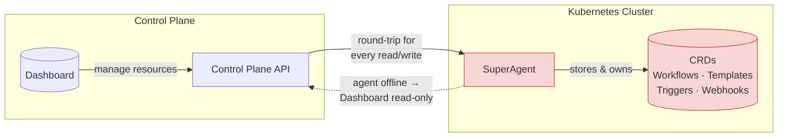
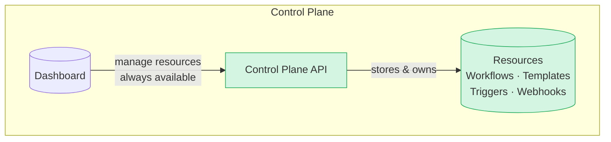

# Control Plane Source of Truth (v2.7)

Starting in Testkube `v2.7`, Testkube stores its Resources in the Control Plane instead of in the default Superagent.

## Background

### The Testkube Agent as the Source-of-Truth

Up until this version of the Testkube, all Testkube Resources available in an Environment were stored and managed as CRDs in the
namespace where the initial Environment Agent ("Superagent") was deployed. This design worked well for standalone agent deployments, but became increasingly 
problematic for complex deployments using the Testkube Control Plane:

- Whenever the initial Agent became unavailable (for example for networking reasons), the Control Plane and Dashboard would no longer have access to 
  the Testkube Resources in that Environment, resulting in the "Read Only" behaviour in the Dashboard.
- Any action in the Testkube Dashboard that involved the retrieval/update of a Testkube Resources (for example updating a Workflow), would require 
  a round-trip to the Agent where the Resource was actually stored - which in large deployment would result in sluggish and sometimes fragile functionality.
- Performing bulk actions on Testkube Resources in the Dashboard (for example search or find/replace across Workflows) was not technically feasible as all 
  Resources would first have to be retrieved from the Agent, and updating them atomically would not be possible.
- RBAC controls for Testkube Resources in the Testkube Dashboard could be bypassed by modifying corresponding Kubernetes resources directly with kubectl/etc.



### Testkube Control Plane as the Source-of-Truth

The new architecture introduced in this release moves the storage and management of all Testkube Resources from the Agent to the Control Plane itself, resulting in:

- An agent is no longer required to create and manage an Environment and its resources in the Testkube Dashboard, it is first when you actually want to 
  run a Workflow, or start listening to Kubernetes Events that you will need to deploy a Runner or Listener Agent - [Read More about Testkube Agents](/articles/agents-overview)
- The Dashboard will no longer exhibit "Read Only" behaviour - it is always connected to the Control Plane where all Resources are stored.
- Latency and reliability for working with Testkube Resources in large deployments should be greatly improved.
- RBAC controls for Testkube Resource are now much harder to bypass, ensuring integrity of your resources in a regulated/audited environment.
- Bulk actions on Resources is now possible - which will allow us to add corresponding functionality going forward.



## What happens when migrating to 2.7.0

When upgrading the Agent to the 2.7.0 version, it will automatically migrate existing Testkube resources to the Control Plane,
in line with the new architecture described above. This migration should be transparent to users.

The Testkube Resources synced are

- `TestWorkflow` (`testworkflows.testkube.io/v1`)
- `TestWorkflowTemplate` (`testworkflows.testkube.io/v1`)
- `TestTrigger` (`tests.testkube.io/v1`)
- `Webhook` (`executor.testkube.io/v1`)
- `WebhookTemplate` (`executor.testkube.io/v1`)

This gives existing environments a consistent starting point when moving to Control Plane ownership.

Once migrated, the (Super)Agent will show up in the list of Agents as an Agent with all 4 agent capabilities enabled; runner, listener, gitops and webhook.
This is functionality equivalent to its pre-migration state, so users can continue using Testkube as before without having to perform any further tasks 
for the migration to finish.

:::note
If you want to continue syncing Testkube resources into the Control Plane after the migration, read the [Testkube Resources and GitOps](#testkube-resources-and-gitops) section below.
:::

## What This Means for Users

For most users, this change simplifies day-to-day operations:

- Workflow updates made in the Control Plane are the authoritative connected state.
- Environment health no longer depends on continuous connection to SuperAgent.
- Environments no longer automatically switch to read-only mode when the SuperAgent connection is unavailable.
- Scheduling is managed centrally from the Control Plane.
- Webhooks and Kubernetes-event triggers continue to execute through agents via the agent capability model (for triggers, see [Listener Agents](/articles/agents-overview#listener-agents)).
- Control Plane metrics are available by default for observability (see [Control Plane Metrics](/articles/control-plane-metrics)).


## Agent Capability Cookbook (v2.7)

In `v2.7`, connected environments still use agent capabilities for eventing and optional sync paths.

Use this section as a practical cookbook when deciding which capabilities to enable on each connected agent.

### Listener capability

Use Listener capability when you need Kubernetes-event triggers (`TestTrigger`) to be evaluated from cluster events.

For self-registering Runner Agents (`testkube-runner` chart):

```yaml
listener:
  enabled: true
```

For namespace-scoped and cluster-wide listening patterns, see [Listener Agent Cookbook](/articles/multi-agent-runner-helm-chart#listener-agent-cookbook).

CLI example:

```bash
testkube install agent <name> --create --listener
```

### GitOps capability

Use GitOps capability when your source of truth for Workflows/Triggers/Webhooks remains in Kubernetes manifests and you want those CRD changes synchronized into connected Control Plane state.

For self-registering Runner Agents (`testkube-runner` chart):

```yaml
gitops:
  enabled: true
```

CLI example:

```bash
testkube install agent <name> --create --gitops
```

### Webhooks capability

Use Webhooks capability when webhook-triggered execution should run through the agent path in connected mode.

For self-registering Runner Agents (`testkube-runner` chart):

```yaml
webhooks:
  enabled: true
```

CLI example:

```bash
testkube install agent <name> --create --webhooks
```

:::note
During SuperAgent migration, webhook capability is preserved so existing webhook behavior continues after upgrading to `v2.7`.
:::

### Combined capability example

A common connected setup keeps Runner + Listener enabled and adds GitOps and Webhooks explicitly:

```yaml
runner:
  enabled: true

listener:
  enabled: true

gitops:
  enabled: true

webhooks:
  enabled: true
```

Equivalent CLI flow:

```bash
testkube install agent <name> --create --runner --listener --gitops --webhooks
```

## Scheduling Changes

Scheduled Workflows are now managed by the Control Plane by default in connected mode.

See [Scheduling Workflows](/articles/scheduling-tests) for schedule syntax and usage, and [Control Plane Metrics](/articles/control-plane-metrics) for scheduler observability.

## Webhooks and Triggers

The execution model for Webhooks and Trigger listeners remains agent-based:

- During SuperAgent migration, SuperAgent keeps the webhook capability so webhook-driven workflow execution continues through the agent path.
- Test Triggers are still handled by Listener Agents.

Related docs:

- [Webhooks](/articles/webhooks)
- [Kubernetes Event Triggers](/articles/test-triggers)
- [Listener Agents](/articles/agents-overview#listener-agents)

:::note
The "webhook capability" naming is currently an internal implementation detail and may change in future releases.
:::

## Metrics Default

Control Plane Prometheus metrics are enabled by default in `v2.7`.

Metrics coverage (including scheduler metrics) is documented in:

- [Control Plane Metrics](/articles/control-plane-metrics)
