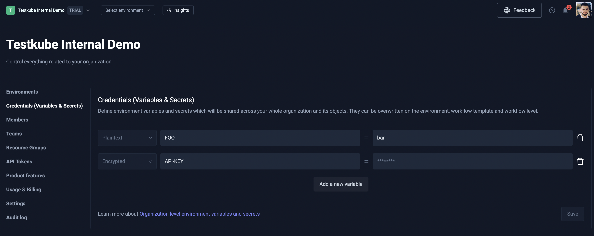
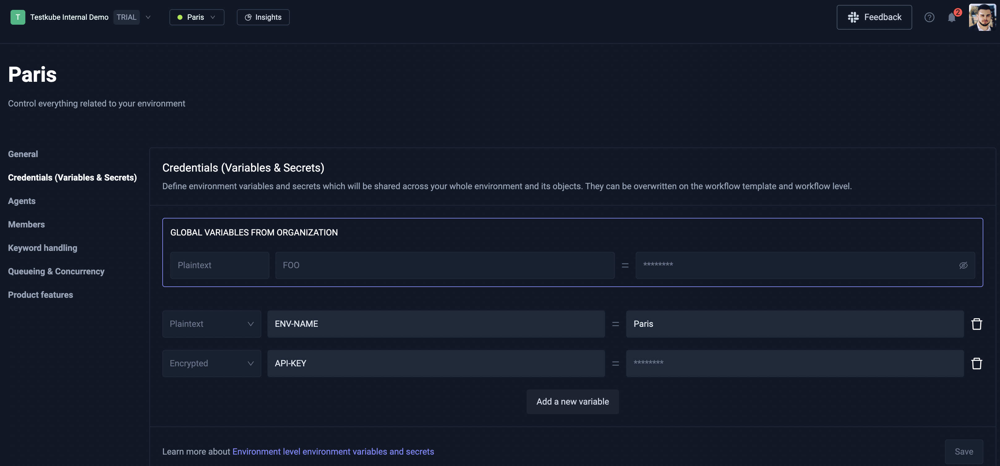
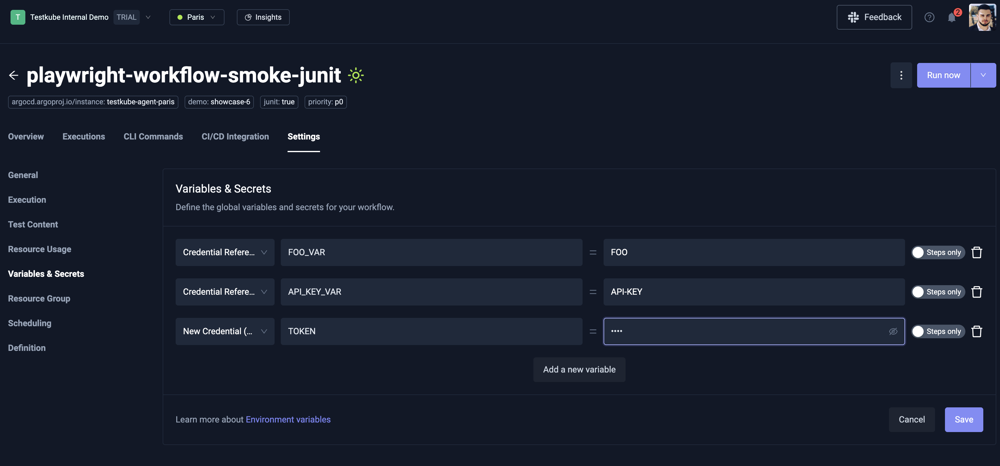

# Testkube Credentials

## What Are Credentials?

Credentials in Testkube help you securely store and use sensitive and non-sensitive information like passwords, API keys,
and configuration values in your tests.
Instead of putting secrets and common configuration params directly in your test code, you store them safely and reference them when needed.

There are two types of credentials:

### **Secret** (For sensitive data)
**Use for**: Passwords, API keys, tokens, private keys
**Benefits**:
- Values are encrypted and hidden in the UI
- Safe to store sensitive information
- Only visible during test execution

**Example**: GitHub personal access token, database password, AWS secret key

### **Variable** (For configuration data)
**Use for**: URLs, settings, non-sensitive configuration
**Benefits**:
- Values are visible in the UI for easy editing
- Good for configuration that needs to be readable
- Can be shared and reviewed by team members

**Example**: API base URL, test database name, environment-specific settings

### Scopes

Credentials can be scoped on 3 different levels:
* **Organization-scoped**: Can be referenced by Workflows which are created in a specific Organization
* **Environment-scoped**: Can be referenced by Workflows which are created in a specific Environment
* **Workflow-scoped**: Can be referenced only within a Workflow in which the credentials were created

> If a credential with the same name is defined in multiple scopes, the resolution priority is workflow > environment > organization.

### Usage

Credentials can be referenced by adding the expression `{{credential("<NAME>")}}` in your Workflow,
in the place where the credential value should be injected.

> Make sure the credential name is quoted inside the `credential()` function!

## Example

### Organization-scoped

Follow this steps to create an Organization-scoped credential:
1. Click the Organization dropdown menu and select the **Organization Management** page.
2. Select **Credentials (Variables & Secrets)** from the left sidenav menu.
3. Click **Add new variable** and create a credential with either **Plaintext** or **Encrypted** type.
4. After you have added all of your credentials, make sure to to click the **Save** button!



### Environment-scoped

Follow this steps to create an Environment-scoped credential:
1. Click the Environment dropdown menu and select the **Environment settings** page.
2. Select **Credentials (Variables & Secrets)** from the left sidenav menu.
3. Click **Add new variable** and create a credential with either **Plaintext** or **Encrypted** type.
4. After you have added all of your credentials, make sure to to click the **Save** button!



### Workflow-scoped

For a specific Workflow, you can either create Workflow-scoped credentials or 
reference existing Organization-, Environment-, or Workflow-scoped credentials.

This can be done by opening Workflow **Settings** page and selecting the **Variables & Secrets** page from the left sidenav.

If you want to create a new Workflow-scoped credential, click the **Add a new variable** button and 
select **New credential (encrypted)** as the credential type.
The name of the credential is actually the name of the global environment variable which will be accessible by all steps, 
and the value will get encrypted and the expression `credential("<NAME>")` will be injected:
```yaml
spec:
  container:
    env:
      - name: SOME_SECRET
        value: '{{credential("tw-playwright-test-rg69tr1")}}'
```

If you want to reference an existing credential, go to the same page, and select `Credential Reference` as the credential type.
You will see a dropdown when you select the **value** field which contains a list of credentials you have access to.

