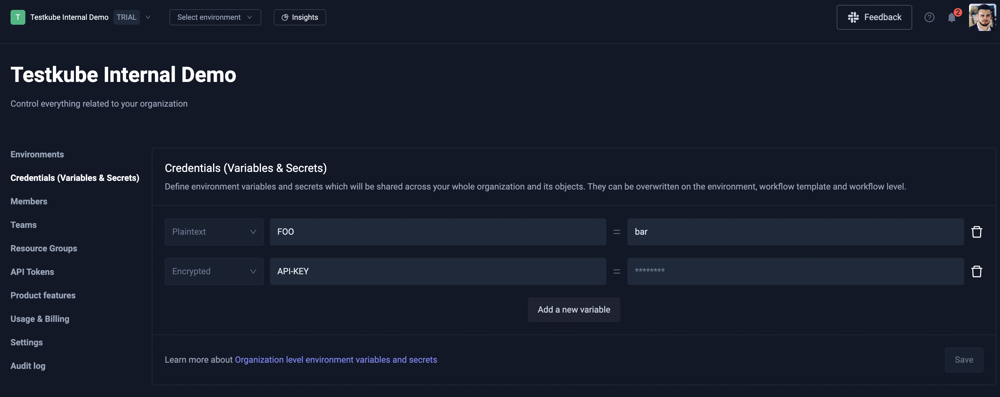
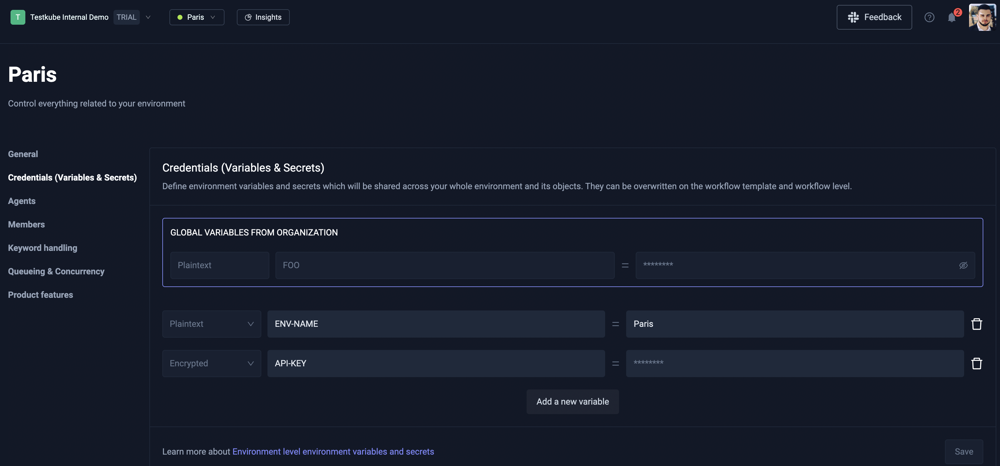
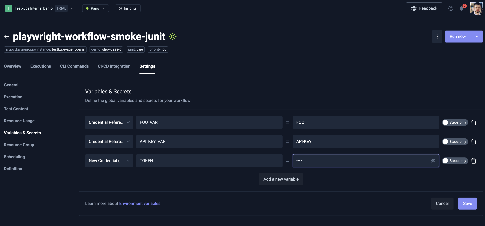

# Testkube Credentials

## What Are Credentials?

Credentials in Testkube help you securely store and use sensitive and non-sensitive information like passwords, API keys,
and configuration values in your tests.
Instead of putting secrets and common configuration params directly in your test code, you store them safely and reference them when needed.

There are three types of credentials:

### **Secret** (For sensitive data)
**Use for**: Passwords, API keys, tokens, private keys
**Benefits**:
- Values are encrypted and hidden in the UI
- Safe to store sensitive information
- Only visible during test execution

**Example**: GitHub personal access token, database password, AWS secret key

### **Variable** (For configuration data)
**Use for**: URLs, settings, non-sensitive configuration
**Benefits**:
- Values are visible in the UI for easy editing
- Good for configuration that needs to be readable
- Can be shared and reviewed by team members

**Example**: API base URL, test database name, environment-specific settings

### **Vault** (For enterprise secret management)
**Use for**: Secrets that must live in HashiCorp Vault
**Benefits**:
- Secrets stay in your existing Vault infrastructure — no duplication
- Centralized audit trail and rotation through Vault
- Testkube reads secrets from Vault at execution time
- Compliant with enterprise security policies that require centralized secret management

**Example**: Production API keys managed by your security team, rotating database credentials, certificates

:::info On-Prem Only
Vault credentials are only available for on-prem (Enterprise) installations with a Vault backend configured.
See [Vault Backend Setup](#vault-backend-setup) below for setup instructions.
:::

:::info On-Prem Master Password Requirement
For on-prem installations, a master password must be configured on the control plane. It is used to encrypt
**Secret** credentials stored in the database and to sign the tokens that allow runners to
retrieve secrets during workflow execution.

Without a master password, only **Variable** (plaintext) credentials can be stored, and workflow executions
that require credentials will fail.

For setup details, runtime behavior, and recovery notes, see
[Master Password for Encryption](/articles/install/advanced-install#master-password-for-encryption)
in the installation guide.

Testkube Cloud users do not need to configure this — it is enabled by default.
:::

:::tip Disabling Credentials
On-prem users who manage secrets externally (e.g. HashiCorp Vault) can disable
credentials entirely or turn off just the encrypted backend.
See [Disabling Credentials](/articles/install/advanced-install#disabling-credentials) for details.
:::

### Scopes

Credentials can be scoped on different levels:
* **Organization-scoped**: Can be referenced by Workflows across the entire Organization
* **Environment-scoped**: Can be referenced by Workflows in a specific Environment
* **Resource-group-scoped**: Can be referenced by Workflows in a specific Resource Group
* **Workflow-scoped**: Can be referenced only within the Workflow where the credentials were created

> If a credential with the same name is defined at multiple scopes, the most specific scope wins:
> workflow > resource group > environment > organization.

### Usage

Credentials can be referenced by adding the expression `{{credential("<NAME>")}}` in your Workflow,
in the place where the credential value should be injected.

> Make sure the credential name is quoted inside the `credential()` function!

## Example

### Organization-scoped

Follow these steps to create an Organization-scoped credential:
1. Click the Organization dropdown menu and select the **Organization Management** page.
2. Select **Credentials (Variables & Secrets)** from the left sidenav menu.
3. Click **Add new variable** and create a credential with either **Plaintext**, **Encrypted**, or **Vault** type.
4. After you have added all of your credentials, make sure to click the **Save** button!



### Environment-scoped

Follow these steps to create an Environment-scoped credential:
1. Click the Environment dropdown menu and select the **Environment settings** page.
2. Select **Credentials (Variables & Secrets)** from the left sidenav menu.
3. Click **Add new variable** and create a credential with either **Plaintext**, **Encrypted**, or **Vault** type.
4. After you have added all of your credentials, make sure to click the **Save** button!



### Workflow-scoped

For a specific Workflow, you can either create Workflow-scoped credentials or
reference existing Organization-, Environment-, or Workflow-scoped credentials.

This can be done by opening Workflow **Settings** page and selecting the **Variables & Secrets** page from the left sidenav.

If you want to create a new Workflow-scoped credential, click the **Add a new variable** button and
select **New credential (encrypted)** as the credential type.
The name of the credential is actually the name of the global environment variable which will be accessible by all steps,
and the value will get encrypted and the expression `credential("<NAME>")` will be injected:
```yaml
spec:
  container:
    env:
      - name: SOME_SECRET
        value: '{{credential("tw-playwright-test-rg69tr1")}}'
```

If you want to reference an existing credential, go to the same page, and select `Credential Reference` as the credential type.
You will see a dropdown when you select the **value** field which contains a list of credentials you have access to.



## Vault Backend Setup

:::info
This section covers using Vault as a **credentials backend** — where Testkube reads and writes workflow secrets
to Vault's KV v2 engine.

If you're looking to inject infrastructure secrets (license keys, Minio credentials, CA certificates) into Testkube's
own pods using Vault's sidecar injector, see [Installation Using Vault](/articles/vault-install) instead.
:::

When you create a credential with type **Vault**, Testkube:

1. Writes the secret value to Vault's KV v2 engine at a deterministic path under your configured mount
2. Stores a reference to that Vault path in its database (the actual secret value is never stored in Testkube)
3. At workflow execution time, the control plane reads the secret from Vault and passes it to the runner

All Vault access goes through the control plane. Agents and runners never talk to Vault directly.

### Prerequisites

- An on-prem (Enterprise) Testkube installation
- A running HashiCorp Vault instance (OSS or Enterprise) accessible from the control plane
- A KV v2 secrets engine enabled in Vault (typically mounted at `secret/`)

### 1. Create a Vault Policy

The control plane needs read and write access to the KV v2 path where credentials will be stored.
By default, Testkube stores secrets under `<mountPath>/data/testkube/...`.

```hcl
path "secret/data/testkube/*" {
  capabilities = ["create", "read", "update", "delete", "list"]
}

path "secret/metadata/testkube/*" {
  capabilities = ["list", "read", "delete"]
}
```

Save this as `testkube-cp.hcl` and write it to Vault:

```bash
vault policy write testkube-cp testkube-cp.hcl
```

### 2. Configure Authentication

Testkube supports two authentication methods: **Kubernetes auth** (recommended for production) and **static token** (for dev/testing).

#### Kubernetes Auth (Recommended)

This method uses the control plane pod's ServiceAccount token to authenticate with Vault.
No static secrets to manage — the token is automatically rotated by Kubernetes and renewed by Testkube.

Enable the Kubernetes auth method in Vault (if not already enabled):

```bash
vault auth enable kubernetes

vault write auth/kubernetes/config \
  kubernetes_host="https://kubernetes.default.svc.cluster.local:443"
```

Create a role bound to the control plane's ServiceAccount:

```bash
vault write auth/kubernetes/role/testkube-cp \
  bound_service_account_names=testkube-enterprise-api \
  bound_service_account_namespaces=<your-namespace> \
  policies=testkube-cp \
  ttl=1h
```

Replace `<your-namespace>` with the namespace where Testkube is installed.

:::tip
The ServiceAccount name `testkube-enterprise-api` is the default created by the Helm chart. If you've
customized `serviceAccount.name` in your values, use that name instead.
:::

#### Static Token (Dev/Testing Only)

For quick testing, you can use a static Vault token. This is not recommended for production
because the token doesn't rotate and must be manually replaced if it expires.

```bash
vault token create -policy=testkube-cp -period=24h
```

### 3. Configure the Helm Chart

Add the vault backend configuration to your `testkube-enterprise` Helm values:

#### With Kubernetes Auth

```yaml
testkube-cloud-api:
  credentials:
    backends:
      vault:
        enabled: true
        addr: "http://vault.vault.svc.cluster.local:8200"
        mountPath: "secret"
        pathPrefix: "testkube"
        authMethod: "kubernetes"
        role: "testkube-cp"
```

#### With Static Token

```yaml
testkube-cloud-api:
  credentials:
    backends:
      vault:
        enabled: true
        addr: "http://vault.vault.svc.cluster.local:8200"
        mountPath: "secret"
        pathPrefix: "testkube"
        authMethod: "token"
        token: "hvs.your-vault-token"
```

For production, store the token in a Kubernetes Secret and reference it instead:

```yaml
testkube-cloud-api:
  credentials:
    backends:
      vault:
        enabled: true
        addr: "http://vault.vault.svc.cluster.local:8200"
        mountPath: "secret"
        pathPrefix: "testkube"
        authMethod: "token"
        tokenSecretRef:
          name: "vault-token-secret"
          key: "token"
```

#### Vault Enterprise Namespace

If you're using Vault Enterprise with namespaces, add the `namespace` field:

```yaml
testkube-cloud-api:
  credentials:
    backends:
      vault:
        enabled: true
        addr: "https://vault.example.com:8200"
        mountPath: "secret"
        pathPrefix: "testkube"
        authMethod: "kubernetes"
        role: "testkube-cp"
        namespace: "my-team"
```

### 4. Apply and Verify

After updating your Helm values, upgrade the release:

```bash
helm upgrade tke testkube-enterprise/testkube-enterprise -f values.yaml -n <namespace>
```

Check the control plane logs for successful Vault initialization:

```bash
kubectl logs deployment/testkube-enterprise-api -n <namespace> | grep -i vault
```

If Vault initialization fails, you'll see a warning like `Failed to initialize vault backend` — the control plane
continues running but vault credentials won't be available. Check the error message for details
(usually a connectivity or authentication issue).

### Vault Configuration Reference

| Parameter | Description | Default |
|-----------|-------------|---------|
| `enabled` | Enable the Vault credentials backend | `false` |
| `addr` | Vault server address (e.g. `http://vault:8200`) | `""` |
| `mountPath` | KV v2 secrets engine mount path | `"secret"` |
| `pathPrefix` | Prefix for all credential paths in Vault | `"testkube"` |
| `authMethod` | `"kubernetes"` or `"token"` | `"token"` |
| `role` | Vault role name (for kubernetes auth) | `""` |
| `token` | Static Vault token (for token auth) | `""` |
| `tokenSecretRef.name` | Kubernetes Secret name containing the token | `""` |
| `tokenSecretRef.key` | Key within the Secret | `"token"` |
| `namespace` | Vault Enterprise namespace | `""` |

### Vault Path Structure

Testkube organizes secrets in Vault by scope. Given the default `mountPath: "secret"` and `pathPrefix: "testkube"`,
the paths look like this:

| Scope | Vault Path |
|-------|-----------|
| Organization | `secret/data/testkube/o/<orgID>/<credentialName>` |
| Environment | `secret/data/testkube/e/<orgID>/<envID>/<credentialName>` |
| Resource Group | `secret/data/testkube/rg/<orgID>/<rgID>/<credentialName>` |
| Workflow | `secret/data/testkube/w/<orgID>/<envID>/<workflowName>/<credentialName>` |

This structure lets you use Vault's ACL policies to restrict access by scope if needed.

### Token Renewal

When using Kubernetes auth, Testkube automatically renews the Vault token before it expires.
If renewal fails (e.g. Vault is temporarily unreachable), Testkube re-authenticates using the pod's
ServiceAccount token with exponential backoff. No manual intervention or pod restart is needed.

For static token auth, token lifecycle is your responsibility. If the token expires, credential
operations will fail until a valid token is provided (either by updating the Secret or restarting the pod
with a new token).
