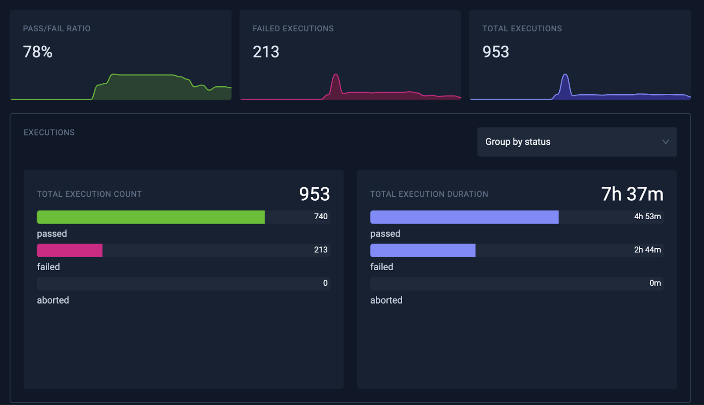
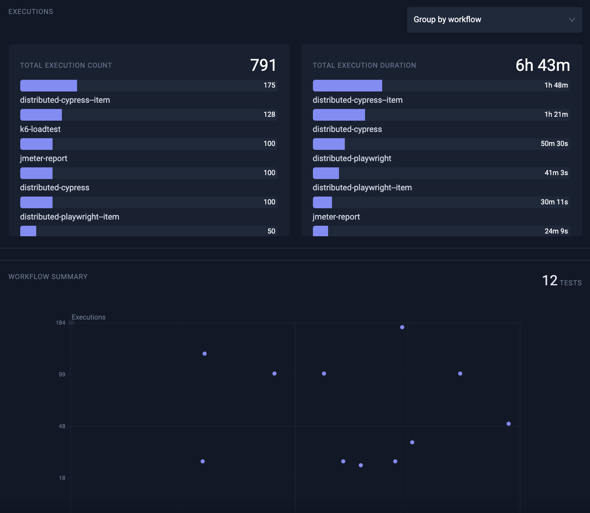
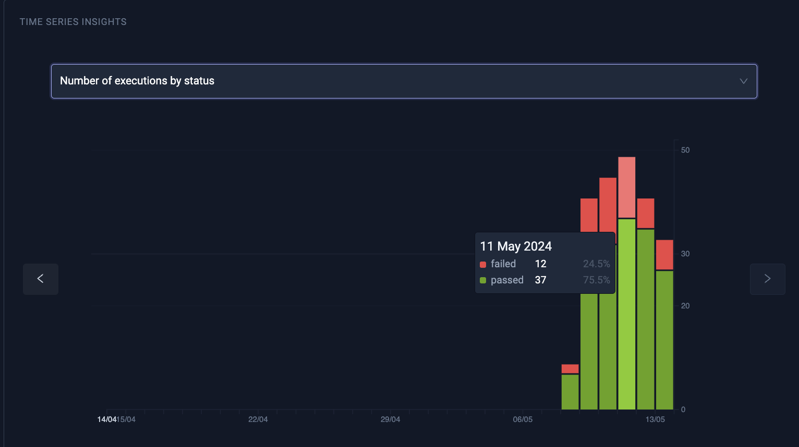
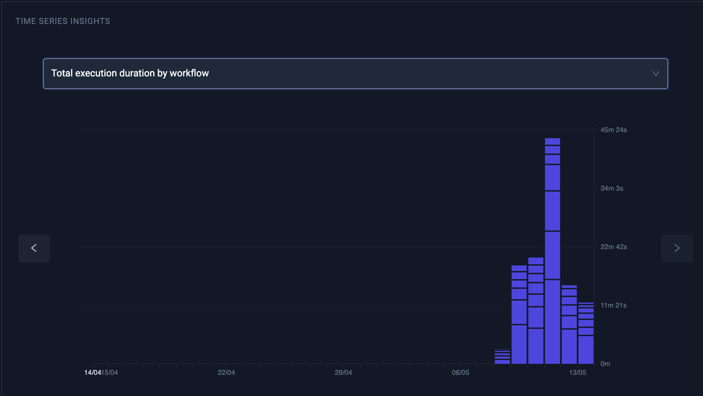

# Data Driven Insights

The Testkube Test Insights feature is tailored to empower DevOps, testers, and QA managers with deep analytical capabilities. This feature provides valuable insights into your tests, enabling data-driven decisions that optimize your testing strategies and improve the quality of your applications.

## The Value of Test Insights

By integrating Test Insights into your testing workflow, your team can leverage several benefits:

- **Enhanced Visibility:** Gain a clear overview of testing activities and outcomes, helping you manage and prioritize testing resources more effectively.
- **Data-Driven Decisions:** Make informed decisions about where to allocate efforts for improving test efficiency and reliability.
- **Improved Test Efficiency:** Identify and address inefficiencies in your testing process, leading to faster development cycles and higher quality software releases.

## Understanding Test Insights

Test Insights is an analytics tool integrated into Testkube, that provides detailed metrics about the execution of your tests. This feature allows teams to track key performance indicators including the number of test executions, pass/fail rates, execution durations, and more, all within a user-friendly dashboard.

With Test Insights, DevOps and QA managers can quickly answer crucial questions that impact the testing cycle and overall software quality, such as:

- Which tests take the longest to execute, and why?
- Which tests have the highest failure rates?
- How do test performance metrics vary by type of test or by the tools used?
- How do key test execution metrics change over time?

## Testing Strategy 

**Efficiency Quadrant Analysis:** Utilize a quadrant chart to visualize tests by execution time and frequency. Tests that frequently run and take longer to execute appear in the top right quadrant, highlighting them as prime candidates for optimization to reduce testing bottlenecks, improve cycle times and optimize infrastructure costs.

### Key Metrics and Groupings

**Execution Metrics:** View the total number of test executions over a given period, along with their status outcomes (passed and failed), helping teams understand the impact of their applications evolution on quality and where they should focus their testing and bug-fixing efforts going forward.

**Performance Analysis:** Assess the execution duration of tests to identify which tests take the longest and may need optimization to reduce application delivery times and infrastructure costs.

**Test Categorization:** Filter insights by test types (load, API, end-to-end) or by testing tools, enabling teams to pinpoint specific areas for improvement.

## The Value of Test Insights

By integrating Test Insights into your testing workflow, your team can leverage several benefits:

- **Enhanced Visibility:** Gain a clear overview of testing activities and outcomes, helping you manage and prioritize testing resources more effectively.
- **Data-Driven Decisions:** Make informed decisions about where to allocate efforts for improving test efficiency and reliability.
- **Improved Test Efficiency:** Identify and address inefficiencies in your testing process, leading to faster development cycles and higher quality software releases.

