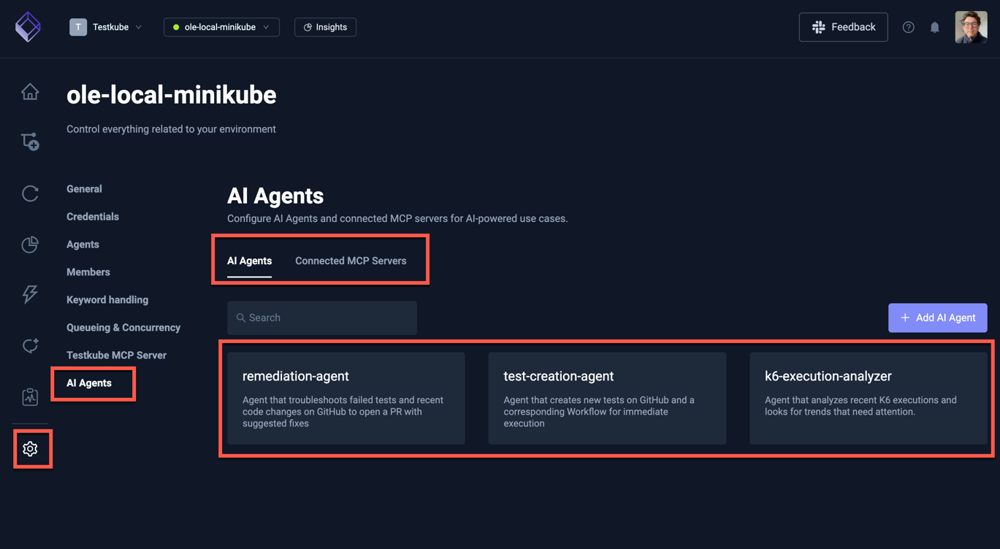
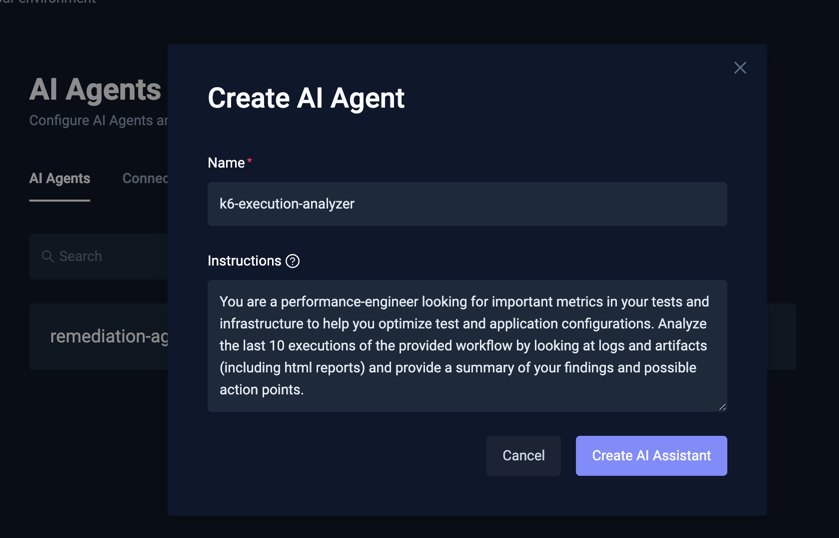
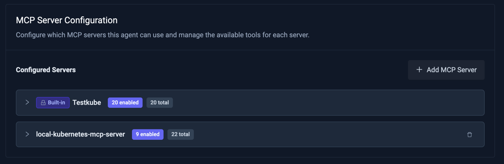
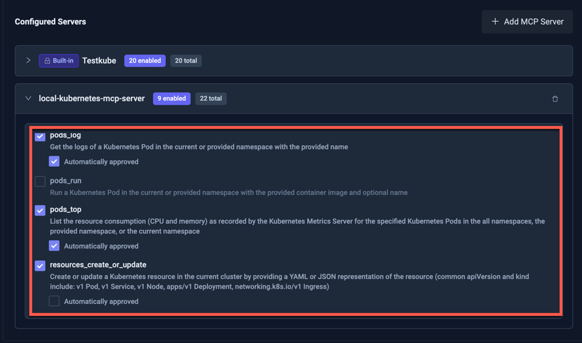
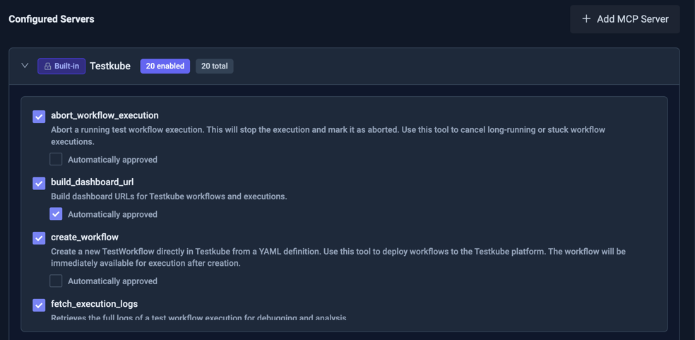
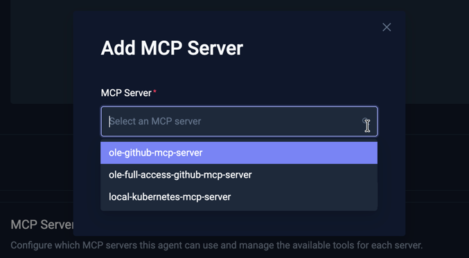

# Managing Testkube AI Agents

Testkube AI Agents are created and managed at the Environment level in the Environment Settings Panel:

This panel has two tabs:

- **AI Agents**: allows you to create and manage the AI Agents in your Testkube Environment
- **Connected MCP Servers**: allows you to connect to MCP Servers that your AI Agents can use to perform their tasks - [Read More](mcp-servers-for-ai-agents).

## Creating a new AI Agent

Selecting the "Add AI Agent" button will open the AI Agent creation panel where you need to specify a name and 
instructions (prompt) for your agent.

Once created, you are taken to the AI Agent details page where you can edit the agent as described below. 

## Editing an AI Agent

Editing an AI Agent is done by selecting it in the AI Agents tab shown above, which opens a panel with the following
fields:

- **Name** - the name of your AI Agent, needs to be unique within the environment and comply with Kubernetes naming conventions.
- **Description** - a short description of what your AI Agent does.
- **Instructions** - the prompt that your AI Agent will use to perform its task, read more about [AI Agent Instructions] 
- **MCP Server Setting**s - allows you to configure which MCP Server(s)/tool(s) your AI Agent has access to.
- **Delete** - deletes the AI Agent.

### Configuring MCP Servers 

The "MCP Server Configuration" section on this page allows you to configure which MCP Servers and tools your 
AI Agent has access to, which includes both the default Testkube MCP Server (see below) and any custom MCP 
Servers you have connected to your Testkube Environment under the "Connected MCP Servers" Tab [Read More](mcp-servers-for-ai-agents).

Constraining an AI Agent to a specific set of MCP Servers and tools has several benefits:
- **Security**: you can make sure your AI Agent does not mistakenly access or modify resources it should not be working with.
- **Performance**: the fewer MCP tools that add to your AI Agents context, the more tokens the AI Agent will be able to use to perform its tasks.

In the screenshot below, the AI Agent has access to both the [default Testkube MCP Server](#the-default-testkube-mcp-server) and a connected Kubernetes MCP Server.

### Configuring MCP Server Tools

Expanding an MCP Server will show you the tools it exposes and if they are enabled for the current AI Agent.

When adding an MCP Server to an AI Agent, all its tools are disabled by default; enable them individually
to allow the AI Agent to use them to perform its task(s). 

Each MCP Server Tool has an "Automatically approved" setting (disabled by default), enabling this will
allow the AI Agent to use the tool without approval. If you do not enable this setting, you will 
be prompted for approval in the Chat Session panel as the Chat is performed - [Read More](/articles/using-ai-agents#mcp-tool-approval).

### The default Testkube MCP Server

All AI Agents always have access to the [Testkube MCP Server](/articles/mcp-overview) for the current Environment, 
which exposes corresponding MCP Tools for accessing executions, managing Workflows, etc. 

This MCP Server can't be removed from an AI Agent, but you can configure which tools it has access to, in line with the descriptions above.

:::note
By default an AI Agent has access to all the Testkube MCP Tools and requires approval only for those that can
modify the state of your Testkube Environment in any way.
:::

### Adding an MCP Server

Select the "Add MCP Server" button to give your AI Agent access to a connected MCP Server, the opened modal will
allow you to select the MCP Server which will then be added to your AI Agent with all Tools disabled.

:::tip
If you want your AI Agent to interact with other Testkube Environments than itself, you can add the Testkube MCP Server
for that Environment under the "Connected MCP Servers" Tab [Read More](mcp-servers-for-ai-agents) and configure it like
any other MCP Server.
:::
