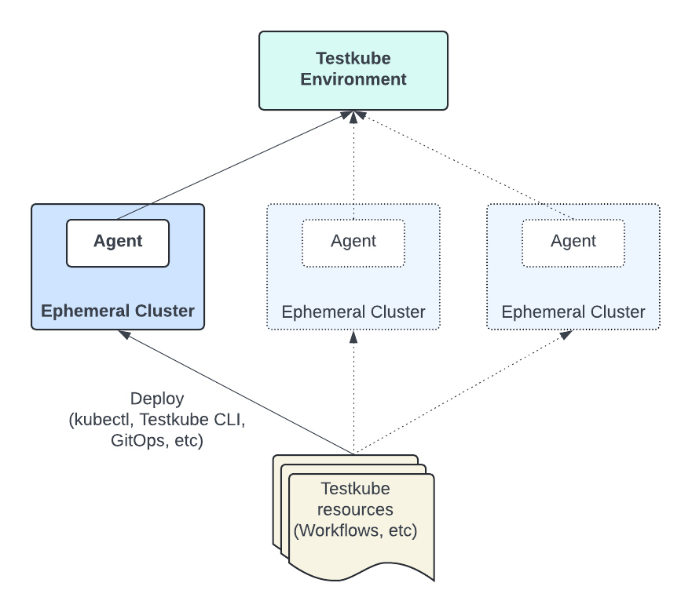
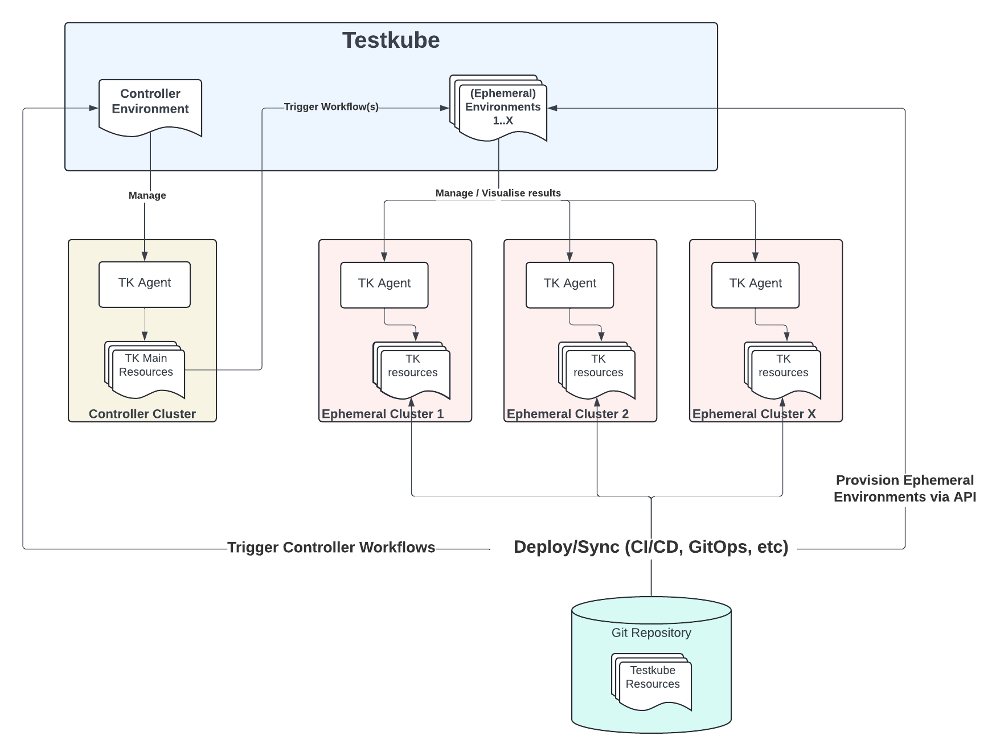

# Ephemeral Clusters

## Background 

Testkube expects your Environments and their corresponding Testkube Agent/Cluster to be long-lived - 
for example a staging or testing Environment where test execution results are aggregated over time to allow for 
continuous testing, troubleshooting, analytics, reporting, etc. 

Another common use-case on the other hand is **ephemeral clusters**, i.e. clusters that are temporary and short-lived,
for example when testing changes in a Pull/Merge Request or running full System tests on a new feature. In this scenario 
Testkube requires you to define a new Environment, install the Agent, configure/run tests, etc. for each ephemeral 
cluster created in your development workflows. Furthermore, once the ephemeral cluster is removed, the corresponding 
Testkube Environment will have to be kept for as long as the contained Test Execution results are required, 
potentially resulting in a large number of environments, which becomes both costly and difficult to manage over time.

A preferred solution would be a single Testkube Environment to which any number of Testkube Agents (deployed
in ephemeral clusters) can connect and report test execution results as they come and go. Unfortunately though,
this approach is currently constrained by how Testkube works today:

- Testkube Environments can currently only handle a single connected agent at a time. 
- Testkube resources (Workflows, Triggers, etc.) are stored in the clusters themselves and not in the Control Plane, 
  so that when a new agent in an ephemeral cluster connects, it won't contain any tests/triggers/etc to run.

Given these constraints let's look at two approaches for working with ephemeral clusters with Testkube.

## 1. Re-using agents within an Environment

As mentioned above, only a single agent can be connected to a Testkube Environment at a time. 
If you can comply with this constraint in your development pipelines, you can simply re-use the agent installation 
command across multiple clusters - just make sure only one cluster/agent is running at a time:

1. [Create an Environment](/testkube-pro/articles/environment-management#operation/updateEnvironment) as usual via the Dashboard
2. Reuse the generated command for connecting an agent for all clusters that should connect to this Environment. 

### Provisioning and execution of Testkube resources

Once the agent has been installed on a new ephemeral cluster, that cluster will not contain any Testkube resources 
for it to run/manage; these need to be installed in the cluster for the agent to run and manage. Since Testkube 
resources are standard Kubernetes CRDs ([Read More](http://localhost:3000/articles/crds)), this can be achieved in 
several ways, for example:

- By automating `kubectl apply` commands for the resources that are need to run your tests in your CI/CD workflows.
- By storing these resources in Git and using a GitOps tool like ArgoCD or Flux to deploy them into your cluster.

The below diagram describes this approach at a high level:



### Triggering provisioned resources

Once your Testkube resources have been created in your ephemeral cluster and the agent has connected to its 
Testkube Environment, you can trigger/use them in any way supported by Testkube. In case of Workflows, you 
might use a GitOps approach to deploy [Execution CRDs](/articles/test-executions) to trigger their execution, 
trigger Test Executions [from CI/CD](/articles/cicd-overview), or simply use/automate the 
Testkube CLI [run command](/cli/testkube_run) in your CI/CD pipeline.

If your Testkube resources contain [Kubernetes Event Triggers](/articles/test-triggers), these will be triggered accordingly.

### Aggregating results

The Testkube Dashboard will aggregate and show test execution results from each ephemeral cluster as its Testkube Agent 
connects and executes its Workflows. 

:::info
Testkube identifies execution results by the name of their Workflow, so as long as the Workflows have the same name
across all your environments, they will be aggregated and shown in the Dashboard under the corresponding Workflow.
:::

## 2. Ephemeral Namespaces

Instead of provisioning ephemeral clusters it is not uncommon to use ephemeral namespaces within an existing cluster
for this purpose. Combined with Testkubes `executionNamespace` functionality you can in this scenario avoid having to install
the Testkube Agent in each ephemeral namespace;

- Install the Agent and all required Testkube resources in a dedicated namespace (`testkube` by default).
- Use the `executionNamespace` property to execute your Workflow in other (temporary) namespaces.

You could specify a corresponding configuration parameter in your Workflow:

```yaml
kind: TestWorkflow
metadata:
  name: example
spec:
  config:
    namespace:
      type: string
  job:
    namespace: "{{ config.namespace }}"
```

and then specify the namespace at runtime, together with any other configuration parameters:

```
testkube run tw my-workflow --config namespace=PR_1234
```

## 3. Using a Controller Environment 

The above approach has the main constraint that it only supports one ephemeral cluster at a time. If this is not
feasible in your setup (for example if you have multiple ongoing PRs, each with their own ephemeral cluster for testing), 
an alternative approach is to automate the creation of ephemeral Testkube Environments using 
the Testkube API, possibly paired with a "Controller Environment" that triggers the execution of tests in these 
ephemeral Environments and aggregates their results for troubleshooting and long-term reporting and analysis.



This is slightly more elaborate setup, let's walk through the main steps:

1. Once an ephemeral cluster has been created, use the Testkube API to [create a new Environment](/openapi/cloud/Organisation-Operations----environments#operation/createEnvironment)
2. The output of this API operation contains the installation commands for installing the corresponding Testkube Agent - run this
   command for your ephemeral cluster to install and connect the Agent to the Environment created in (1).
3. Provision the Testkube resources needed in your cluster as described for the previous approach (kubectl, CLI, GitOps, etc.).
4. Trigger the Workflows now available in your ephemeral environment (see below)
5. After all Testkube actions have been completed, you can destroy the ephemeral environment 
   with the [Delete environment](/openapi/cloud/Organisation-Operations----environments#operation/deleteEnvironment) API operation.

Triggering Workflows in Ephemeral Environments can be done in several ways:

- As described above for the "Re-used Agent" approach - the test execution results will be saved in the
  ephemeral environment created in (1) above (and will consequently be lost once the environment is deleted). 
  This might be ok if you don't need long-term access to the results for troubleshooting or reporting. 
- Create a separate "Controller Environment" (shown to the left in the diagram above) that contains Workflows that 
  in themselves triggers the execution of Workflow(s) in your ephemeral environment(s) (see example below). 
  The output from the Workflow(s) running in your ephemeral environment(s) will be saved with the execution results 
  in the Controller Environment, allowing you to safely delete your Ephemeral Environments as described above 
  once their corresponding cluster has been removed.

### Triggering Workflows in Ephemeral Environments

The below Workflow shows how to trigger a Workflow in another Environment using the Testkube CLI. As you can see
it defines [configuration parameters](/articles/test-workflows-examples-configuration) for all required inputs; 
- `apiToken`, this should be an API-token that you create for the target environment under its organisation - [Read More](/testkube-pro/articles/api-token-management).
- `environmentId`, `organizationId` are provided by the API call to create the ephemeral Environment mentioned above.
- `rootDomain` will be the hostname for the Testkube Control Plane containing the target Environment (`testkube.io`
  if you are using Testkube Cloud).
- `workflowToRun` is the name of the Workflow to run.

```yaml
kind: TestWorkflow
apiVersion: testworkflows.testkube.io/v1
metadata:
  name: run-remote-workflow
  namespace: testkube
spec:
  config:
    apiToken:
      type: string
      default: tkcapi_XX
    environmentId:
      type: string
      default: tkcenv_XX
    organizationId:
      type: string
      default: tkcorg_XX
    rootDomain:
      type: string
      default: testkube.io
    workflowToRun:
      type: string
  steps:
  - run:
      image: kubeshop/testkube-cli:latest
      shell: |
        testkube set context \
          --api-key {{ shellquote(config.apiToken) }} \
          --root-domain {{ shellquote(config.rootDomain) }} \
          --org-id {{ shellquote(config.organizationId) }} \
          --env-id {{ shellquote(config.environmentId) }}

        testkube run tw {{ shellquote(config.workflowToRun) }} -f
status: {}
```

The log-output of the Workflow executed by the `testkube run tw` command will automatically be captured 
and stored in the log-output of the calling Workflow.

:::tip
If you want to capture artifacts generated by the target Workflow have a look at [Remote Workflow Execution](/articles/remote-workflow-execution)
for more details on the above approach.
:::

## Alternative approaches

The above suggested approaches can of course be combined or expanded on depending on your specific needs in regard
to Workflow management, scheduling, etc. Please don't hesitate to reach out on our [Slack Community](https://bit.ly/testkube-slack) or 
by [Getting in touch](https://testkube.io/contact) if you have a specific scenario that Testkube should solve for.

:::info
The Testkube team is looking into adding true multi-agent support to Testkube Environments - let us know if you have
any specific requirements in this regard so we can make sure to cover them also.
:::
