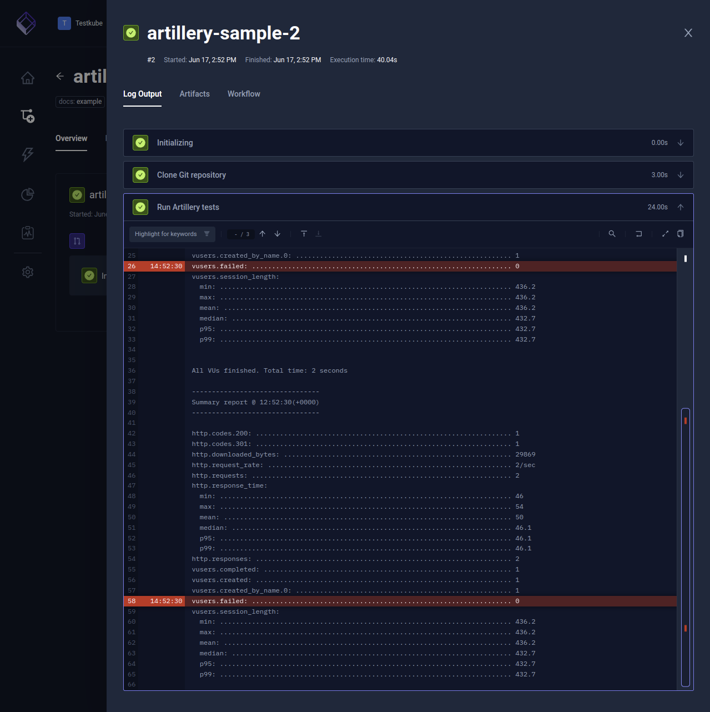

import Tabs from "@theme/Tabs";
import TabItem from "@theme/TabItem";
import SimpleArtillery from "../../workflows/simple-artillery-workflow.md"

# Basic Artillery Example

Below is a basic workflow for executing an Artillery test. You can paste this directly into the YAML of an existing or new test, just make
sure to update the `name` and `namespace` for your environment if needed.

- The `spec.content` property defines the location of the GitHub project.
- The `spec.steps` property defines a single step that runs the `artillery` command.

<SimpleArtillery/>

After execution, you can see the output from the executions under the executions panel tabs:

<Tabs>
<TabItem value="logs" label="Log Output" default>

The log output from the Artillery execution:

</TabItem>
</Tabs>
