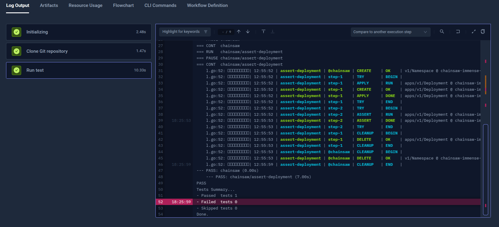

import Tabs from "@theme/Tabs";
import TabItem from "@theme/TabItem";
import SimpleChainsaw from "../../workflows/simple-chainsaw-workflow.md"

# Basic Chainsaw Example

Below is a simple workflow for executing a Chainsaw test available on [GitHub](https://github.com/cerebro1/chainsaw-testkube-demo.git). You can paste this directly into the
YAML of an existing or new test, just make sure to update the `name` and `namespace` for your environment as needed.

- The `spec.content` property defines the path to the Chainsaw test in a GitHub repository.
- The `spec.container` property uses the official Chainsaw image to set up test environment.
- The `spec.steps` property defines a single step that runs the `chainsaw test <test path>` test command.

<SimpleChainsaw/>

After execution, you can see the log output from the test executions under the executions panel tabs:

<Tabs>
<TabItem value="logs" label="Log Output" default>

</TabItem>
</Tabs>
