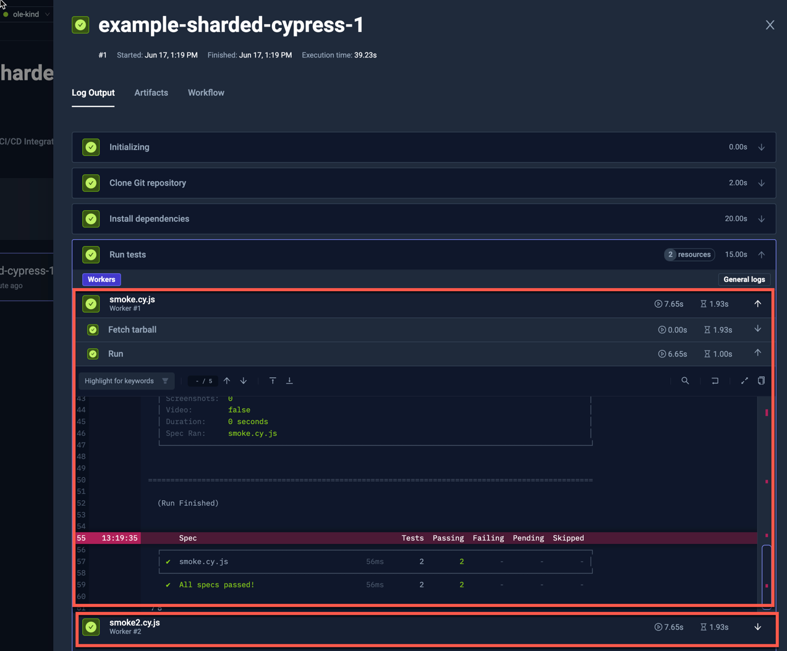

import Tabs from "@theme/Tabs";
import TabItem from "@theme/TabItem";
import ShardedCypress from "../../workflows/sharded-cypress-workflow.md"

# Sharded Cypress Example

Testkube has built-in support for parallelizing any testing tool - check out the
[Parallelization](../test-workflows-parallel) documentation for details and examples.

The below example shows how to distribute ("shard") a set of Cypress tests across a configurable
number of nodes.

The example below:

* Loads the Cypress tests from the Git repository (`content`).
* Sets the working directory to the tests one (`container.workingDir`).
* Installs the project dependencies (`steps[0].shell`).
* Runs Cypress tests with dynamic sharding (`steps[1].parallel`).
  * The shards will be built off the test files in `cypress/e2e` directory (`steps[1].parallel.shards.testFiles`).
  * It will have maximum of 5 shards (`steps[1].parallel.maxCount`).
    * When there is less than or equal to 5 test files, it will run 1 shard per test file.
    * When there will be more than 5 test files, it will distribute them across 5 shards.
  * Each shard will run only selected test files with `--spec` Cypress' argument (`steps[1].parallel.run.args`).

<ShardedCypress/>

The log output from one of the workers:

