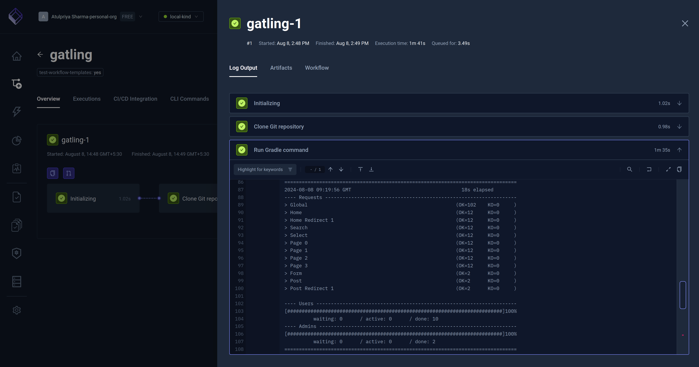

import SimpleGatling from "../../workflows/simple-gatling-workflow.md"

# Basic Gatling Example

Below is a simple workflow for executing a Gatling test available on GitHub. You can paste this directly into the
YAML of an existing or new test, just make sure to update the `name` and `namespace` for your environment as needed.

- The `spec.content` property defines the path to the Gatling test in a GitHub repository
- the `spec.use` property uses the official Gradle template to run the test with Gradle

<SimpleGatling/>

After execution, you can see the log output from the test executions under the executions panel tabs:

