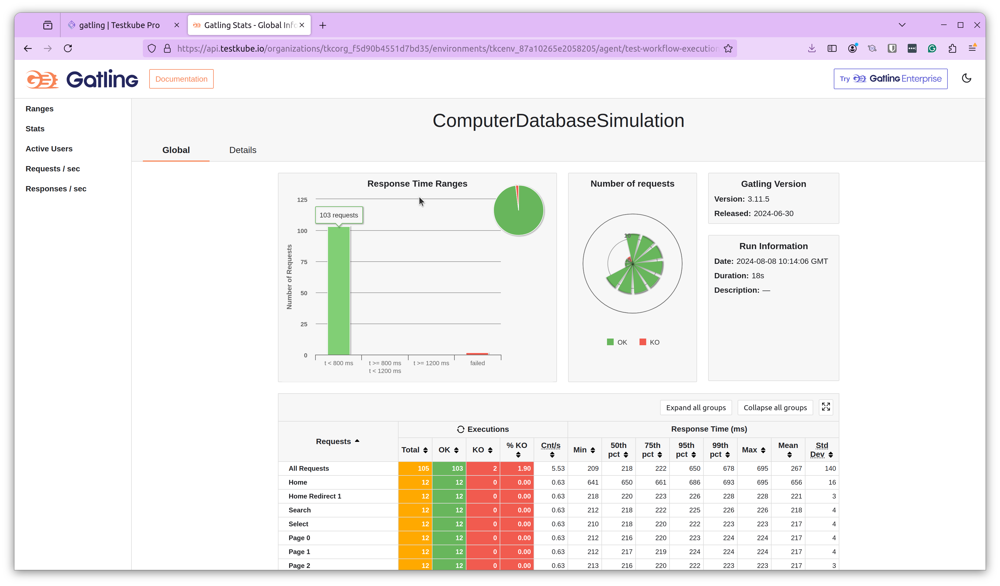

import Tabs from "@theme/Tabs";
import TabItem from "@theme/TabItem";
import SimpleGatling from "../../workflows/simple-gatling-workflow.md"

# Basic Gatling Example

Below is a simple workflow for executing a Gatling test available on GitHub. You can paste this directly into the
YAML of an existing or new test, just make sure to update the `name` and `namespace` for your environment as needed.

- The `spec.content` property defines the path to the Gatling test in a GitHub repository.
- The `spec.use` property uses the official Gradle template to run the test with Gradle.

<SimpleGatling/>

After execution, you can see the log output from the test executions under the executions panel tabs:

<Tabs>
<TabItem value="logs" label="Log Output" default>

</TabItem>
<TabItem value="artifacts" label="Artifacts" default>

The uploaded report is available in the Artifacts tab:

</TabItem>
</Tabs>

See how to effortlessly perform load testing in Kubernetes using Gatling and Testkube from the Testkube UI here:

<iframe width="500" height="300" src="https://youtube.com/embed/mgnwhg9KZ2I" title="Create & Run Gatling Tests with Testkube" frameborder="0" allow="accelerometer; autoplay; clipboard-write; encrypted-media; gyroscope; picture-in-picture; web-share" referrerpolicy="strict-origin-when-cross-origin" allowfullscreen></iframe>

