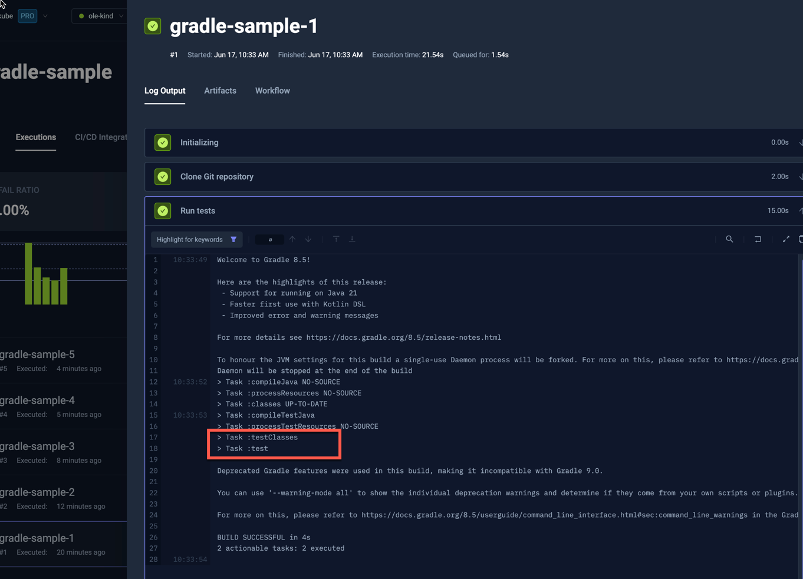

import SimpleGradle from "../../workflows/simple-gradle-workflow.md"

# Basic Gradle Example

Below is a simple workflow for executing tests in a Gradle project stored on GitHub. You can paste this directly into the
YAML of an existing or new test, just make sure to update the `name` and `namespace` for your environment as needed.

- The `spec.content` property defines the path to the Gradle project on GitHub
- the `spec.container` property defines default constraints for any container created in this workflow
- the `spec.steps` property defines a single step that runs the `gradle --no-daemon` test command

<SimpleGradle/>

After execution, you can see the log output from the test executions under the executions panel tabs:

