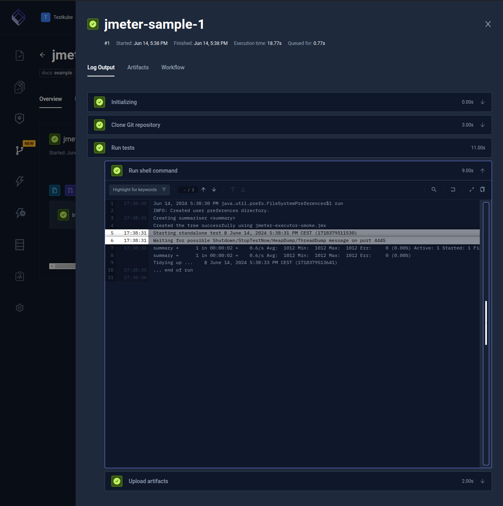
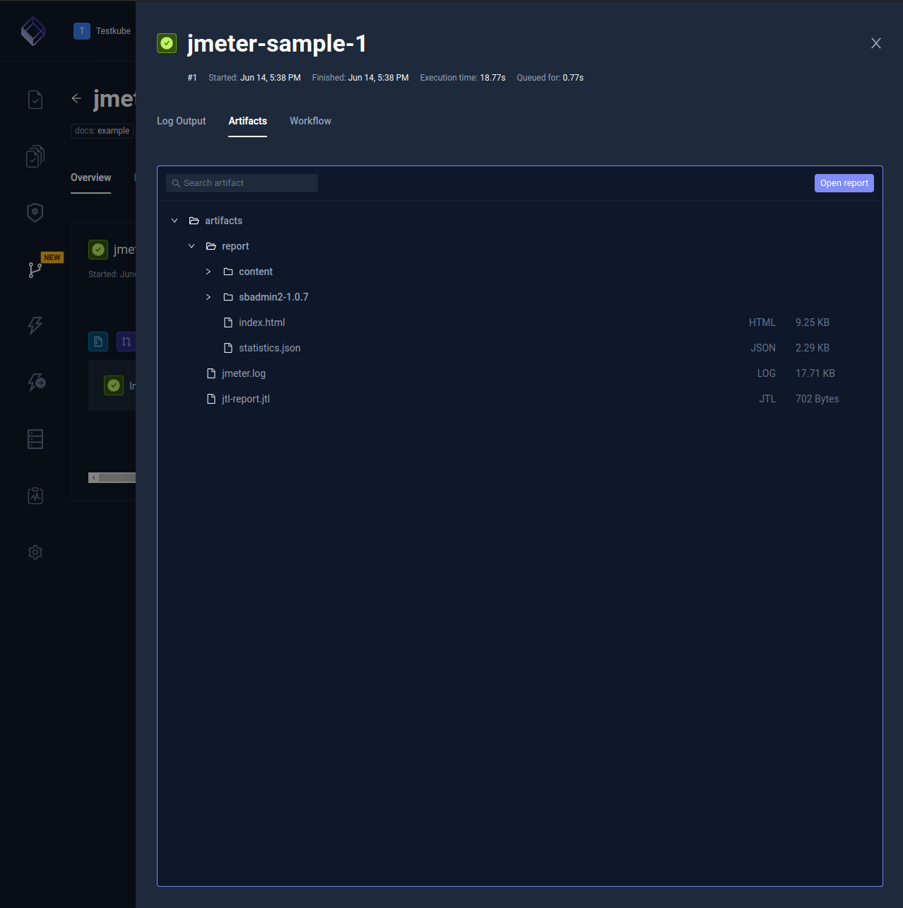

import Tabs from "@theme/Tabs";
import TabItem from "@theme/TabItem";
import SimpleJMeter from "../../workflows/simple-jmeter-workflow.md"

# Basic JMeter Framework Example

Below is a basic workflow for executing a JMeter test which is available
on GitHub. You can paste this directly into the YAML of an existing or new test, just make
sure to update the `name` and `namespace` for your environment if needed.

- The `spec.content` property defines the location of the GitHub project
- the `spec.steps` property defines a single step that runs the test and uploads the created reports.

<SimpleJMeter/>

After execution, you can see the output from the test executions under the executions panel tabs:

<Tabs>
<TabItem value="logs" label="Log Output" default>

The log output from the JMeter execution:

</TabItem>
<TabItem value="artifacts" label="Artifacts" default>

The uploaded report is available in the Artifacts tab:

</TabItem>
</Tabs>

## JMeter statistics in Test Insights

When the workflow uploads JMeter's generated `report/statistics.json` file, Testkube processes it as a native JMeter statistics report for [Test Insights](/articles/test-insights).
The report includes response-time percentile slots from JMeter as:

- `response_time_percentile_1_ms`
- `response_time_percentile_2_ms`
- `response_time_percentile_3_ms`

By default, JMeter maps these slots to the 90th, 95th, and 99th percentiles. If your JMeter configuration overrides `aggregate_rpt_pct1`, `aggregate_rpt_pct2`, or `aggregate_rpt_pct3`, the same Testkube metric keys represent those configured percentile slots instead.
