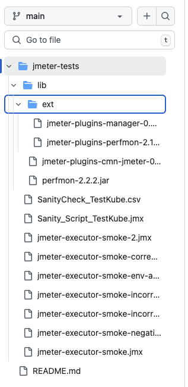

# Using JMeter plugins

Plugins extend basic Jmeter testing capabilities with attractive features to support a wide range of use cases. There are a few ways to use Jmeter plugins when executing Jmeter tests in Testkube:

- Manually download each plugin during Test Workflow execution
- Extend existing Jmeter container images to include plugins
- Store plugins with your tests, and instruct the Jmeter runtime engine to scan the corresponding directories

This article will explore the setup for the third option. Stay tuned for an article on building your own container image! 

### Background

[As stated in the Jmeter documentation](https://jmeter.apache.org/usermanual/get-started.html#classpath), Jmeter automatically find classes from jars in the `JMETER_HOME/lib` (utility jars) and `JMETER_HOME/lib/ext` (components and plugins) directories. However if you store your utility, component, and plugin jars outside of these directories, you will need to instruct Jmeter to scan the directories in which they live using `search_paths` and `plugin_depenedency_paths`. 

### Workflow

```yaml
kind: TestWorkflow
apiVersion: testworkflows.testkube.io/v1
metadata:
  name: jmeter-sample-private-git-repo
  namespace: testkube-agent-paris
  labels:
    se-demo: "yes"
spec:
  content:
    git:
      uri: https://github.com/Jfortunati/testkube-tests/
      revision: main
      usernameFrom:
        secretKeyRef:
          name: testkube-tw-jmeter-sample-private-git-repo-vp147m
          key: env-git-user
      tokenFrom:
        secretKeyRef:
          name: testkube-tw-jmeter-sample-private-git-repo-vp147m
          key: env-git-token
  container:
    workingDir: /data/repo/jmeter-tests/
  steps:
  - name: Run tests
    container:
      image: alpine/jmeter:5.6
    shell: |
      jmeter -n -t Sanity_Script_TestKube.jmx \
      -Lorg.apache.jmeter.util=INFO \
      -Jplugin_dependency_paths=/data/repo/jmeter-tests/lib \
      -Jsearch_paths=/data/repo/jmeter-tests/lib/ext \
      -j /data/artifacts/jmeter.log \
      -o /data/artifacts/report \
      -l /data/artifacts/jtl-report.jtl \
      -e
    artifacts:
      paths:
      - /data/artifacts/**/*
status: {}

```

### Explanation

Here’s what this workflow is doing:

- Fetching Jmeter tests from a private git repo, with credentials stored in a `secretKeyRef`
- Sets the working directory for the container to match the repository directory structure (remember! [Git repository contents are mounted at `/data/repo` by default](https://docs.testkube.io/articles/test-workflows-content#git-repository)):



- Uses shell commands to execute a jmeter test with -`Jplugin_dependency_paths=/data/repo/jmeter-tests/lib` and -`Jsearch_paths=/data/repo/jmeter-tests/lib/ext` set to ensure Jmeter scans for the desired jars.

Your Jmeter tests will now have access to the requisite jars.
