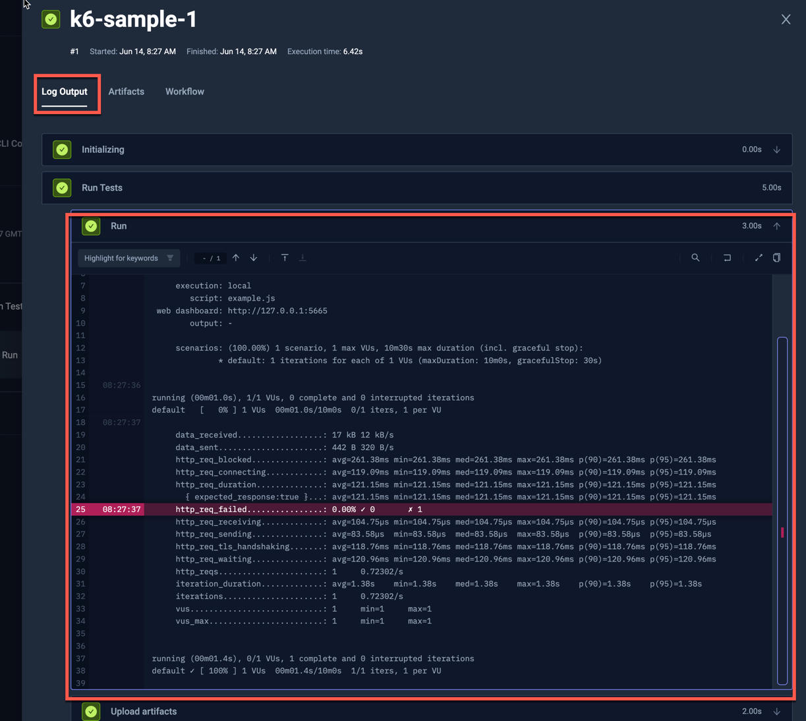
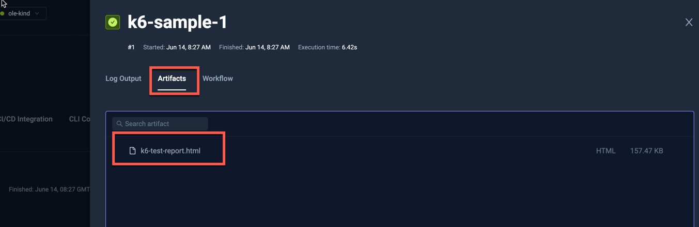
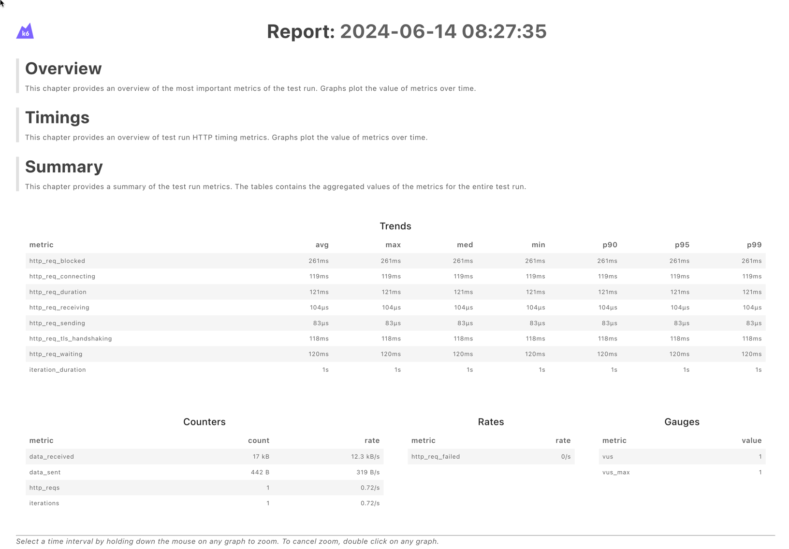

import Tabs from "@theme/Tabs";
import TabItem from "@theme/TabItem";

# Basic K6 Example

Below is a simple workflow for executing an inline K6 test. You can paste this directly into the YAML of an existing or new test, just make 
sure to update the `name` and `namespace` for your environment if needed.

- The `spec.content` property defines a simple k6 script which gets written to `/data/example.js`
- the `spec.steps` property defines a single step that runs the test and uploads the created report.

```yaml
kind: TestWorkflow
apiVersion: testworkflows.testkube.io/v1
metadata:
  name: k6-sample
  namespace: testkube
spec:
  content:
    files:
    - path: /data/example.js
      content: |-
        import http from 'k6/http';
        import { sleep } from 'k6';
        export default function () {
            http.get('https://test.k6.io');
            sleep(1);
        };
  steps:
    - name: Run Tests
      workingDir: /data
      run:
        image: grafana/k6:0.49.0
        env:
          - name: K6_WEB_DASHBOARD
            value: "true"
          - name: K6_WEB_DASHBOARD_EXPORT
            value: k6-test-report.html
        args:
          - run
          - example.js
      artifacts:
        paths:
          - k6-test-report.html
```

After execution, you can see the output from the test executions under the executions panel tabs:

<Tabs>
<TabItem value="logs" label="Log Output" default>

The log output from k6:



</TabItem>
<TabItem value="artifacts" label="Artifacts" default>

The uploaded report is available in the Artifacts tab:



</TabItem>

<TabItem value="htlm-report" label="HTLM Report" default>

Clicking the HTLM report opens it in your browser:



</TabItem>
</Tabs>

