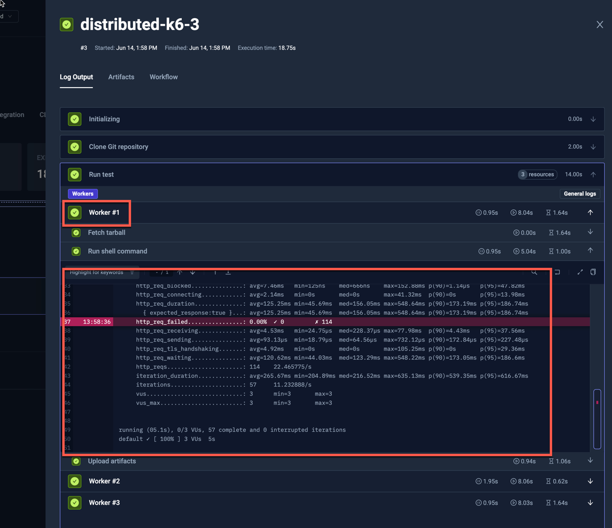
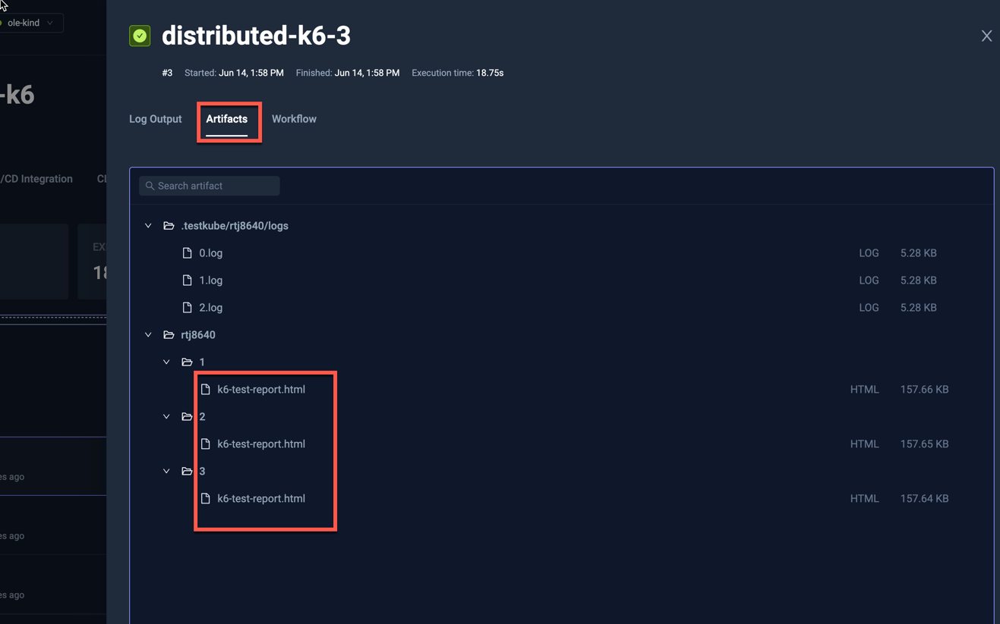

import Tabs from "@theme/Tabs";
import TabItem from "@theme/TabItem";
import DistributedK6 from "../../workflows/distributed-k6-workflow.md"

# Distributed K6 Example

Testkube has built-in support for parallelising any testing tool - check out the
[Parallelization](../test-workflows-parallel) documentation for details and many examples. 

The below example shows how to distribute a K6 tests across a configurable
number of nodes

* Takes optional run configuration parameters (`config`)
    * `vus` to declare Virtual Users to distribute
    * `duration` to declare Load Test time
    * `workers` to declare number of K6 instances to create
* Load the K6 script from Git repository (`content`)
* Run distributed K6 tests (`steps[0].parallel`)
    * It's using built-in `distribute/evenly` Test Workflow Template, that sets [`pod.topologySpreadConstraints`](https://kubernetes.io/docs/concepts/scheduling-eviction/topology-spread-constraints/) to distribute pods evenly across nodes (`steps[0].parallel.use`)
    * It's creating as many K6 workers as has been declared in `workers` config (`steps[0].parallel.count`)
    * It copies the test case from Git repository into workers (`steps[0].parallel.transfer`)
    * It reserves 1/8 CPU and 128MB for each worker (`steps[0].parallel.container.resources`)
    * It ensures that all workers will start load tests at the same time, when all are ready (`steps[0].parallel.paused`)
    * It runs K6 executable against that test case (`steps[0].parallel.run.shell`)
        * It passes number of Virtual Users and test duration via K6 parameters
        * It uses K6 [**--execution-segment**](https://grafana.com/docs/k6/latest/using-k6/k6-options/reference/#execution-segment) argument to select the fraction of tests to run
    * It retrives the generated HTML reports as artifacts

<DistributedK6/>

<Tabs>
<TabItem value="logs" label="Log Output" default>

The k6 log output from one of the workers: 

</TabItem>
<TabItem value="artifacts" label="Artifacts" default>

The uploaded HTML reports for each of the Workers is available in the Artifacts tab

</TabItem>

</Tabs>
