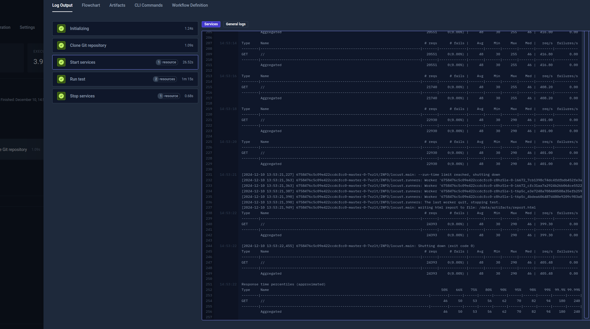

import Tabs from "@theme/Tabs";
import TabItem from "@theme/TabItem";
import DistributedLocust from "../../workflows/distributed-locust-workflow.md"

# Distributed Locust Example

import RequiresCommercialWorkflows from "../_commercial-workflows-note.mdx"

<RequiresCommercialWorkflows/>

Testkube has built-in support for parallelising any testing tool - check out the
[Parallelization](../test-workflows-parallel) documentation for details and examples. 

The below example shows how to distribute a Locust test across a configurable
number of "workers"

<DistributedLocust/>

After execution, you can see the output from the test executions under the executions panel tabs:

<Tabs>
<TabItem value="logs" label="Log Output" default>

The log output from the Locust execution:

</TabItem>
</Tabs>
