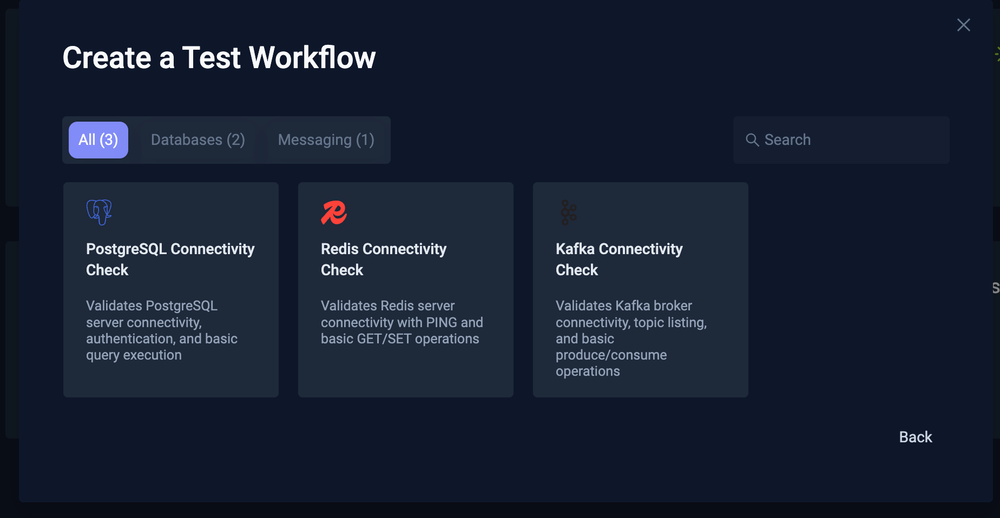
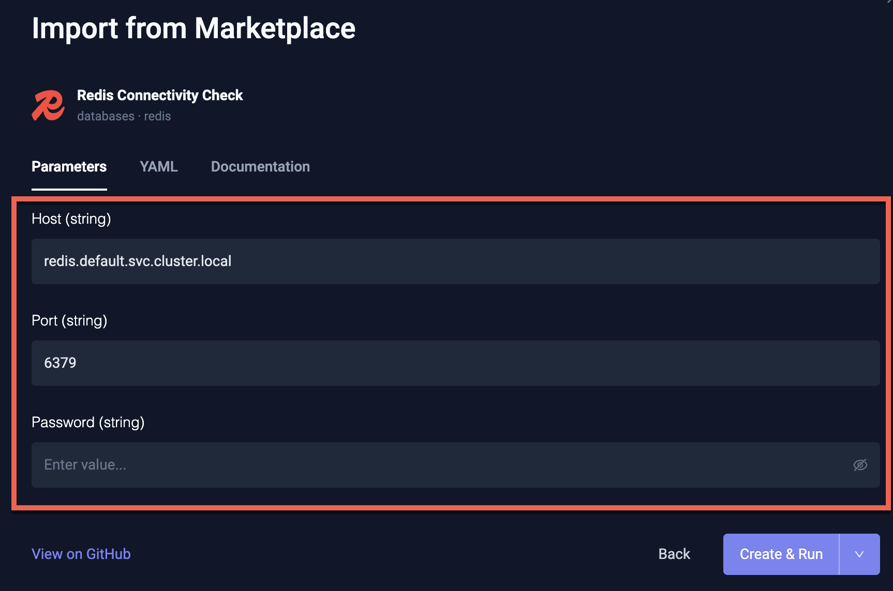

# Testkube Marketplace

The [Testkube Marketplace](https://github.com/kubeshop/testkube-marketplace) is a community-driven collection of
reusable TestWorkflows for validating infrastructure components in Kubernetes environments. It provides pre-built,
security-vetted workflows for common infrastructure such as databases, message brokers, networking, storage,
and more — ready to deploy and run in minutes.

## Available Categories

The Marketplace organizes workflows by infrastructure type:

| Category | Components | Examples |
|----------|------------|----------|
| **Databases** | PostgreSQL, MySQL, MongoDB, Redis | Connectivity checks, health validation |
| **Messaging** | Kafka, RabbitMQ, NATS | Broker connectivity, topic validation |
| **Networking** | Ingress controllers, Service mesh | Endpoint health, ingress validation |
| **Storage** | MinIO, Elasticsearch, Persistent Volumes | PVC binding, attachment checks |
| **Observability** | Prometheus, Grafana, Jaeger | Monitoring stack validation |
| **Security** | Vault, cert-manager | Certificate and secret management checks |
| **Kubernetes Core** | Pods, StatefulSets, Namespaces | Resource health, namespace scoping |

## Using the Marketplace from the Dashboard

The Testkube Dashboard includes a built-in wizard for browsing and importing workflows directly from the Marketplace 
When creating a new TestWorkflow, select **"Create from Marketplace"** to browse available workflows, see their
documentation, and configure parameters before deploying - 
see [Create From Catalog](/articles/test-workflows-create-wizard#infrastructure-validation) for more details.



Each Marketplace Workflow includes configurable parameters that are rendered in the Dashboard when importing,
letting you customize connection details, credentials, and other settings for your environment.



## Using the Marketplace from the CLI

The Testkube CLI ships with a built-in `marketplace` command group that talks to the same catalog the
Dashboard uses, so open-source users can browse and install workflows without leaving the terminal.

### Browse the Catalog

Discover what categories exist before drilling into specific workflows:

```bash
testkube marketplace categories
```

List every workflow in the Marketplace, optionally filtered by category or component:

```bash
testkube marketplace list
testkube marketplace list --category databases
testkube marketplace list --component postgresql --output json
```

The default `pretty` output renders a table; use `--output json|yaml|go` (with `--go-template`) for
machine-readable formats.

### Inspect a Workflow

`get` shows the catalog entry, the configurable parameters extracted from `spec.config`, and optionally
the raw YAML and readme:

```bash
testkube marketplace get redis-connectivity
testkube marketplace get redis-connectivity --show-yaml --show-readme
```

### Install a Workflow

`install` downloads the workflow YAML, applies any `--set key=value` overrides to the matching
`spec.config.<key>.default` fields, and creates (or updates) the TestWorkflow in your cluster — the
same pipeline as `testkube create testworkflow -f`:

```bash
# Install with the workflow's defaults
testkube marketplace install redis-connectivity

# Override one or more parameters; values are written into spec.config defaults
testkube marketplace install redis-connectivity \
  --set host=my-redis.default.svc.cluster.local \
  --set port=6379

# When attached to a terminal, install prompts for every parameter the workflow
# exposes by default. --set values become the pre-filled default; empty input
# keeps the current value; sensitive parameters are read with masked input.
testkube marketplace install redis-connectivity

# Force non-interactive (use defaults + --set as-is) -- handy on a terminal
# when you know the overrides already cover everything you need.
testkube marketplace install redis-connectivity --interactive=false

# Validate without creating, or upsert an existing workflow
testkube marketplace install redis-connectivity --dry-run
testkube marketplace install redis-connectivity --update
```

Prompting is automatically skipped when stdin is not a terminal (CI, piped
input), so the same command works unattended in pipelines. Pass
`--interactive=true` (or `-i`) to force prompting even off a TTY.

Because `--set` (and any values collected interactively) rewrite the workflow's
defaults, subsequent `testkube run testworkflow redis-connectivity` calls do
not need to repeat `--config` overrides.

After a successful install the command asks whether to run the workflow immediately. Use
`--run` to skip the prompt and make the command fully automatable, or `-f`/`--follow` to
stream logs until the execution finishes:

```bash
# Install and run unattended (suitable for CI)
testkube marketplace install redis-connectivity --run=true

# Install only, do not prompt or run
testkube marketplace install redis-connectivity --run=false

# Install, run, and follow the execution (logs stream until completion;
# exit code matches the workflow's result)
testkube marketplace install redis-connectivity -f
```

`-f` implies `--run=true` when `--run` is not supplied; combine with `--update` to
reinstall-and-rerun an existing workflow in a single command.

### Install Directly from a URL

`testkube create testworkflow` also accepts a `--url` flag that fetches a TestWorkflow YAML from any
HTTP(S) endpoint before validating and creating it. This works for raw GitHub URLs, internal storage,
or any other source:

```bash
testkube create testworkflow --url \
  https://raw.githubusercontent.com/kubeshop/testkube-marketplace/main/workflows/databases/redis/redis-connectivity.yaml
```

`--url` and `--file` are mutually exclusive.

### Clone and Apply (Manual Workflow)

If you prefer working from a local checkout, the workflows can still be applied directly:

```bash
git clone https://github.com/kubeshop/testkube-marketplace.git
cd testkube-marketplace

kubectl apply -f workflows/databases/redis/redis-connectivity.yaml
# or
testkube create testworkflow -f workflows/databases/redis/redis-connectivity.yaml
```

### Run with Custom Parameters at Execution Time

If you installed a workflow with the original defaults, you can still override parameters per-run:

```bash
testkube run testworkflow redis-connectivity \
  --config host=my-redis.default.svc.cluster.local \
  --config port=6379
```

## Example: Redis Connectivity Check

Below is the Redis connectivity workflow from the Marketplace. It validates that a Redis server is reachable
and operational by running PING, SET, GET, and DEL operations.

```yaml
apiVersion: testworkflows.testkube.io/v1
kind: TestWorkflow
metadata:
  name: redis-connectivity
  labels:
    marketplace.testkube.io/category: databases
    marketplace.testkube.io/component: redis
    marketplace.testkube.io/validation-type: connectivity
  annotations:
    marketplace.testkube.io/display-name: "Redis Connectivity Check"
    marketplace.testkube.io/description: "Validates Redis server connectivity with PING and basic GET/SET operations"
    marketplace.testkube.io/icon: "https://cdn.simpleicons.org/redis"

spec:
  config:
    host:
      type: string
      default: "redis.default.svc.cluster.local"
      description: "Redis host address"
    port:
      type: string
      default: "6379"
      description: "Redis port"
    password:
      type: string
      default: ""
      sensitive: true
      description: "Redis password (leave empty if no auth)"
    db:
      type: string
      default: "0"
      description: "Redis database number"

  steps:
  - name: "Validate Redis Connectivity"
    run:
      image: docker.io/library/redis:7-alpine@sha256:ee64a64...
      shell: |
        echo "Target: {{ config.host }}:{{ config.port }}"

        REDIS_ARGS="-h {{ config.host }} -p {{ config.port }} -n {{ config.db }}"

        # PING test
        RESULT=$(redis-cli $REDIS_ARGS PING 2>&1)
        if [ "$RESULT" = "PONG" ]; then
          echo "✓ PING successful"
        else
          echo "✗ PING failed: $RESULT"
          exit 1
        fi

        # SET / GET / DEL operations
        TEST_KEY="testkube:validation:$(date +%s)"
        redis-cli $REDIS_ARGS SET "$TEST_KEY" "test-value" EX 60
        redis-cli $REDIS_ARGS GET "$TEST_KEY"
        redis-cli $REDIS_ARGS DEL "$TEST_KEY"

        echo "✓ Redis Connectivity Validation Passed"
```

All Marketplace workflows follow this pattern: standardized metadata labels and annotations for discovery,
configurable parameters with sensible defaults, and clear pass/fail output.

## Workflow Metadata

Marketplace workflows use standardized metadata so they can be indexed and filtered in the Dashboard:

### Labels

| Label | Purpose | Values |
|-------|---------|--------|
| `marketplace.testkube.io/category` | Infrastructure type | `databases`, `messaging`, `networking`, `storage`, `observability`, `security`, `other` |
| `marketplace.testkube.io/component` | Specific component | `redis`, `postgresql`, `kafka`, etc. |
| `marketplace.testkube.io/validation-type` | What's being validated | `connectivity`, `health`, `performance`, `security` |

### Annotations

| Annotation | Purpose |
|------------|---------|
| `marketplace.testkube.io/display-name` | Human-readable name shown in the Dashboard |
| `marketplace.testkube.io/description` | What the workflow validates |
| `marketplace.testkube.io/icon` | Icon URL for UI display |
| `marketplace.testkube.io/tags` | Search keywords |

## Security

All workflows in the Marketplace follow strict security guidelines enforced by CI on every pull request:

- **Approved registries only** — images must come from vetted sources (Docker Hub official, Bitnami, Chainguard, etc.)
- **Digest pinning** — all images use immutable SHA256 digest references instead of mutable tags
- **Automated validation** — CI checks reject PRs that violate image security policies

## Contributing

The Marketplace is open for community contributions. To add a new workflow:

1. Fork the [testkube-marketplace](https://github.com/kubeshop/testkube-marketplace) repository
2. Add your workflow under the appropriate category in `workflows/`
3. Include the required metadata labels and annotations
4. Ensure all images are from approved registries with digest pinning
5. Add a `README.md` with usage documentation
6. Submit a pull request

See the [Contributing Guidelines](https://github.com/kubeshop/testkube-marketplace/blob/main/CONTRIBUTING.md)
for full details on naming conventions, image security requirements, and the PR checklist.
