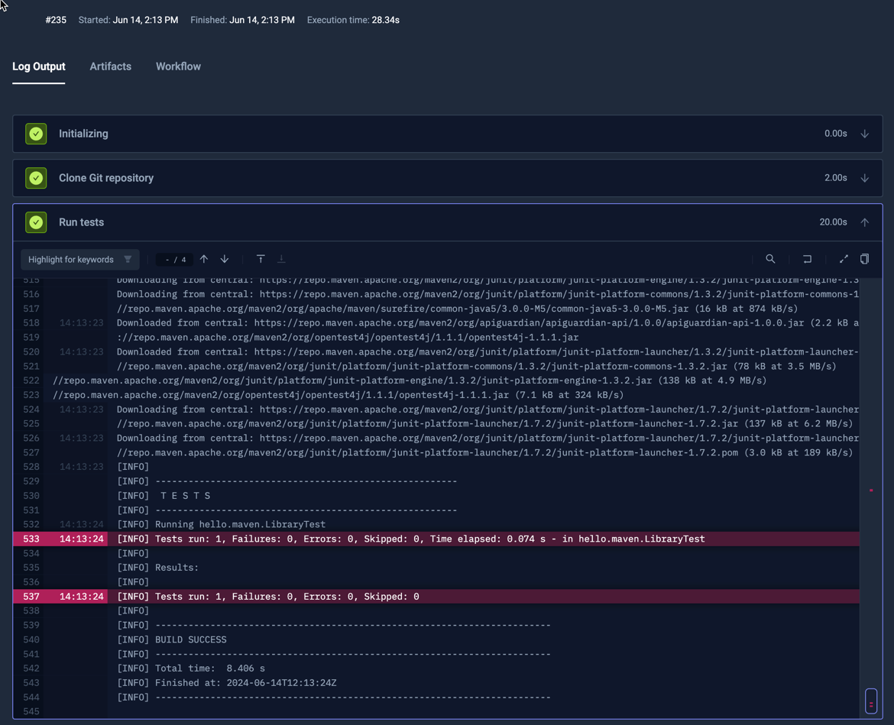

import SimpleMaven from "../../workflows/simple-maven-workflow.md"

# Basic Maven Example

Below is a simple workflow for executing tests in a maven project stored on GitHub. You can paste this directly into the
YAML of an existing or new test, just make sure to update the `name` and `namespace` for your environment as needed.

- The `spec.content` property defines the path to the maven project on GitHub
- the `spec.steps` property defines a single step that runs the mvn:test

<SimpleMaven/>

After execution, you can see the log output from the test executions under the executions panel tabs:

:::tip
The [Selenium Example](selenium-basic) also uses Maven for running tests and shows how to collect artifacts
created by the Maven Surefire plugin.
:::
