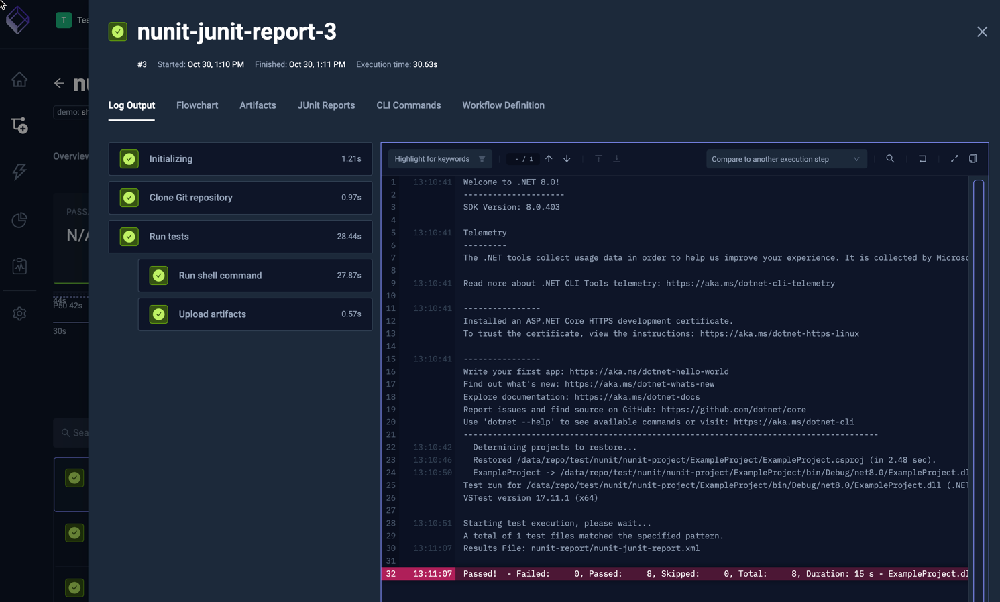
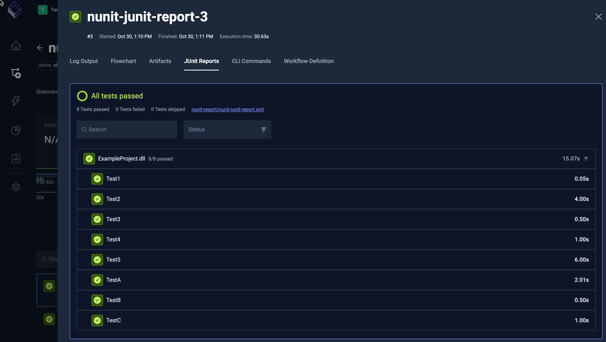

import Tabs from "@theme/Tabs";
import TabItem from "@theme/TabItem";
import SimpleNUnit from "../../workflows/simple-nunit-workflow.md"

# Basic NUnit Example

Below is a basic workflow for executing a NUnit tests in a git repository. You can paste this directly into the YAML of an existing or new test, just make
sure to update the `name` and `namespace` for your environment as needed.

- the `spec.steps` property defines the NUnit execution together with arguments to generate JUnit-compatible NUnit reports.

<SimpleNUnit/>

After execution, you can see the output from the executions under the executions panel tabs:

<Tabs>
<TabItem value="logs" label="Log Output" default>

The log output from the NUnit execution:

</TabItem>
<TabItem value="junit" label="JUnit Report" default>

  The JUnit Report from the NUnit execution:

  

</TabItem>
</Tabs>

