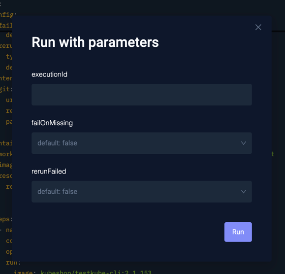
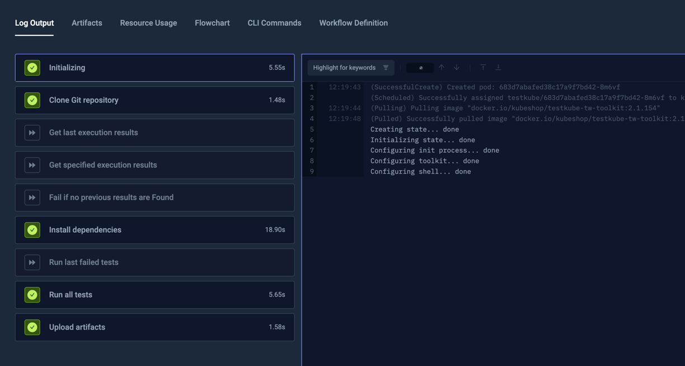
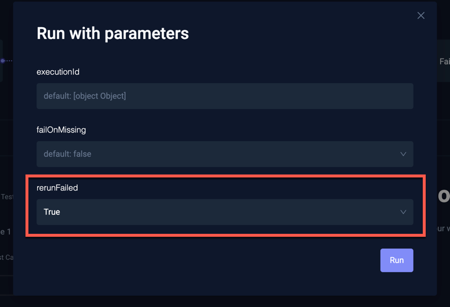
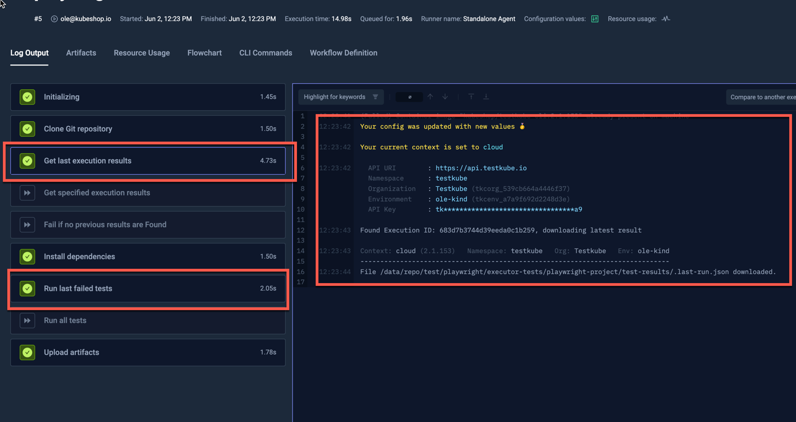
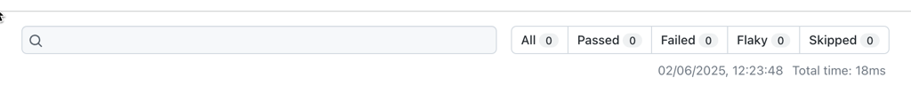

import RerunPlaywright from "../../workflows/rerun-failed-playwright-workflow.md"

# Playwright - Rerun Failed Tests

Playwright provides the ability to only rerun failed tests from a previous execution, which can come in handy
to cut down overall execution times when working with flaky tests and/or when you know the reason for a specific test failure
has been fixed and rerunning all tests is not necessary - [Read More](https://playwright.dev/docs/running-tests#run-last-failed-tests).

:::note
Since all testing tools have different approaches to rerunning failed tests, Testkube does not have a native "Rerun failed tests" functionality.
That being said, it is certainly possible to create Workflows that tap into the corresponding functionality in the testing tool at hand,
with some custom scripting and/or configuration parameters.

The below Workflow is an example of how to achieve this for Playwright tests.
:::

## Workflow Overview

Playwright needs the `test-results/.last-run.json` file from a previous execution to rerun failed tests. The Workflow below retrieves this by automating
the Testkube CLI `testkube download artifact` command to download the corresponding file from a previous execution and saving it to the 
root tests folder (where Playwright will be looking for it).

- The **"Get last execution results"** step (lines 31-49) uses `testkube get testworkflowexecution` to get the execution before the ongoing one
  and then a combination of `grep` and `sed` to extract the `executionId`.
- The **"Get specific execution results"** step (lines 50-64) uses the provided `executionId` instead.
- The CLI needs an API Token to retrieve results; it is recommended to use a `Member` token with access to the
  containing Environment with Read permissions as described at [Member Tokens](/testkube-pro/articles/api-token-management#member-tokens)
  and replace the `tkcapi_XXXX` value on line 57
- The Workflow prompts for three parameters (all optional):
  - `rerunFailed` : tells the Workflow to rerun failed executions from a previous execution; if set to `false` (default)
     the Workflow will just run your Playwright tests normally (see line 75)
  - `executionId` : which previous execution to rerun; if not specified the Workflow will use the previous execution when `rerunFailed` is set to `true`.
  - `failOnMissing` : fails the Workflow if the previous/specified execution has no results when `rerunFailed` is set to true (defaults to `false`).
- The **"Get xx execution results"** steps are marked as `optional` so they don't fail the Workflow if no corresponding execution or artifact is found.
  This is achieved by the "Fail if no previous results are Found" step instead if the `failOnMissing` property is set to `true`.

:::note
Please note that this `rerun-failed` option should only be used for the same or "compatible" revision/"version"/branch of your underlying Playwright tests, 
just using the last one may not always be correct.
:::

<RerunPlaywright/>

## Workflow Execution

### Running tests normally 

When initially/normally running this Workflow, we'll not provide any input, which results in our Playwright tests executing normally:

As you can see in the execution popup, the steps related to rerunning were skipped:

### Rerunning failed tests

Now let's rerun our test with the `rerunFailed` parameter set to true:

The execution now runs the corresponding steps, and we can see the downloading of the previous results artifact in the log:

Since we didn't have any failing tests in our previous execution, this new execution didn't run any tests at all, which you
can see in the generated report:

