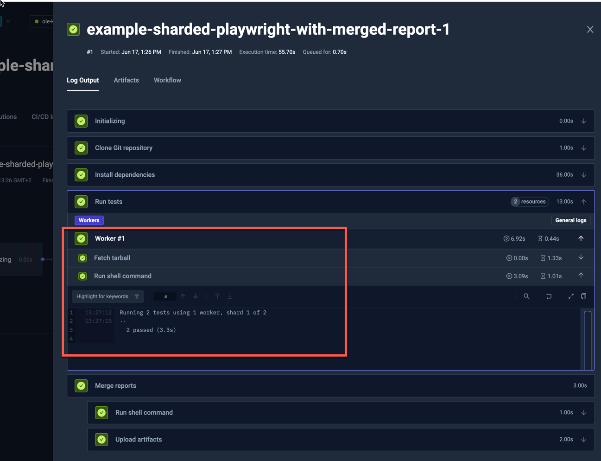
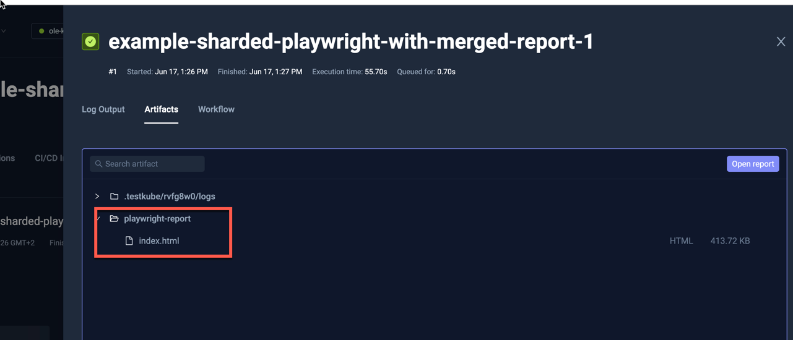
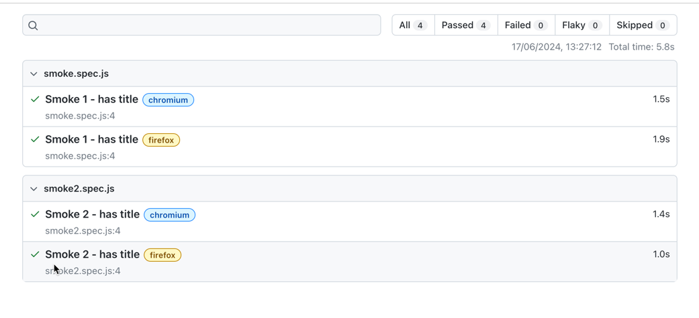

import Tabs from "@theme/Tabs";
import TabItem from "@theme/TabItem";
import ShardedPlaywright from "../../workflows/sharded-playwright-workflow.md"

# Sharded Playwright Example

import RequiresCommercialWorkflows from "../_commercial-workflows-note.mdx"

<RequiresCommercialWorkflows/>

Testkube has built-in support for parallelizing any testing tool - check out the
[Parallelization](../test-workflows-parallel) documentation for details and examples.

The below example shows how to distribute ("shard") a set of Playwright tests across a configurable
number of nodes and aggregate individual reports into a single report that is available as an artifact.

The example below:

* Load the Git repository with Playwright test (`content`)
* Install the project dependencies (`steps[0].shell`)
* Run the Playwright tests split to 2 shards (`steps[1].parallel`)
  * Reserve 1 CPU and 1GB RAM for each shard (`steps[1].parallel.container.resources`)
  * Copy the repository and `node_modules` inside (`steps[1].parallel.transfer`)
  * Run Playwright test - with `blob` reporter, and with specific shard segment (`steps[1].parallel.shell`)
  * Fetch the Blob reporter's data to corresponding directory on Execution's pod (`steps[1].parallel.fetch`)
* Merge the reports using Playwright's tooling (`steps[2].shell`)
* Save the merged report as an artifact (`steps[2].artifacts`)

<ShardedPlaywright/>

<Tabs>
<TabItem value="logs" label="Log Output" default>

The log output from the Playwright Framework execution:

</TabItem>
<TabItem value="artifacts" label="Artifacts" default>

The uploaded report is available in the Artifacts tab:

</TabItem>

<TabItem value="htlm-report" label="HTLM Report" default>

Clicking the HTLM report opens it in your browser:

</TabItem>
</Tabs>
