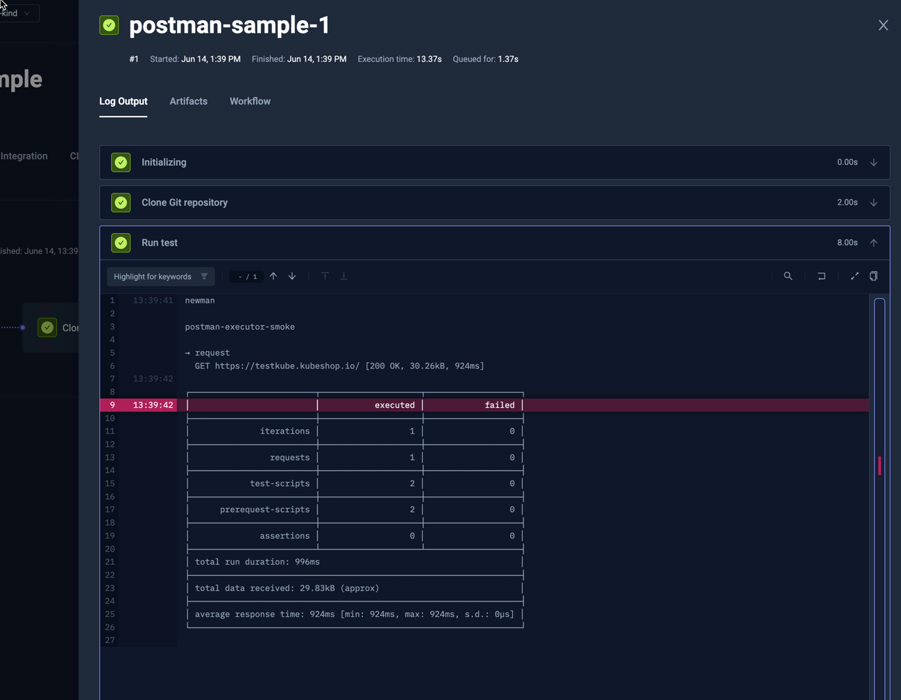

import SimplePostman from "../../workflows/simple-postman-workflow.md"
import SimplePostmanFromTemplate from "../../workflows/simple-postman-workflow-from-template.md"

# Basic Postman Example

Below is a simple workflow for executing a Postman collection stored on GitHub. You can paste this directly into the 
YAML of an existing or new test, just make sure to update the `name` and `namespace` for your environment as needed.

- The `spec.content` property defines the path to the postman collection in a GitHub repository
- the `spec.steps` property defines a single step that runs the collection with the newman Docker image

<SimplePostman/>

After execution, you can see the log output from the test executions under the executions panel tabs:

## Basic Postman from Template
Below is an example workflow for executing the Postman collection using an official Testkube Template.

<SimplePostmanFromTemplate/>

 :::note
Please visit YouTube to watch our video on how to Simplify API Testing in Kubernetes with Postman and Testkube:
<iframe width="600" height="400" src="https://www.youtube.com/embed/7HAwEtFDwvU" title="Simplify API Testing in Kubernetes with Postman and Testkube" frameborder="0" allow="accelerometer; autoplay; clipboard-write; encrypted-media; gyroscope; picture-in-picture; web-share" referrerpolicy="strict-origin-when-cross-origin" allowfullscreen></iframe>
:::