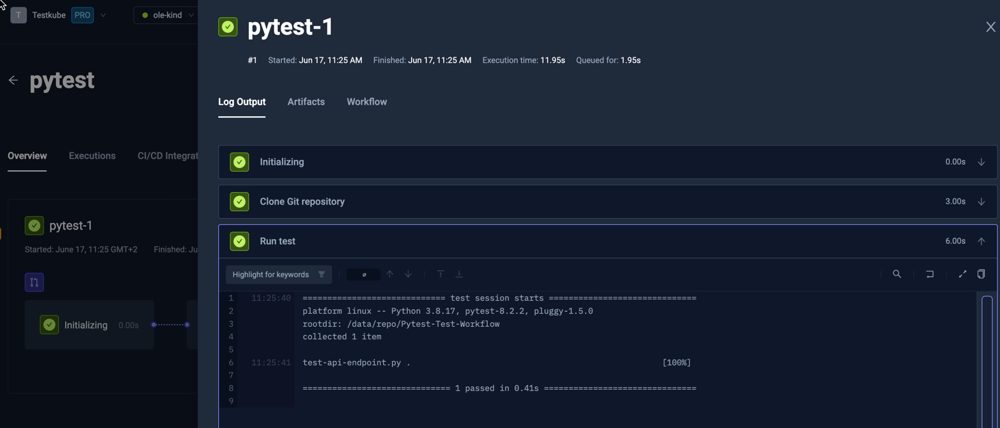

import Tabs from "@theme/Tabs";
import TabItem from "@theme/TabItem";
import SimplePytest from "../../workflows/simple-pytest-workflow.md"

# Basic Pytest Example

Below is a simple workflow for executing pytest tests stored on GitHub.
You can paste this directly into the YAML of an existing or new test, just make
sure to update the `name` and `namespace` for your environment if needed.

- The `spec.content` property defines the location of the folder containing the Pytest test on GitHub
- The `spec.container` property defines the workingDir and docker image used in the Workflow.
- the `spec.steps` property defines a single step that runs the test.

<SimplePytest/>

After execution, you can see the log output from the Pytest runner under the executions panel Log Output tab:

