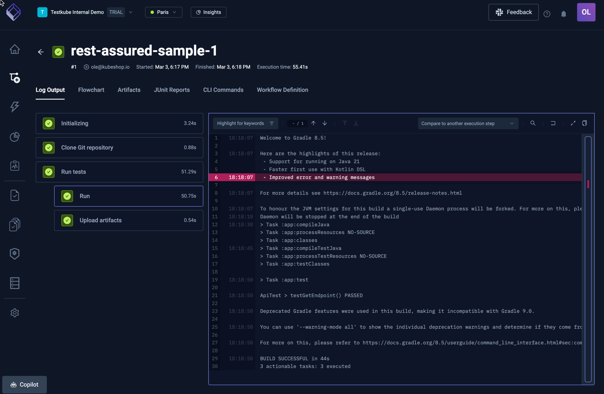
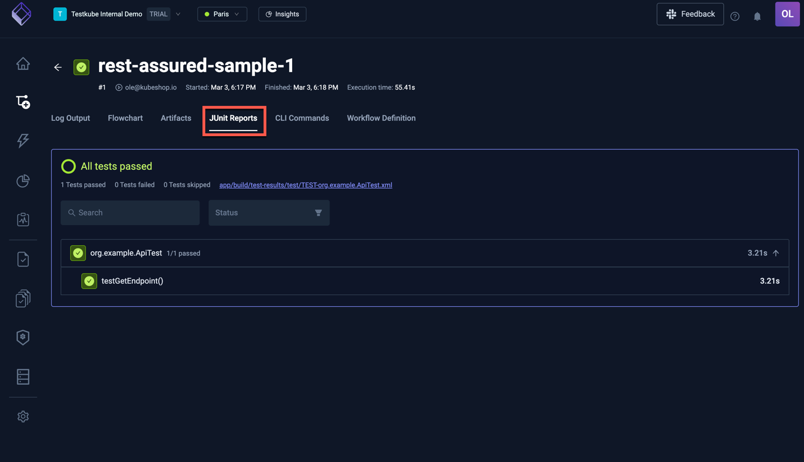
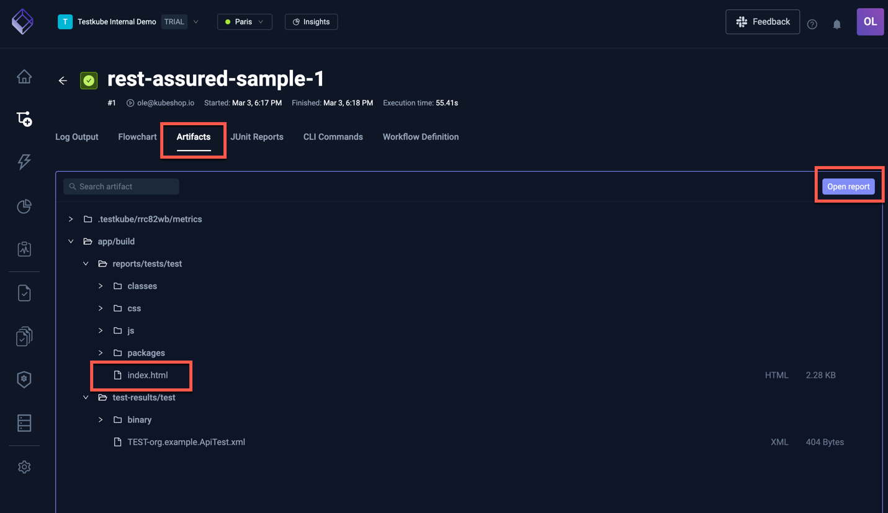
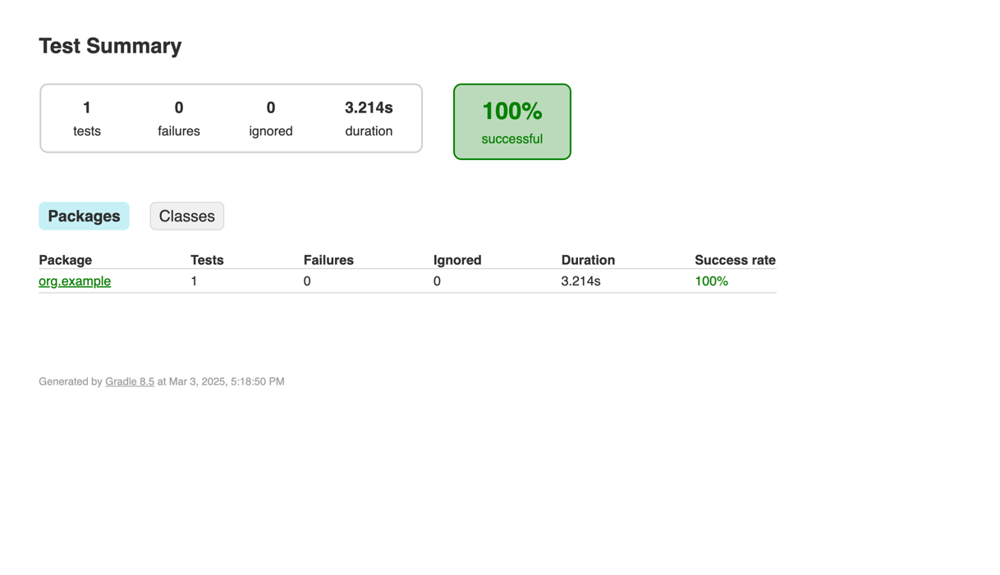

import Tabs from "@theme/Tabs";
import TabItem from "@theme/TabItem";
import SimpleRestAssured from "../../workflows/simple-restassured-workflow.md"

# Basic RestAssured Example

Below is a simple workflow for executing RestAssured tests in a Gradle project stored on GitHub. You can paste this directly into the
YAML of an existing or new test, just make sure to update the `name` and `namespace` for your environment as needed.

- The `spec.content` property defines the path to the Gradle project on GitHub.
- The `spec.container` property defines default constraints for any container created in this workflow.
- The `spec.steps` property defines a single step that runs the `gradle --no-daemon` test command.

<SimpleRestAssured/>

After execution, you can see the output from the test executions under the executions panel tabs:

<Tabs>
  <TabItem value="logs" label="Log Output" default>

    The log output from the REST Assured execution:

   

  </TabItem>
  <TabItem value="junit" label="JUnit Report" default>

    The uploaded report is available in the Artifacts tab:

    

  </TabItem>
  <TabItem value="artifacts" label="Artifacts" default>

    The uploaded report is available in the Artifacts tab:

    

  </TabItem>

  <TabItem value="html-report" label="HTML Report" default>

    Clicking the HTML report opens it in your browser:

    

  </TabItem>
</Tabs>

:::tip
Read more about running RestAssured Tests with Testkube at https://testkube.io/learn/api-testing-using-restassured-and-testkube
:::
