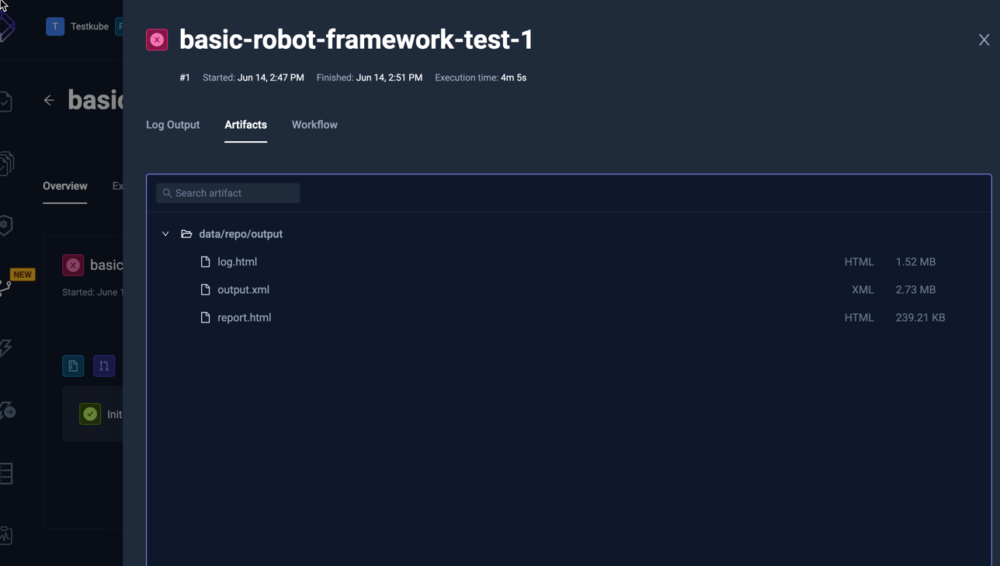
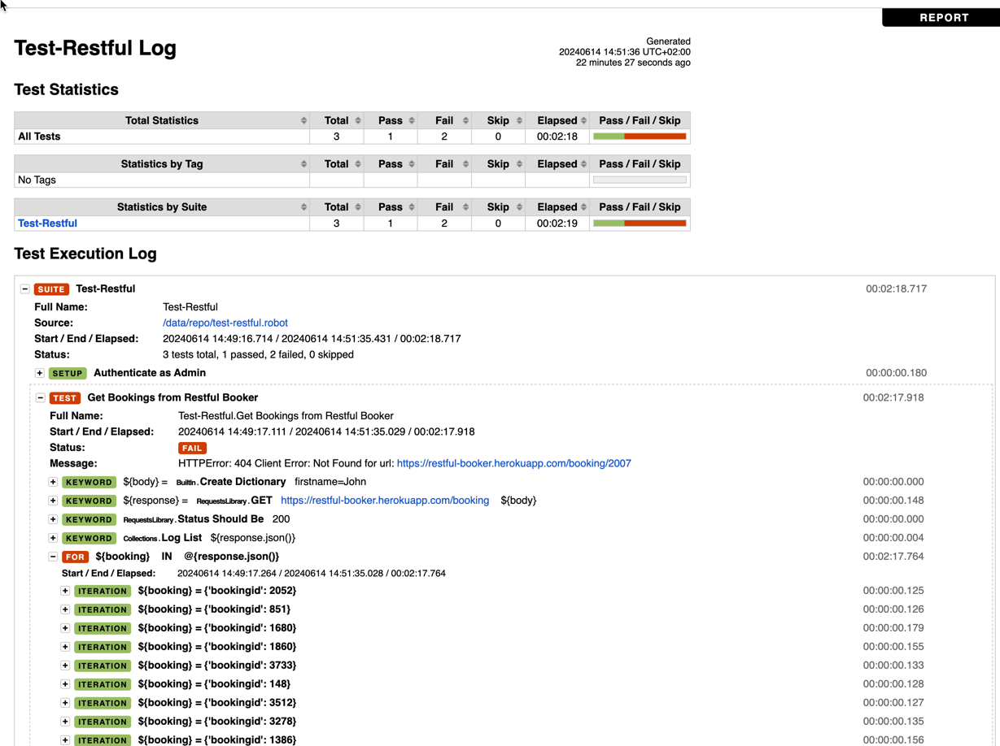

import Tabs from "@theme/Tabs";
import TabItem from "@theme/TabItem";
import SimpleRobotFramework from "../../workflows/simple-robot-framework-workflow.md"

# Basic Robot Framework Example

Below is a basic workflow for executing a Robot Framework test which is available
on GitHub. You can paste this directly into the YAML of an existing or new test, just make
sure to update the `name` and `namespace` for your environment if needed.

- The `spec.content` property defines the location of the GitHub project
- the `spec.steps` property defines a single step that runs the test and uploads the created reports.

<SimpleRobotFramework/>

After execution, you can see the output from the test executions under the executions panel tabs:

<Tabs>
<TabItem value="logs" label="Log Output" default>

The log output from the Robot Framework execution:

</TabItem>
<TabItem value="artifacts" label="Artifacts" default>

The uploaded report is available in the Artifacts tab:

</TabItem>

<TabItem value="html-report" label="HTML Report" default>

Clicking the HTML report opens it in your browser:

</TabItem>
</Tabs>

